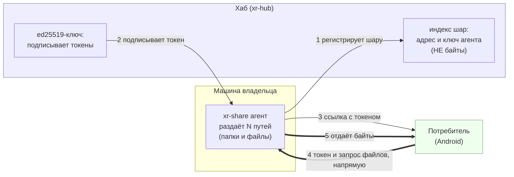
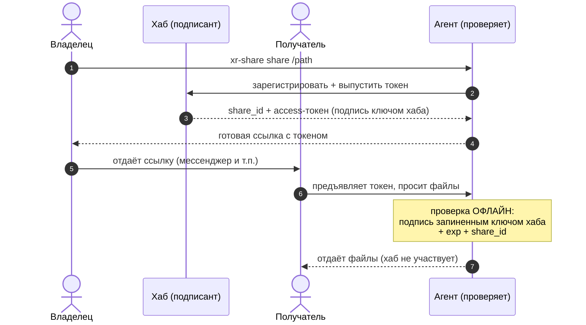
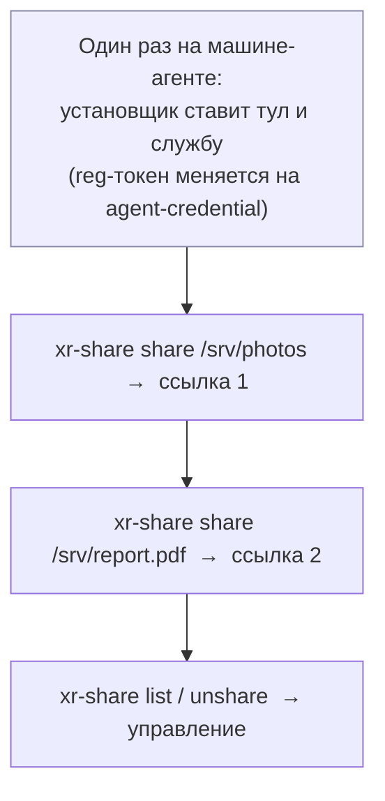
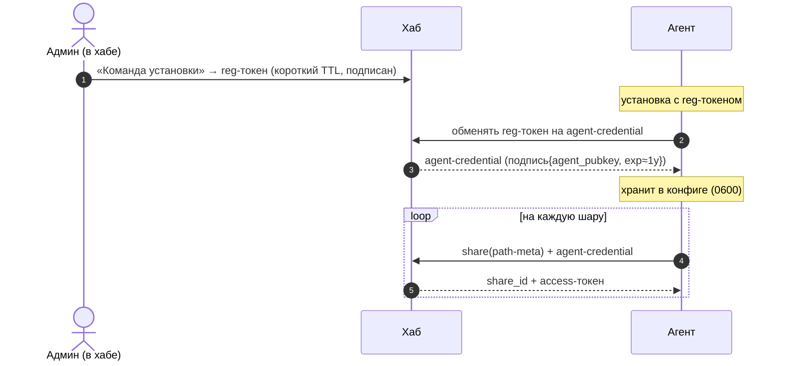
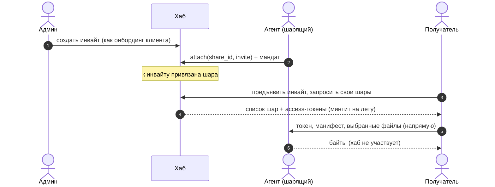

# LLD-19. Файлообмен: агент-шара на машине пользователя + хаб-индекс адресов

**Статус:** Draft
**Область:** новый крейт `xr-share` (кроссплатформенный **server-режим**: раздаёт
директорию **read-only** по HTTP(S), отдаёт манифест с хешами; Win/Linux),
`xr-hub` (индекс шар, **только адрес+метаданные, без байтов**; ручная
регистрация `адрес:порт`; выдача подписанных share-токенов; раздел «Шары» в Admin
SPA), `xr-core` (**движок one-way sync**: диф манифеста, что докачать и удалить,
чистый Rust), `xr-android` (экран «Файлы»: список шар → **разовое скачивание** и
**фоновая синхронизация** выбранных файлов/директорий на устройство), `xr-proto`
(типы `ShareRecord`/`ShareToken`/`ShareManifest`).
**Зависимости:** [LLD-01](01-control-plane.md): хаб, инвайты, ed25519-подпись,
Admin SPA: переиспользуем подпись токенов и UI. [LLD-17](17-hub-router-registry.md)
(XR-025): идентичность и реестр, запись шары живёт тем же стором; опц. heartbeat
агента (online/динамический IP) тем же паттерном. [LLD-04](04-onboarding-qr-uri.md):
TOFU public-key, потребитель пинит **идентичность агента** через хаб.
[LLD-12](12-android-apk-self-update.md): паттерн «отдать файл с SHA-256» и
скачивание в приложении переиспользуем для шар.
**Связанные документы:** [ARCHITECTURE.md §3 (хаб)](../ARCHITECTURE.md): новый
компонент `xr-share`. Кросс-реф [XR-017](../TASKS.md) (нативные десктоп-клиенты,
туда же «десктопный sync-потребитель», позже).

Хочется удобно делиться файлами в доверенном кругу одного хаба, но **юридически
чисто**: данные **не лежат на хабе** и **не проходят через него**. Поток: на
Windows/Linux запускается `xr-share` (server-режим), владелец **регистрирует в
хабе `адрес:порт`** своего сервера, а пользователи хаба **разово скачивают** или
**синхронизируют** выбранные файлы/директории на своё устройство (в MVP это Android).
Хаб хранит **только ссылку на адрес**, как телефонная книга; оператор хаба не
хостит и не передаёт контент.

---

## 0. Схема работы (для тех, кто видит это впервые)

Здесь три роли. **Хаб** это телефонная книга и нотариус: он знает адреса
агентов и подписывает «пропуска» (токены), но **байты файлов через него не
идут**. **Агент** (`xr-share`) стоит на машине владельца, раздаёт выбранные
пути (папки и файлы) и **сам проверяет пропуска офлайн**. **Потребитель**
забирает файлы напрямую у агента.



Жирные стрелки (4 и 5) и есть передача файлов: она идёт **агент ↔ потребитель,
минуя хаб**.

### Как работает доступ (токен)

Токен это подписанная хабом «бумажка» вида *«доступ к шаре `share_id` до момента
`exp`»*. Агент проверяет подпись **сам**, ключом хаба, который запинил при
установке, и в хаб при этом не звонит (хаб не на пути данных, отзыв по TTL).



### Поставил один раз, шаришь сколько угодно



Шара = **любой путь** (директория ИЛИ одиночный файл). Один агент держит
неограниченное число шар; `share`/`list`/`unshare` работают поверх уже
запущенной службы, без переустановки.

---

## 1. Текущее состояние

- Файлообмена нет. Хаб раздаёт только свои артефакты (APK/пресеты со своего диска,
  LLD-01/12). Нет понятия «шара», индекса чужих файловых эндпоинтов,
  кроссплатформенного агента, движка синхронизации.
- Десктоп-компонентов нет (даже macOS-клиент в P3 [XR-017], Windows нет нигде).
- Многопользовательской модели нет (один админ + анонимные клиенты, LLD-01); здесь
  доступ идёт по **подписанным токенам в доверенном кругу**, без аккаунтов.

## 2. Целевое поведение

### 2.1 Модель: данные у пользователя, на хабе только адрес

- Пользователь запускает `xr-share` (server-режим) на своей машине (Windows/Linux),
  указывает директорию для раздачи **read-only**.
- Владелец **вручную регистрирует шару в хабе**: имя + **`адрес:порт`** агента +
  идентичность (pubkey агента). Хаб хранит **только** это (`ShareRecord`).
  **Никаких байтов/листинга файлов**, листинг отдаёт сам агент (§3.1).
- *Опц. (refinement, не MVP):* агент шлёт heartbeat в хаб (online/offline + текущий
  адрес для динамического IP), тем же паттерном, что роутер в LLD-17.

### 2.2 Доступ по токену, проверяемому агентом

- Владелец в хабе создаёт **share-токен**, подписанный ed25519-ключом хаба (TTL,
  привязка к `share_id`), механика инвайта LLD-01.
- Потребитель предъявляет токен **агенту**; агент верифицирует подпись **офлайн**
  pinned-ключом хаба (хаб **не в data-path**). Отзыв через TTL и опц. revocation-list.
- Контроль доступа целиком **на агенте**, т.к. хаб байты не видит (§3.3).

### 2.3 Разовое скачивание

1. Потребитель (Android-приложение; браузер best-effort) спрашивает хаб «какие
   шары доступны» → хаб отдаёт имя + **`адрес:порт`** + pinned-ключ агента.
2. Потребитель подключается **напрямую** к агенту, предъявляет токен → агент отдаёт
   **манифест** (листинг: путь, размер, mtime, SHA-256) → пользователь выбирает
   файлы/папки → качает напрямую с агента.
3. Целостность: сверка SHA-256 (паттерн LLD-12).

### 2.4 Синхронизация (one-way mirror, server → устройство)

Раз MVP **только чтение** это **однонаправленный mirror без конфликтов**:

- Пользователь помечает файлы/директории шары «синхронизировать» → приложение
  держит их локальную копию в актуальном состоянии.
- **Движок (xr-core, чистый Rust):** берёт `ShareManifest` с агента, сравнивает с
  локальным состоянием → план: докачать новое/изменённое (по SHA-256/mtime), **удалить
  локально пропавшее** в пределах синхронизируемого набора. Без заливки, без
  конфликтов.
- **Расписание (Android):** периодически + при выходе приложения на foreground;
  фоновый прогон через существующий foreground-сервис / WorkManager с учётом
  ограничений Doze (§5).
- **Хранилище:** в память приложения или выбранную папку (SAF); учёт размера/места.
- **Семантика удаления:** true mirror, если файл удалён на сервере, локальная копия
  удаляется (предупредить пользователя; «аддитивный» режим как follow-up, §7).

### 2.5 Достижимость: только прямой доступ в MVP

- Агент доступен напрямую: **публичный IP + проброс порта** или агент на **уже
  публичной машине** (свой VPS). Адрес вводится вручную (§2.1).
- **CGNAT/NAT без проброса в MVP не поддержан**, снаружи не видно. Релей через
  сервер (для CGNAT) это **отдельная задача** (§7) с компромиссом «транзит, не
  хранение». Динамический IP без статики/DDNS ломает ручную запись; лечит опц.
  heartbeat (§2.1), follow-up.

### 2.6 Идентичность агента / TLS

- Потребитель-приложение пинит **ключ** агента через хаб (**TOFU**, LLD-04) → не
  зависит от CA, работает с self-signed TLS агента; пиннинг на ключ, не на адрес.
- **Браузерный** потребитель упирается в сертификат (self-signed → предупреждение,
  либо LE при домене у пользователя). MVP опирается на приложение; браузер
  best-effort для разового скачивания.

### 2.7 Кроссплатформенный агент (server-режим)

- `xr-share` это Rust-бинарь под **Windows** (`x86_64-pc-windows-gnu`/msvc) и **Linux**
  (`x86_64-unknown-linux-musl`). Минимальная служба: конфиг (hub_url, share_id,
  identity, `dir`, listen addr), read-only HTTP(S)-раздача + манифест, верификация
  токенов. systemd на Linux, служба/автозапуск на Windows.
- Раздача **строго в пределах** `dir` (канонизация пути, отказ на `..`/симлинки
  наружу), критично (§5.2).
- **client/sync-режим агента на десктопе** (миррор на Win/Linux) это **вне MVP**
  (потребитель sync = Android); см. §7.

## 3. Дизайн-решения

### 3.1 Хаб как индекс, не хостинг (юр-чистота)

Хаб хранит только имя+`адрес:порт`+идентичность, **никогда** байты/листинг (листинг
и манифест у агента). Оператор хаба не несёт и не передаёт данные. Центральное
требование.

### 3.2 Регистрация ручная (адрес+порт), heartbeat как опц. refinement

MVP: владелец сам вбивает `адрес:порт` (он же отвечает за достижимость). Heartbeat
агента (как роутер в LLD-17) это опциональное улучшение для online/offline и
динамического IP, не блокирует MVP.

### 3.3 Контроль доступа на агенте, подпись на хабе

Хаб это корень доверия (ed25519-ключ LLD-01), подписывает токены; агент верифицирует
офлайн. Хаб вне data-path, доступ при этом настоящий (TTL/отзыв).

### 3.4 Sync как однонаправленный mirror, движок в xr-core

Read-only → mirror server→client без конфликтов (проще двунаправленной sync).
Логика дифа/плана это **чистый Rust в xr-core** (тестируемо, переиспользуемо), Android
делает только хранилище/расписание/разрешения, как с пресетами/update в LLD-01/12.

### 3.5 Прямой доступ в MVP, релей отдельно

Прямой доступ держит хаб/сервер **полностью вне передачи** (юр-чистота). Релей для
CGNAT тянет байты транзитом → отдельная задача с явным компромиссом.

### 3.6 Потребитель sync = Android; десктопный sync-клиент позже

В MVP синхронизирует только Android-приложение. `xr-share` в client/sync-режиме на
десктопе это follow-up (§7), чтобы не раздувать MVP.

### 3.7 Идентичность агента через TOFU на хабе

Приложение пинит ключ агента (LLD-04), без CA для прямого подключения к домашнему
агенту с self-signed TLS.

## 4. Изменения в коде

| Файл | Что меняется |
|---|---|
| `xr-share/` (новый крейт) | **Server-режим:** конфиг (`hub_url`, `share_id`, identity, `dir`, listen addr); read-only HTTP(S)-раздача в пределах `dir` (anti-traversal); `GET /manifest` (путь/размер/mtime/SHA-256); офлайн-верификация share-токенов pinned hub-ключом; range-запросы (докачка). systemd (Linux) / служба (Windows). |
| `xr-proto/src/...` | `ShareRecord { share_id, name, owner, addr, port, agent_pubkey }` (**без содержимого**), `ShareToken { share_id, exp, signature }`, `ShareManifest { entries: Vec<{path,size,mtime,sha256}> }`; подпись/верификация (ed25519 LLD-01). Чистые функции. |
| `xr-core/src/...` (sync-движок) | One-way mirror: `plan_sync(manifest, local_state) -> {fetch, delete}` (диф по SHA-256/mtime), применение плана через скачивание с агента, локальное состояние. **Чистые функции дифа, без сети.** |
| `xr-hub/src/...` | Стор шар (JSON, как presets/invites; **только адрес+метаданные**). Эндпоинты: `GET /api/v1/shares` (потребитель → доступные: имя+адрес+pinned-ключ), admin: `POST /admin/shares` (ручная регистрация `адрес:порт` + выдача токена), `GET /admin/shares`, `DELETE /admin/shares/:id`. Раздел «Шары» в Admin SPA. *(Опц. `POST /api/v1/share/heartbeat`, refinement.)* |
| `xr-android/...` | Экран «Файлы»: список шар из хаба → подключение к агенту (пиннинг ключа TOFU) → манифест → **разовое скачивание** и пометка для **фоновой синхронизации**; хранилище (SAF/app storage), расписание (foreground-сервис/WorkManager), статус sync. Сам диф через `xr-core` (JNI). |
| `Cargo.toml` | `members += "xr-share"`. |
| `docs/ARCHITECTURE.md` §3 | Новый компонент `xr-share` + контур «хаб-индекс, данные у пользователя, sync в xr-core/Android». |

Тесты (Rust, чистые функции / без сети):

- `test_share_token_sign_verify` (валид / чужой ключ / протухший `exp` → reject).
- `test_path_traversal_blocked` (запрос вне `dir`, `..`, симлинк наружу → отказ),
  **критичный**.
- `test_plan_sync_*`, диф: новый файл → fetch; изменённый SHA-256 → fetch;
  пропавший на сервере → delete; идентичный → no-op.
- `test_sha256_integrity`.
- `test_share_record_has_no_content` (в записи хаба нет байтов/листинга).
- Windows-служба / Android (хранилище, расписание): без автотестов
  ([[feedback_android_tests]]), ручной план §6.

## 5. Риски и edge-кейсы

1. **CGNAT/NAT: шара недостижима.** Прямой доступ требует публичной достижимости.
   В MVP явно: публичный IP / проброс / публичная машина. Релей отдельно (§7).
2. **Path traversal / переэкспонирование.** Агент строго ограничивает раздачу `dir`
   (канонизация, отказ на `..`/симлинки). Иначе раздача всего диска.
   `test_path_traversal_blocked`.
3. **Mirror удаляет локальные файлы.** Удаление на сервере → удаление локальной
   копии: сюрприз/потеря. Предупреждать пользователя; «аддитивный» режим (не удалять)
   как follow-up (§7). Удаление только в пределах синхронизируемого набора.
4. **Фоновое выполнение на Android (Doze/лимиты).** Sync может откладываться;
   опираемся на foreground-сервис когда активен + WorkManager с ограничениями;
   гарантируем sync при выходе на foreground.
5. **Большие файлы / докачка / место на устройстве.** Range-запросы для resume;
   проверка свободного места перед sync; частичные файлы не публиковать до полной
   сверки SHA-256.
6. **Утечка токена / capability.** TTL + опц. revocation-list; привязка к `share_id`;
   не светить в логах.
7. **MITM / идентичность агента.** Пиннинг **ключа** агента через хаб (TOFU LLD-04);
   смена адреса (динамический IP) не сбрасывает пиннинг.
8. **Доступность зависит от машины пользователя / динамический IP.** Машина выключена
   → недоступна; ручной `адрес:порт` протухает при смене IP, спасает статика/DDNS или опц.
   heartbeat (§2.1, §3.2).
9. **Юр-чистота при будущем релее.** Релей = байты транзитом; зафиксировать «транзит,
   не хранение», без логирования содержимого, это компромисс отдельной задачи.
10. **Безопасность содержимого.** Доверенный круг + токены снижают абьюз; SHA-256
    даёт целостность, но не «безопасность» файлов, это ответственность шарящего.

## 6. План проверки

Rust (подпись/traversal/диф/integrity) автотестами; агент и приложение вручную.

1. **Регистрация.** `xr-share` на публичной Win/Linux-машине; в хабе вручную задан
   `адрес:порт` → шара видна, манифест тянется напрямую с агента.
2. **Разовое скачивание.** Android выбирает файлы → качает **напрямую** с агента;
   SHA-256 сходится; **хаб в передаче не участвует** (трафик не идёт через хаб).
3. **Sync (первичный).** Пометить директорию → локально появилась полная копия.
4. **Sync (инкремент).** Изменить/добавить файл на сервере → при следующем прогоне
   докачалось только изменённое; удалить файл на сервере → удалился локально.
5. **Токен.** Без/протухший/чужая подпись → агент отказывает.
6. **Path traversal.** Запрос `../` вне `dir` → отказ.
7. **Идентичность.** Подмена агента с чужим ключом → приложение не доверяет (пиннинг).
8. **Windows.** Агент собирается и стартует службой на Windows, раздаёт директорию.
9. `cargo test --workspace` зелёный, 0 warnings.

## 7. Вне скоупа (отдельные будущие задачи)

- **Заливка / двунаправленный обмен** меняет модель доверия/абьюза; отдельно.
- **Десктопный sync-потребитель** (`xr-share` client-режим на Win/Linux): MVP-sync
  только Android; территория [XR-017] для GUI.
- **E2E-шифрование содержимого** отдельно.
- **Релей для CGNAT**: байты транзитом через сервер с явным юр-компромиссом.
- **Аддитивный режим sync** (не удалять локально пропавшее на сервере) как follow-up.
- **Heartbeat агента** (online/offline + динамический IP) как refinement поверх ручной
  регистрации.
- **Полноценный браузерный UX с валидным TLS**: нужен домен/LE; best-effort.
- **Федерация/кластер хабов**: один хаб (решено в обсуждении).

## 8. Открытые вопросы (закрыты в этом дизайне)

- *Где лежат данные?* → **у пользователя на агенте**; на хабе только `адрес:порт`
  (§2.1, §3.1).
- *Что в MVP, скачивание или sync?* → **оба**: разовое скачивание + однонаправленный
  sync (§2.3, §2.4).
- *Где работает sync (потребитель)?* → **Android-приложение**; десктопный sync-клиент
  как follow-up (§3.6, §7).
- *Как регистрируется сервер?* → **вручную, `адрес:порт`** в хабе; heartbeat опц.
  refinement (§2.1, §3.2).
- *Заливка / E2E в MVP?* → **нет**, отдельно (§7).
- *Достижимость за NAT?* → **MVP только прямой доступ**; релей для CGNAT отдельно
  (§2.5, §3.5).
- *Как гейтить доступ, если хаб не видит байты?* → **подписанный хабом токен,
  верифицируемый агентом офлайн** (§2.2, §3.3).
- *Имя компонента?* → **`xr-share`**.

---

## 9. Универсальный мультишаринг (v2, доработка XR-028, реализовано, XR-029)

MVP-агент держал **одну** директорию и слипал «установку» с «шарингом». v2
разводит их и делает шару универсальной.

### 9.1 Модель

- **Шара = любой путь**: директория ИЛИ одиночный файл. Один агент держит
  **неограниченное** число шар.
- Конфиг агента это список:
  ```toml
  listen = "0.0.0.0:8443"
  hub_pubkey = "<base64>"
  agent_credential = "<выдан хабом при установке>"
  [[share]]
  share_id = "…"
  path = "/srv/photos"     # папка
  [[share]]
  share_id = "…"
  path = "/srv/report.pdf" # файл
  ```
- **Роутинг по `share_id`**: `GET /{share_id}/manifest` и
  `GET /{share_id}/file/{*rel}`. Токен несёт `share_id` → выбирает корень.
  Файл-шара даёт манифест из одной записи, корнем выступает сам файл.
- **Горячая перезагрузка**: служба следит за mtime конфига и подхватывает новые
  шары без рестарта; `xr-share share/unshare` просто правят конфиг.

### 9.2 Авторизация агента перед хабом (чтобы `share` сам выдавал токен)

Чтобы `xr-share share` не требовал каждый раз admin-действий, агент получает
**долгоживущий agent-credential** один раз при установке и им авторизует
последующие регистрации и выпуск access-токенов.



- `agent-credential` это подпись хаба над `{agent_pubkey, exp}` (≈1 год). Хаб
  проверяет его **без состояния** (подписью своим ключом), хранилище доверенных
  агентов не нужно. Это мандат на предъявителя, лежит на машине агента (0600).
- Хаб-эндпоинты v2: `POST /api/v1/share/exchange` (reg-токен → agent-credential),
  `POST /api/v1/share/add` (agent-credential → создать шару + выпустить
  access-токен), `POST /api/v1/share/mint` (ещё токен на существующую шару).

### 9.3 Команды (CLI)

- `install` (одной командой) ставит только бинарь и службу, **без** привязки к
  папке; при наличии reg-токена сразу обменивает его на мандат.
- `xr-share share <путь> [--ttl]` регистрирует шару и печатает готовую ссылку.
- `xr-share list` и `xr-share unshare <id|путь>` для управления поверх службы.

### 9.4 Тесты (v2)

- `test_share_path_file` (шара-файл: манифест из 1 записи, отдаётся файл).
- `test_router_share_id` (запрос к чужому `share_id` с токеном этой шары → reject).
- `test_agent_credential_verify` (валид / протухший / чужой ключ → reject).
- `test_config_reload` (добавление шары подхватывается без рестарта).

### 9.5 Доступ через инвайт (XR-031)

Право доступа к шаре выдаётся не отдельной ссылкой, а **привязкой шары к
инвайту**. Инвайт это долгоживущий якорь доступа (LLD-01/04): сейчас владение
инвайтом и есть аутентификация, в будущем поверх встаёт OIDC с email-OTP и JWT
(XR-030), не трогая data-path. Получив инвайт, потребитель видит все привязанные
к нему шары. Одним инвайтом удобно навешивать доступ к набору ресурсов.

Юр-чистота сохраняется: потребитель аутентифицируется **в хабе** инвайтом
(control-plane), хаб по каждой привязанной шаре минтит подписанный access-токен,
а байты потребитель тянет у агента **офлайн-проверкой токена** (data-plane, хаб
не на пути данных).



Эндпоинты:
- `POST /api/v1/share/attach` (под мандатом агента): привязать свою шару к
  инвайту; `detach` наоборот. То же действие доступно админу в UI.
- `GET /api/v1/invite/{token}/shares`: по живому инвайту вернуть привязанные шары
  `{share_id, name, addr, port, agent_pubkey, access_token}`. Не consuming
  (доступ долгоживущий, в отличие от one-time онбординг-claim).

### 9.6 Выбор файлов (selection) и приём

Получатель синхронизирует **подмножество** шары, а не всё дерево. Выбор это набор
путей из манифеста; `xr-core::plan_with_selection(manifest, local, selection)`
считает «желаемое = манифест ∩ выбор», локальная копия сходится к нему (снятая
галочка удаляет файл локально, как и пропавший на сервере). `plan_sync` без
выбора остаётся синонимом «всё дерево».

Приёмники поверх одного `xr-core`:
- **Android** (продуктовый): экран «Файлы», дерево манифеста с чекбоксами,
  фоновый mirror выбранного. Проверяет владелец на устройстве.
- **Десктоп** (`xr-share pull --invite <token>`): забрать шары инвайта, выбрать
  файлы (`--select`/`--all` или интерактивно), синхронизировать. Заодно харнесс
  для прогона флоу целиком без устройства.

### 9.7 Тесты (XR-031)

- `test_attach_detach_share` (привязка и отвязка шары к инвайту, владение по мандату).
- `test_invite_shares_lists_attached` (по инвайту приходят только привязанные шары плюс токены).
- `test_plan_selection_subset` (синкается только выбор; снятая галочка удаляет локально).
- `test_invite_shares_rejects_expired` (протухший инвайт отвергается).
