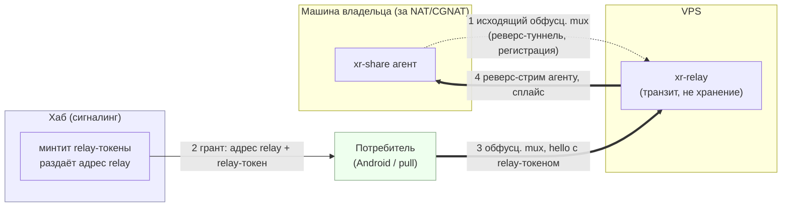

# LLD-23. Доступ к шаре без белого IP: реверс-relay поверх mux (XR-035)

**Статус:** Draft
**Область:** новый крейт `xr-relay` (транзит зашифрованных байтов между
потребителем и агентом за NAT; сам байты не читает и не хранит); `xr-share`
(исходящий реверс-туннель к relay, TLS-сертификат из identity-ключа,
обслуживание реверс-стримов тем же HTTP-роутером); `xr-hub` (сигналинг:
relay-дескриптор в грантах, признак достижимости шары, выпуск relay-токенов);
`xr-proto` (`RelayToken`, чётные/нечётные id стримов, адаптер `MuxStream` под
hyper, relay-клиент для потребителя); `xr-core` и `xr-share pull` (pinned-TLS
verifier, relay как последний адрес в переборе).
**Зависимости:** [LLD-19](19-file-sharing-agent.md) (шара, токены,
`AgentCredential`); [XR-046](../TASKS.md) (подписанный манифест: желателен
рядом, но не гейт, §3.3); [XR-050](../tasks/XR-050.md) (перебор адресов шары:
relay встаёт последним адресом, §3.6); [XR-064](../tasks/XR-064.md)
(UDP-транспорт: гейт фазы hole-punching, §7).

Сейчас шара доступна только при прямой достижимости агента: белый IP плюс
проброс порта либо агент на публичной машине (LLD-19 §2.5). Агент за NAT/CGNAT
снаружи не виден, а таких машин большинство (домашний ПК за роутером,
ноутбук за LTE). XR-035 закрывает дыру: недостижимый агент остаётся доступен
через посредника, при этом посредник не видит содержимое (E2E) и ничего не
хранит (транзит вслепую).

---

## 0. Схема relay-пути

Жирные стрелки (3 и 4) это транзит байтов, но внутри сплайса идёт TLS
потребитель <-> агент с пиннингом на ключ агента: relay видит только
шифртекст. Хаб остаётся чистым сигналингом, байты через него не идут
(инвариант LLD-19 §3.1 не трогаем).

## 1. Текущее состояние

- Достижимость агента только прямая: `addr:port` вручную в хабе, владелец
  отвечает за проброс (LLD-19 §2.5). За CGNAT шара не работает вовсе.
- Data-path потребитель -> агент это plain HTTP по умолчанию; TLS у агента
  опционален (файлы cert/key руками, фича `tls`). `agent_pubkey` едет в
  грантах до Android, но в data-path нигде не проверяется: пиннинг заявлен
  (LLD-19 §2.6), фактически не реализован.
- Обфусцированный mux в `xr-proto` умеет всё нужное для долгоживущего
  туннеля: keepalive Ping/Pong, детект мёртвого линка (XR-083), приоритет
  контрольных кадров (XR-086), reader не блокируется на writer (XR-084).
  Стримы сегодня открывает только инициатор соединения.
- `AgentCredential` уже есть (LLD-19 §9.2): долгоживущий мандат
  `{agent_pubkey, exp}` с подписью хаба, проверяется stateless. Это готовая
  идентичность агента для регистрации на relay.
- `ShareGrant` (LLD-19 §9.5) несёт `addr, port, agent_pubkey, token` на шару;
  расширяем, не ломая.

## 2. Целевое поведение

### 2.1 Реверс-туннель агента

- Агент с включённым relay (`[relay]` в конфиге) держит **постоянное
  исходящее** обфусцированное mux-соединение к relay и переподключается с
  экспоненциальным бэкофом. Исходящий TCP проходит любой NAT, пробросы не
  нужны.
- Сразу после mux-хендшейка агент открывает **регистрационный стрим**
  (Connect на псевдо-таргет `xr-relay:register`) и проходит
  challenge-response: relay шлёт nonce, агент отвечает
  `{agent_credential, подпись nonce identity-ключом}`. Relay проверяет мандат
  офлайн ключом хаба (как агент проверяет токены) плюс владение ключом по
  подписи, и кладёт соединение в реестр `agent_pubkey -> mux`.
- Регистрационный стрим остаётся открытым как признак живости: его закрытие
  или смерть mux (dead-link, XR-083) убирает агента из реестра. Повторная
  регистрация того же ключа вытесняет старое соединение (last-writer-wins,
  зомби глушится `shutdown()`, урок XR-086).

### 2.2 Путь потребителя

- Потребитель получает от хаба грант с relay-дескриптором (§2.4), открывает
  обфусцированное mux-соединение к relay и на каждый HTTP-коннект открывает
  стрим: Connect на псевдо-таргет `xr-relay:connect`, первым Data-кадром
  hello `{relay_token}`.
- Relay проверяет relay-токен офлайн (подпись хаба, TTL, привязка к
  `agent_pubkey`), находит агента в реестре, открывает **реверс-стрим** по
  его mux-соединению и дальше тупо сплайсит байты двух стримов.
- Ответ на hello: байт `OK` либо `Close` с причиной (агент офлайн, токен
  отвергнут), §2.5.
- HTTP-стек потребителя не меняется: relay-клиент в `xr-proto` поднимает
  loopback-forwarder (listener на `127.0.0.1:0`, каждое принятое соединение
  становится relay-стримом), а reqwest/ureq ходят на локальный адрес с
  resolve-override. Для sync-движка `xr-core` это просто ещё один base-URL.

### 2.3 E2E поверх сплайса

- Внутри relay-стрима идёт **TLS 1.3 потребитель <-> агент**, терминируется
  на агенте. Агент при старте генерирует self-signed сертификат из своего
  ed25519 identity-ключа (rcgen); потребитель проверяет не CA-цепочку, а
  **SPKI == `agent_pubkey` из гранта** (кастомный rustls-verifier, имя хоста
  игнорируется, пиннинг на ключ, не на адрес, в духе LLD-19 §2.6).
- На relay-пути такой TLS **обязателен**: без него relay видел бы плейнтекст.
  На прямом пути тот же identity-TLS включается как дефолт (закрывает
  «опц. TLS» из XR-046 и снимает часть боли XR-034).
- Авторизация на агенте не меняется: `ShareToken` проверяется агентом как и
  раньше, relay-токен это отдельный, более грубый гейт транзита.

### 2.4 Сигналинг на хабе

- Хаб знает свой relay из конфига (`[relay]`: `addr`, `port`, ключ
  обфускации; MVP это один relay на хаб). Агенту дескриптор отдаётся при
  `exchange`/`share add`, потребителю в грантах.
- `ShareRecord` получает признак достижимости `via_relay` (адрес может быть
  пустым). `GET /invite/{token}/shares` для такой шары минтит рядом с
  `ShareToken` ещё и `RelayToken` и кладёт в грант
  `relay: {addr, port, obf, relay_token}`.
- Потребитель пробует адреса по порядку: прямые, затем relay. Это ровно
  модель XR-050 (перебор адресов, первый ответивший), relay встаёт последним
  элементом списка; сами задачи независимы по коду (§3.6).

### 2.5 Отказы

- Агент офлайн (нет в реестре): relay отвечает `Close` с новым reason-байтом
  `CLOSE_REASON_AGENT_OFFLINE = 3` (старые клиенты лишний байт игнорируют,
  wire совместим). Потребитель показывает «источник недоступен», та же
  семантика, что различение из XR-096/099.
- Relay перезапустился: агент переподключается своей петлёй, потребитель
  ретраит соединение. Никакого состояния, кроме живых соединений, у relay
  нет, восстанавливать нечего.
- Мёртвый линк с обеих сторон ловится штатным mux-детектом (XR-083), зомби в
  реестре не живут дольше `DEAD_LINK_TIMEOUT`.

### 2.6 Учёт трафика

Каждый relayed-байт стоит двойного egress VPS (вход плюс выход). Relay
считает байты per `relay_token.share_id` атомиками и пишет агрегаты в лог
раз в интервал. Это и ops-видимость, и хук под метринг/квоты (XR-075/073);
никакого содержимого в счётчиках нет.

## 3. Дизайн-решения (развилки задачи закрыты здесь)

### 3.1 Relay это база, hole-punching это оптимизация после

Развилка из постановки решается порядком, а не выбором одного из двух.
Relay работает всегда (исходящий TCP проходит любой NAT), а hole-punching
через CGNAT и симметричный NAT часто не пробивается, то есть relay нужен
как fallback в любом случае. Строим сначала то, без чего нельзя. Punch
вдобавок требует UDP-транспорта данных (класс QUIC, XR-064), которого ещё
нет, а TCP simultaneous open ненадёжен. Сигналинг, E2E и реестр агентов,
спроектированные под relay, переиспользуются punch-фазой как есть (§7).

### 3.2 Relay это отдельный сервис, не хаб и не режим xr-server

Не хаб: юр-чистота LLD-19 §3.1 (хаб никогда не несёт байты) это центральное
требование, транзит выносится в отдельный процесс с отдельной ролью
(«транзит, не хранение»). Не xr-server: у прокси-выхода другая модель
угроз и жизненный цикл, склейка ролей мешала бы раздельному деплою и
лимитам. При этом код общий: `xr-relay` собирается из тех же кирпичей
`xr-proto` (Codec, Multiplexer, паттерны accept/semaphore/timeouts из
xr-server) и деплоится рядом с xr-server отдельным systemd-юнитом и
портом, сразу на оба существующих VPS (решение владельца).

### 3.3 E2E это pinned TLS до агента, не своя криптография

Свой Noise-канал сейчас означал бы бежать впереди протокола v2
(XR-060/061). Берём стандартный TLS 1.3, а доверие сводим к уже принятой
модели пиннинга ключа агента через хаб (TOFU, LLD-19 §2.6): сертификат
генерируется из identity-ключа, verifier сравнивает SPKI с `agent_pubkey`
из гранта. Relay не может ни читать, ни подменить содержимое: подмена
сертификата ломает пиннинг. Подписанный манифест (XR-046) остаётся
самостоятельной задачей о происхождении данных: он защищает и прямой
plain-HTTP путь, и не зависит от канала; желателен рядом, но relay-путь
без него уже целостен за счёт канала. Интерфейс сплайса байт-агностичен,
при переезде на v2 канал заменяется без правок relay.

### 3.4 Реверс-туннель агента поверх существующего mux

Постоянное исходящее соединение обязано уметь keepalive, детект мёртвого
линка, переподключение и мультиплекс многих потребителей. Всё это уже
есть в обфусцированном mux вместе с оплаченными уроками XR-083/084/086,
поэтому транспорт переиспользуется, а не пишется заново (подсказка прямо в
постановке задачи). Новое в mux ровно одно: стримы должен уметь открывать
и принимающий (relay в сторону агента). Id-space делится по чётности
(инициатор соединения нечётные, акцептор чётные), для действующих
клиентов VPN это ничего не меняет (сервер стримов не открывает, id для
него непрозрачны), версия wire не бампается.

### 3.5 Потребитель ходит к relay тем же обфусцированным mux

Единый листенер и один протокол на оба плеча: роль соединения различается
первым стримом (`xr-relay:register` против `xr-relay:connect`), никаких
новых кадров в wire. Обфускация плеча потребителя даёт анти-DPI
консистентно с остальным продуктом (relay стоит на тех же VPS, что и
прокси, и не должен выделяться на фоне). Hello с relay-токеном идёт первым
Data-кадром, а не в `TargetAddr` (там лимит 255 байт, токен длиннее).
Клиентский код у потребителя уже есть (mux-клиент в `xr-core`),
loopback-forwarder оставляет HTTP-стек нетронутым.

### 3.6 Сигналинг в грантах, relay это последний адрес перебора

Хаб уже раздаёт всё, что нужно потребителю для доступа к шаре
(`ShareGrant`), relay-дескриптор с токеном едет там же, отдельного
discovery-протокола не появляется. Модель отказоустойчивости совпадает с
XR-050 (список адресов, пробуем по очереди, берём первый ответивший):
relay это просто последний, самый дорогой адрес. Задачи развязаны: XR-050
может ехать до или после, стык только в порядке перебора.

### 3.7 Авторизация транзита отдельным relay-токеном

Без гейта relay был бы открытым rendezvous для любого, кто узнал
`agent_pubkey`, и бесплатным транзитом. Relay-токен минтится хабом
(домен-сепарированная подпись `xr-relay-token\nv1\n{share_id}\n{agent_pubkey}\n{exp}`,
тот же паттерн, что `ShareToken`), проверяется relay офлайн, привязан к
агенту и шаре, живёт по TTL гранта. Конечная авторизация остаётся на
агенте (`ShareToken` внутри E2E), relay видит только «этому предъявителю
можно транзит к этому агенту».

## 4. Изменения в коде

| Файл | Что меняется |
|---|---|
| `xr-proto/src/share.rs` | `RelayToken { share_id, agent_pubkey, exp, signature }` + sign/verify (домен `xr-relay-token`); `RelayDescriptor { addr, port, obf }`; поле `relay: Option<...>` в `ShareGrant`. |
| `xr-proto/src/protocol.rs` | `CLOSE_REASON_AGENT_OFFLINE = 3`. |
| `xr-proto/src/mux.rs` | Чётные/нечётные id стримов (параметр инициатор/акцептор); адаптер `MuxStream` -> `AsyncRead + AsyncWrite` (для hyper на агенте и сплайса на relay). |
| `xr-proto/src/relay_client.rs` (новый, feature `share`) | Клиент relay для потребителя: mux-соединение, стрим с hello, loopback-forwarder для HTTP-стека. |
| `xr-relay/` (новый крейт) | Листенер (обфусц. mux, скелет accept из xr-server), реестр `agent_pubkey -> mux` (вытеснение дублей), challenge-response регистрации, проверка relay-токенов, сплайс стримов, счётчики байтов per share, лимиты (§5). |
| `xr-share/` | `[relay]` в конфиге; uplink-петля к relay (реконнект с бэкофом); регистрационный стрим; обслуживание реверс-стримов тем же axum `Router` (hyper `serve_connection` поверх адаптера); identity-TLS: генерация self-signed cert из identity-ключа (rcgen), обязателен на реверс-стримах, дефолт на прямом листенере. |
| `xr-hub/` | `[relay]` в конфиге; `via_relay` в `ShareRecord`; relay-дескриптор агенту (в ответе `exchange`/`add`) и потребителю (минт `RelayToken` в `/invite/{token}/shares`); отметка «через relay» в админке. |
| `xr-core/src/sync.rs` + `update`-паттерн | Pinned-TLS verifier (SPKI == `agent_pubkey`); выбор транспорта по гранту: прямые адреса, затем relay через `relay_client`. JNI меняется только составом JSON гранта. |
| `xr-share/src/pull.rs` | Тот же fallback на relay через `relay_client` (десктопный харнесс всего флоу без устройства). |

Тесты (Rust, без сети, in-process через duplex):

- `test_relay_token_sign_verify` (валид / чужой ключ / протухший / чужая шара
  или агент -> reject) и домен-сепарация от `ShareToken`/`AgentCredential`.
- `test_mux_stream_id_parity` (обе стороны открывают стримы, id не
  сталкиваются; старый клиент против нового сервера живёт).
- `test_relay_registry` (регистрация, вытеснение дубля с глушением старого
  mux, снятие по закрытию register-стрима и по dead-link).
- `test_relay_hello` (без токена / плохая подпись / офлайн-агент ->
  `Close` с причиной; валидный -> `OK` и сплайс).
- `test_relay_splice_opaque` (сплайс гоняет произвольные байты в обе стороны
  и пробрасывает закрытие; relay не парсит содержимое, транзит структурно
  слеп).
- `test_agent_serves_over_reverse_stream` (манифест и файл отдаются через
  реверс-стрим тем же роутером, `ShareToken` проверяется как раньше).
- `test_identity_cert_spki` (SPKI сертификата == identity-ключ агента).
- `test_pinned_verifier` (кастомный verifier принимает cert агента,
  отвергает чужой: MITM со стороны relay ломается о пиннинг).
- Интеграционный: агент + relay + потребитель в одном процессе, полный флоу
  манифест + файл через relay с E2E TLS, сверка SHA-256.

## 5. Риски и edge-кейсы

1. **Двойной egress VPS.** Каждый relayed-байт проходит VPS дважды; шары в
   десятки ГБ делают relay дорогим. Ответ: счётчики per share (§2.6), прямой
   путь всегда первым в переборе, hole-punching как следующая фаза (§7).
2. **Relay как открытый транзит / DoS.** Гейт relay-токеном (§3.7), лимиты:
   семафор соединений и стримов (паттерн xr-server `max_connections`),
   idle-timeout стримов, кап регистраций с одного IP. Псевдо-таргеты
   `xr-relay:*` не резолвятся в сеть: relay не умеет соединяться наружу,
   SSRF-класс исключён конструктивно.
3. **Долгие загрузки против лайфтайм-капа mux.** У VPN-mux принудительный
   реконнект (4ч) и стагер; обрыв реверс-туннеля роняет живые стримы.
   Докачка Range уже есть у потребителя (LLD-19 §5.5), агент при плановой
   ротации uplink держит старое соединение до опустошения стримов
   (drain, как стагер XR-086).
4. **Часы и TTL.** Relay проверяет `exp` токенов по своим часам; перекос
   часов VPS лечится NTP, окно nonce challenge-response от replay не зависит
   от часов вовсе.
5. **Зомби-агент в реестре.** Агент умер без FIN (LTE-обрыв): реестр чистится
   по `DEAD_LINK_TIMEOUT` (XR-083) и вытеснением при переподключении;
   потребитель в окне зомби получает `AGENT_OFFLINE` после таймаута
   реверс-Connect.
6. **Приватность реестра.** Relay знает `agent_pubkey`, живость и объём
   шифртекста, содержимое и листинг не видит (E2E §3.3, слепой сплайс
   `test_relay_splice_opaque`). Логи без токенов и без имён шар.
7. **Совместимость wire.** Ни одного нового кадра: псевдо-таргеты, hello в
   Data, reason-байт в Close (старые игнорируют), чётность id прозрачна для
   действующих клиентов. Обычный VPN-клиент, случайно пришедший на порт
   relay, отваливается на challenge (не знает `xr-relay:*`), и наоборот.
8. **Компрометация VPS с relay.** Даёт наблюдение метаданных и отказ в
   обслуживании, но не байты (E2E) и не право доступа (токены минтит хаб,
   ключа хаба на relay нет, только публичный).

## 6. План проверки

Rust-часть автотестами (§4). Живой сценарий:

1. Агент на машине за NAT (без пробросов), `[relay]` включён -> в админке
   хаба шара помечена «через relay», агент числится онлайн.
2. Android вне LAN агента: список шар приходит, манифест открывается, файл
   скачивается, SHA-256 сходится. На агенте в логах реверс-стримы, на relay
   только счётчики байтов.
3. `xr-share pull --invite ...` с третьей машины: тот же флоу без устройства.
4. Прямой путь жив: шара с белым IP качается напрямую, relay в переборе не
   участвует (по логам relay ноль стримов).
5. Отказ: остановить агента -> потребитель получает «источник недоступен»
   быстро (не таймаут-минуты); запустить -> доступ восстанавливается без
   действий на relay/хабе.
6. Рестарт relay -> агент сам переподключается в пределах минуты, доступ
   восстанавливается.
7. E2E: tcpdump на VPS relay показывает только обфусцированный поток, ни
   одной сигнатуры HTTP/TLS-plaintext манифеста; подмена сертификата на
   relay (тестовый MITM) роняет скачивание ошибкой пиннинга.
8. `cargo test --workspace` зелёный, 0 warnings.

## 7. Фаза 2: hole-punching (набросок, отдельная задача после XR-064)

Цель: байты напрямую агент <-> потребитель, relay остаётся сигналингом и
fallback'ом. Контур: обе стороны уже держат соединения к relay, он видит их
внешние `addr:port` (готовый STUN-наблюдатель); по control-стримам стороны
обмениваются кандидатами и бьют одновременный UDP-punch; транспорт данных
поверх пробитой дыры это UDP/QUIC-класс из XR-064 (стримы, потери, 0-RTT),
E2E тот же пиннинг ключа агента. Не пробилось (симметричный NAT/CGNAT с
обеих сторон) -> остаёмся на relay, поведение фазы 1. Отдельная задача в
бэклог после посадки XR-064; сюда не тянем ни строчки.

## 8. Вне скоупа

- **Hole-punching** (§7, отдельной задачей).
- **Несколько relay / выбор ближайшего**: MVP один relay на хаб; мульти-relay
  по паттерну `ServerPool` позже, если упрёмся.
- **Квоты и биллинг трафика**: здесь только счётчики (§2.6), политика в
  XR-073/075.
- **Автодетект достижимости** (агент сам понимает, что за NAT, и включает
  relay): MVP это явный `[relay]` в конфиге / флаг при `share`.
- **Подписанный манифест**: XR-046, самостоятельная задача (§3.3).
- **Relay для не-share трафика** (туннель VPN через relay): другая задача с
  другой экономикой.

## 9. Открытые вопросы (закрыты в этом дизайне)

- *Relay против hole-punching?* -> **relay база, punch оптимизация после
  XR-064** (§3.1).
- *Где живёт relay?* -> **отдельный крейт/сервис на тех же VPS** (§3.2).
- *E2E?* -> **pinned TLS до агента поверх слепого сплайса** (§3.3).
- *Транспорт?* -> **обфусцированный mux на обоих плечах, реверс-стримы через
  чётность id** (§3.4, §3.5).
- *Сигналинг?* -> **хаб, relay-дескриптор и relay-токен в грантах** (§3.6,
  §3.7).
- *Деплой первой выкатки?* -> **сразу на оба VPS** (решение владельца при
  утверждении дизайна).
