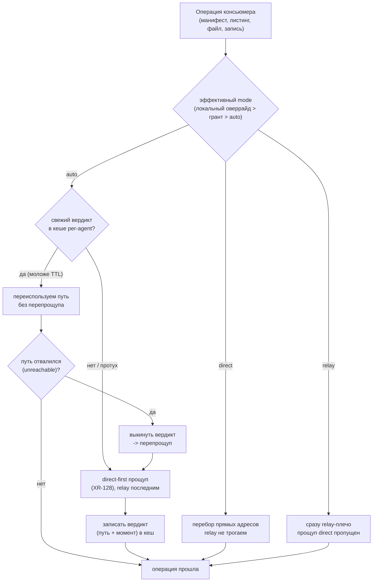

# LLD-26. Режим доступа к шаре: auto/direct/relay, кеш вердикта и health-ручка (XR-129)

**Статус:** Draft
**Область:** `xr-proto` (перечисление `AccessMode`, поле у `ShareRecord` и
`ShareGrant`); `xr-hub` (умный дефолт режима при регистрации, эндпоинт смены
режима, минт режима в грант); `xr-core` (учёт режима в `direct_then_relay`, кеш
auto-вердикта per-agent с TTL); `xr-share` (health-ручка агента, флаг `--mode` у
`share`); `xr-android` (переключатель режима на карточке шары как локальный
оверрайд консьюмера).
**Зависимости:** [LLD-23](23-share-relay-nat.md) (direct/relay-механика, реестр
агентов, relay-токены и гранты, `direct_then_relay`); [XR-128](../TASKS.md)
(устойчивый direct-first-прощуп с fallback на relay, поверх которого эта задача
строит режимы и кеш); стык с [LLD-33](33-share-git-sync.md) (харнесс синка тоже
выбирает путь и может опереться на тот же кеш, разобрано в п. 2.6).

XR-128 сделал правильный дефолт: консьюмер идёт direct-first, коротко прощупывает
прямой путь и уходит на relay, если direct молчит. По дизайну XR-128 остались две
претензии из ревью. Прощуп повторяется на каждую операцию, а при пофайловом
скачивании и на каждый файл. И нет ручного оверрайда, когда владелец шары или сам
консьюмер точно знают ситуацию (агент заведомо за NAT, либо у агента стабильный
белый IP). Обе претензии закрываются здесь, при этом фиксировать тип шары один раз
как единственный механизм нельзя: достижимость это не свойство шары, а свойство
четвёрки (потребитель, агент, сетевой путь, момент времени). IP агента плавает
(DHCP, переезд ноутбука между сетями), достижимость разная у разных потребителей
(телефон в той же LAN дотянется напрямую, друг за CGNAT нет), проверка при
добавлении смотрит с точки хаба, а важна точка потребителя в момент доступа, и
транзиентный сбой (ребут роутера, моргнул провайдер) прощуп переживает, а
фиксированный тип нет. Поэтому `auto` остаётся дефолтом и настоящим прощупом,
а `direct`/`relay` это ручные оверрайды поверх него, не замена.

---

## 0. Схема выбора пути

Кеш и прощуп живут у консьюмера (`xr-core`), а не на хабе: реачабилити это
взгляд потребителя, момент времени ограничен TTL. Режим приезжает в гранте от
хаба как дефолт владельца, локальный оверрайд консьюмера его перекрывает.

## 1. Текущее состояние

- `direct_then_relay` ([sync.rs](../../xr-core/src/sync.rs), функция около строки
  1292) это ядро XR-128. Он перебирает прямые адреса-кандидаты (LAN раньше
  публичного, XR-050), каждый при наличии запасного пути пробуется коротким
  liveness-прощупом `direct_reachable` (`DIRECT_PROBE_TIMEOUT` = 6с, строка 1260),
  первый ответивший обслуживает операцию, relay-плечо поднимается последним. Мёртвый
  LAN-IP снаружи отсекается за секунды вместо полного таймаута.
- Прощуп повторяется на каждый вызов `direct_then_relay`, а вызывается он на каждую
  операцию: `sync_share_grant` (строка 920), `upload_file` (959), `delete_file`
  (996) и остальные заходят в него самостоятельно. Состояния между операциями нет,
  так что серия открытий и пофайловых скачиваний перепрощупывает один и тот же
  агент раз за разом. Это и есть хвост из ревью XR-128.
- `direct_reachable` ([sync.rs](../../xr-core/src/sync.rs)) прощупывает агент
  неавторизованным `GET /healthz` и живым считает только ответ самого агента
  (`2xx` с телом `ok`); транспортная ошибка, таймаут и чужой ответ это
  недоступность. Так это стало после XR-219: до него прощуп ходил на
  `GET /{share_id}/manifest` и живостью считал любой HTTP-ответ, из-за чего чужой
  хост на приватном адресе забирал операцию себе.
- Ручка `GET /healthz` ([server.rs](../../xr-share/src/server.rs), строка 191)
  отдаёт голый `ok`, версии и статуса relay-аплинка не несёт.
- Достижимость шары фиксируется на хабе одним булевым `via_relay` у `ShareRecord`
  ([share.rs](../../xr-proto/src/share.rs), строка 155), выставляется один раз при
  регистрации: CLI `xr-share share --relay`/`--no-relay`
  ([cli.rs](../../xr-share/src/cli.rs), `resolve_via_relay` строка 49) шлёт флаг в
  `POST /share/add` ([share_v2.rs](../../xr-hub/src/api/share_v2.rs), строка 191).
  `via_relay` = «relay-плечо доступно» и определяет, минтит ли хаб `RelayGrant` в
  грант потребителя (`invite_shares` около строки 499). Поменять его после
  регистрации нечем: эндпоинта правки `ShareRecord` на хабе нет (роуты в
  [mod.rs](../../xr-hub/src/api/mod.rs)), только `unshare` и повторный `add`.
- Консьюмер режима не выбирает вовсе. Android ([Share.kt](../../xr-android/app/src/main/java/com/xrproxy/app/model/Share.kt))
  из `ShareConfig` собирает `agentBaseUrls` (LAN-адреса плюс публичный, строка 204)
  и `relayArg` (`relayJson` или пустая строка, строка 197) и отдаёт их в нативный
  слой; вся логика перебора-с-fallback живёт в Rust. Карточка шары
  ([FilesScreen.kt](../../xr-android/app/src/main/java/com/xrproxy/app/ui/files/FilesScreen.kt))
  показывает только вкл/выкл синка и число выбранных файлов; единственный
  per-share тумблер это `Switch` синка в `ShareActionsSheet` (строка 436).

## 2. Целевое поведение

### 2.1 Режим `AccessMode` у шары и в гранте

- `AccessMode { Auto, Direct, Relay }` в [share.rs](../../xr-proto/src/share.rs),
  сериализуется строкой `"auto"|"direct"|"relay"`, `Default` это `Auto`. Поле
  `mode` добавляется у `ShareRecord` и у `ShareGrant` с `#[serde(default)]`, так что
  записи и гранты, написанные до XR-129, грузятся как `auto` (ровно текущее
  поведение). Отдельного поля у `RelayGrant` не заводим: режим это политика на
  весь доступ к шаре, relay-плечо остаётся описанием транспорта.
- Смысл значений для консьюмера:
  - `auto` (дефолт): прощуп direct-first с fallback на relay (XR-128) плюс кеш
    вердикта (п. 2.2). Настоящая проверка достижимости в момент доступа.
  - `direct`: перебираем только прямые адреса, relay-плечо не трогаем даже если оно
    есть в гранте. Прощуп с коротким дедлайном не нужен: если прямых путей нет,
    операция честно падает недоступностью. Для агента со стабильным белым IP.
  - `relay`: прямой прощуп пропускаем целиком, идём сразу на relay-плечо. Экономит
    дедлайн прощупа там, где владелец знает, что агент за NAT и direct заведомо
    молчит. Грант без relay-плеча при `mode = relay` это рассогласование хаба
    (не должно случаться, минт плеча идёт по тому же признаку); консьюмер трактует
    его как недоступность с внятным текстом, а не молча уходит на прощуп.
- Режим `direct`/`relay` переключается мгновенно и без перепрощупа: он ничего не
  измеряет, а фиксирует политику.

### 2.2 Кеш auto-вердикта per-agent с TTL

Прямой ответ на «зачем прощупывать постоянно». Кеш живёт в `xr-core`
([sync.rs](../../xr-core/src/sync.rs)) и обслуживает только `auto`; `direct`/`relay`
детерминированы и кеша не касаются.

- Ключ это `agent_pubkey` (пиннингованная идентичность агента, стабильна при смене
  IP), а не share_id: достижимость это свойство хоста агента и общая для всех его
  шар. Значение это вердикт `{ путь, момент }`, где путь это либо выигравший прямой
  адрес `host:port`, либо маркер `Relay`, а момент это `Instant` снятия. Базовый URL
  под конкретную шару достраивается из `host:port` и share_id на месте, так что один
  вердикт переиспользуется всеми шарами агента.
- Хранилище это модульный `static VERDICT_CACHE: OnceLock<Mutex<HashMap<..>>>`
  в `sync.rs` (процесс-глобальный, как это нужно на стыке с JNI, где каждый
  `nativeXxx` это отдельный заход в FFI без общего объекта). Кеш чисто в памяти,
  переживать перезапуск ему незачем.
- TTL порядка 45с (константа, в вилке брифа 30-60с). При лукапе вердикт старше TTL
  игнорируется и вычищается; серия открытий и пофайловых скачиваний внутри окна
  переиспользует одно решение, а не перепрощупывает.
- В `auto` `direct_then_relay` сперва смотрит кеш: свежий вердикт `Direct(host:port)`
  гоняет `op` сразу по этому адресу без прощупа, вердикт `Relay` сразу поднимает
  relay-плечо. Промах или протухший вердикт это полный прощуп XR-128, по итогу
  которого выигравший путь пишется в кеш.
- Инвалидация двойная. По TTL (окно момента из четвёрки). И по факту: если `op` на
  кешированном пути падает ошибкой недоступности (`should_try_next`, строка 1370),
  вердикт выкидывается и происходит полный перепрощуп. Так реальная смена пути
  (агент переехал в другую сеть, провайдер моргнул) стоит одной неудачной операции
  плюс перепрощуп, а не молчаливого залипания на мёртвом адресе.

### 2.3 Health-ручка агента

- `GET /health` у агента ([server.rs](../../xr-share/src/server.rs)): без auth,
  крошечный JSON `{ "ok": true, "version": "<crate>", "relay": "up"|"down"|"off" }`.
  Ручка агентовая, не пошаренная: живость это свойство хоста, share_id ей не нужен,
  поэтому она рядом с существующей `/healthz`, а не под `/{share_id}`.
- Существующую `/healthz` (голый `ok`) оставляем как есть для тех, кто её уже дёргает;
  `/health` это её расширение под прощуп и диагностику, дублирующего смысла не
  плодим. `relay` в ответе это статус реверс-аплинка агента к relay (`up` держит
  туннель, `down` включён, но сейчас оборван, `off` не сконфигурирован), полезно в
  диагностике «почему шара за NAT не открывается».
- `direct_reachable` ([sync.rs](../../xr-core/src/sync.rs)) переключается с
  `GET /healthz` на `GET /health`: тот же хостовый уровень, но с диагностикой в
  ответе. Живостью считается `2xx` с телом, где `ok = true`; всё прочее (чужой
  JSON, HTML captive-портала, статус не `2xx`) это недоступность, адрес держит не
  наш агент. Правило «любой валидный ответ это живость» снято в XR-219: по
  приватному адресу в чужой сети отвечает роутер или заглушка провайдера, и её
  ответ уезжал пользователю как ответ агента. Остальные поля (`version`, `relay`)
  прощуп не читает, они для ручной проверки и будущей админки.
- Дёргает health **консьюмер по прямому адресу агента**, а не хаб. Relay доступен
  всегда через реестр, вопрос ровно в достижимости direct с точки консьюмера, а её
  видно только с места консьюмера. Отдельный одноразовый заход хаба на health при
  регистрации это умный дефолт (п. 2.4), к прощупу консьюмера он отношения не имеет.

### 2.4 Умный дефолт режима при регистрации

- При `POST /share/add` ([share_v2.rs](../../xr-hub/src/api/share_v2.rs)) хаб, если
  режим не задан явно, делает best-effort короткий заход на `http://<addr>:<port>/health`
  публичного адреса агента. Ответ пришёл: начальный `mode = auto` (агент снаружи
  виден, прощуп разберётся). Не ответил в короткий дедлайн: начальный `mode = relay`
  и `via_relay = true` (агент похоже за NAT, нет смысла гонять консьюмеров в глухой
  direct-прощуп). Заход строго не фатальный: провал прощупа лишь смещает дефолт к
  relay, регистрацию не роняет.
- Это подсказка для стартового значения, а не замена прощупа. Вантаж-пойнт хаба
  отличается от консьюмерского (хаб мог дотянуться, а друг за CGNAT нет, и
  наоборот), поэтому в `auto` консьюмер всё равно проверяет сам. Владелец переопределяет
  дефолт флагом (п. 2.5).
- Явный режим в запросе (`--mode` из CLI) старше умного дефолта: если владелец
  сказал `direct`, health-заход хаба не делается вовсе.

### 2.5 Управление режимом: владелец и консьюмер

Две точки контроля, обе честно ложатся на четвёрку.

- **Дефолт владельца, хаб-сайд.** `mode` у `ShareRecord` это утверждение владельца
  на всю шару, минтится в грант. Ставится флагом `xr-share share --mode auto|direct|relay`
  ([cli.rs](../../xr-share/src/cli.rs)); старые `--relay`/`--no-relay` остаются
  синонимами `--mode relay`/`--mode direct` для совместимости привычки. Сменить
  режим после регистрации, не пересоздавая шару, позволяет новый self-service
  эндпоинт `POST /share/setmode` (мандат агента в теле, как у `add`/`unshare`):
  правит `mode` у записи и сохраняет. «Мгновенно» тут значит, что следующий фетч
  гранта несёт новый режим, перепрощупа при этом нет.
- **Локальный оверрайд консьюмера, девайс-сайд.** Реачабилити это взгляд
  потребителя, поэтому у консьюмера есть право прибить режим под свой вантаж, не
  трогая хаб. Переключатель на карточке шары в приложении (п. 2.6) хранится в
  `ShareConfig` локально и перекрывает режим гранта для этого устройства. Это
  прямой ответ на четвёрку: владелец задаёт дефолт на шару, каждый консьюмер может
  зафиксировать свою точку. Оверрайд мгновенный и без сетевого раунд-трипа.
- Эффективный режим, который получает `xr-core`, это `локальный оверрайд, иначе
  режим гранта, иначе auto`. Слои схлопываются на стороне вызывающего (JNI/приложение
  и десктопный харнесс), а `direct_then_relay` принимает уже один готовый
  `AccessMode` и про слои не знает.

### 2.6 Приложение и стыки

- Android: переключатель `auto/direct/relay` едет в `ShareActionsSheet`
  ([FilesScreen.kt](../../xr-android/app/src/main/java/com/xrproxy/app/ui/files/FilesScreen.kt),
  строка 436) рядом с тумблером синка. Бэкенд это новое поле у `ShareConfig`
  ([Share.kt](../../xr-android/app/src/main/java/com/xrproxy/app/model/Share.kt),
  строка 167) с сериализацией в `toJson`/`fromJson`, сеттер во `FilesViewModel` по
  образцу `setSyncEnabled`, и учёт эффективного режима при сборке аргументов для
  нативного слоя (что фильтровать в `agentBaseUrls`/`relayArg`). По правилу проекта
  Android без автотестов: логика режима и кеш живут и тестируются в `xr-core`, слой
  Kotlin тонкий.
- JNI ([lib.rs](../../xr-android-jni/src/lib.rs)): `mode` едет в JSON гранта рядом с
  `addrs`/`relay` (около строк 1219-1231) и восстанавливается в `grant_from_parts`
  (около 1534); эффективный режим прокидывается параметром в вызовы синка и записи.
- Десктопный харнесс `xr-share pull`/`push`/`sync` учитывает `mode` из гранта; флаг
  локального оверрайда харнессу пока не нужен (у одноразовой команды нет карточки
  для переключения, при надобности добавится параметром).
- Стык с LLD-33 (git-синк): его харнесс тоже выбирает путь и перевыбирает по обрыву;
  кеш вердикта per-agent из этой задачи ему пригодится как есть, но не является для
  него гейтом (цикл синка выбирает путь один раз на сессию). Ручка HEAD из LLD-33 и
  health из этой задачи не пересекаются: health без auth и про достижимость, HEAD
  под грантом и про данные.

## 3. Дизайн-решения

### 3.1 Режим это оверрайд поверх прощупа, а не его замена

Фиксировать тип шары один раз как единственный механизм нельзя: достижимость это
свойство четвёрки, а не шары (аргументы в шапке). Поэтому `auto` остаётся дефолтом
и настоящим прощупом XR-128, а `direct`/`relay` это ручные оверрайды для случая,
когда человек знает ситуацию точно. Претензия «зачем постоянно проверяем» бьёт не в
сам прощуп, а в его повтор на каждую операцию, и снимается кешем (п. 2.2), не отменой
измерения. Так транзиентный сбой прощуп по-прежнему переживает, а серия операций
платит за прощуп один раз на TTL.

### 3.2 Кеш ключуется агентом, а не шарой, и живёт у консьюмера

Достижимость общая для всех шар одного агента (это про его хост и сеть), поэтому
ключ вердикта это `agent_pubkey`, а не share_id: одно измерение переиспользуется
всеми шарами агента. Кеш обязан жить у консьюмера (`xr-core`), потому что момент и
точка это его вантаж, а не хабский. Значение хранит выигравший путь, а не готовый
базовый URL, чтобы достроить URL под любую шару агента. Инвалидация двойная (TTL
плюс факт неудачи на кешированном пути) ровно потому, что вердикт это материализация
четвёрки: TTL закрывает ось момента, а неудача ловит смену оси пути раньше, чем
истечёт TTL.

### 3.3 Health отдельной ручкой, а не прощупом манифеста

Прощуп XR-219 сидит на `/healthz`, и это уже правильный уровень: ручка агентовая,
share_id ей не нужен, ответ в две буквы. Отдельная `/health` добавляет к тому же
крошечному телу версию и статус relay-аплинка, полезные в диагностике «почему шара
за NAT не открывается». Расширяем существующую `/healthz`, а не плодим третью
ручку живости. Тело сверяется по-прежнему (`ok = true` вместо голого `ok`):
живостью считается ответ нашего агента, а не факт того, что по адресу кто-то есть.
Проверяет ручку консьюмер по прямому адресу: relay доступен всегда, измерять надо
ровно достижимость direct с места потребителя.

### 3.4 Умный дефолт это хабская подсказка, не источник истины

Хаб при регистрации видит агент со своего вантажа, и этого достаточно, чтобы
выбрать разумное стартовое значение (виден снаружи -> `auto`, молчит -> `relay`), но
не чтобы зафиксировать режим навсегда: у консьюмера вантаж другой. Поэтому health-заход
хаба это best-effort и не фатален, а `auto` в любом случае перепроверяет с места
консьюмера. Явный `--mode` владельца старше подсказки.

### 3.5 Две точки контроля: дефолт владельца и оверрайд консьюмера

Брифовое «оверрайд на стороне хаба» и четвёрка «реачабилити это взгляд потребителя»
не спорят, если развести роли. Владелец задаёт дефолт на всю шару (хаб-сайд, минтится
в грант, правится `--mode` и `setmode`). Консьюмер поверх может прибить режим под
свой вантаж локально (девайс-сайд, без раунд-трипа). Эффективный режим это `оверрайд
консьюмера, иначе грант, иначе auto`, слои схлопываются до одного `AccessMode` у
границы `xr-core`, так что ядро и его тесты про слои не знают.

### 3.6 Режим не подписывается

`mode` это политика транспорта, а не авторитет. Подделанный режим меняет лишь то,
какой путь консьюмер попробует, и оба пути гейтятся теми же токенами (`ShareToken`
у агента, `RelayToken` у relay), что и без режима. Поэтому поле не входит в
подписываемые байты и не требует своего домена, в отличие от подписи манифеста и
подписанного HEAD. MITM, подменивший `mode`, ничего не выигрывает: доступ он этим не
получает, максимум перегонит консьюмера на заведомо мёртвый путь, что тот же отказ,
что и без подмены.

## 4. Изменения в коде

| Файл | Что меняется |
|---|---|
| `xr-proto/src/share.rs` | `enum AccessMode { Auto, Direct, Relay }` (serde строкой, `Default = Auto`); поле `mode: AccessMode` (`#[serde(default)]`) у `ShareRecord` и `ShareGrant`. |
| `xr-hub/src/api/share_v2.rs` | `AddShareReq.mode: Option<AccessMode>`; умный дефолт (health-заход на публичный адрес при отсутствии явного режима, п. 2.4); минт `mode` в `ShareGrant` внутри `invite_shares`; новый хендлер `setmode` (мандат агента, правка `ShareRecord.mode` + сохранение). |
| `xr-hub/src/api/mod.rs` | Роут `POST /share/setmode` в ряду self-service (`add`/`unshare`/`attach`). |
| `xr-hub/src/api/shares.rs` | `create_share` проставляет `mode` (по умолчанию `Auto`), чтобы админ-SPA-путь не ломал форму записи. |
| `xr-hub/admin-ui/` | Колонка/бейдж режима у шары в списке (данные уже есть в записи; смена режима из SPA за пределами MVP, отдельной строкой в п. 7). |
| `xr-core/src/sync.rs` | Параметр `mode: AccessMode` в `direct_then_relay` и прокинуть его через `sync_share_grant`/`upload_file`/`delete_file` и родственные; ветвление `direct`/`relay`/`auto`; `static VERDICT_CACHE` (per-agent, TTL) с лукапом и двойной инвалидацией; `direct_reachable` переводится с `/healthz` на `GET /health` и сверяет `ok = true` в теле. |
| `xr-share/src/server.rs` | Роут `GET /health` (без auth, JSON `{ok, version, relay}`); `/healthz` не трогаем. Статус relay-аплинка агент отдаёт из состояния реверс-туннеля (фича `relay`; в сборке без неё `relay = "off"`). |
| `xr-share/src/cli.rs`, `xr-share/src/main.rs` | Флаг `--mode` со значением `auto`, `direct` или `relay` у `share` (старые `--relay`/`--no-relay` это синонимы `relay`/`direct`); режим уезжает в тело `share/add`. |
| `xr-android-jni/src/lib.rs` | `mode` в JSON гранта и в `grant_from_parts`; эффективный режим параметром в вызовы синка/записи. |
| `xr-android/.../model/Share.kt` | Поле режима у `ShareConfig` (сериализация в `toJson`/`fromJson`); учёт эффективного режима при сборке `agentBaseUrls`/`relayArg`. |
| `xr-android/.../ui/files/FilesScreen.kt`, `FilesViewModel.kt` | Переключатель режима в `ShareActionsSheet`; сеттер во `FilesViewModel` по образцу `setSyncEnabled`. |

Долгоживущие доки (правятся в этой же задаче, п. 2 правила документации):

| Документ | Что меняется |
|---|---|
| `docs/ARCHITECTURE.md` | Строка LLD-26 в разделе 9. После реализации факты переезжают: в разд. 4.7 (режимы поверх `direct_then_relay`, кеш вердикта, health-ручка), в разд. 4.2 (кеш auto-вердикта в `xr-core`), в разд. 4.6 (переключатель режима на карточке), в разд. 5.3 (эндпоинты `/health` у агента и `/share/setmode` у хаба), в разд. 4.1 (`AccessMode`). |
| `README.md` | В разделе файлообмена: режим доступа к шаре (auto/direct/relay) и что auto это дефолт-прощуп. |
| `xr-share/README.md` | Флаг `share --mode`, ручка `/health`, что relay-статус видно в её ответе. |
| `configs/server.toml` (блок хаба) | Комментарий про health-заход умного дефолта при регистрации, если понадобится тюнить его дедлайн. |

Тесты (Rust; логика и кеш в `xr-core`, серверные это роутер-тесты axum как в
`server.rs`; Android без автотестов по правилу проекта):

- `test_access_mode_serde`: `auto/direct/relay` гоняются в строку и обратно;
  отсутствующее поле в старом гранте/записи грузится как `auto` (совместимость
  `#[serde(default)]`).
- `test_mode_direct_skips_relay`: `mode = direct` перебирает только прямые адреса и
  не поднимает relay-плечо даже когда оно есть в гранте; при мёртвом direct падает
  недоступностью, а не уходит на relay.
- `test_mode_relay_skips_probe`: `mode = relay` идёт сразу на relay без direct-прощупа
  (детерминированно: одноразовый direct-сервер, который принял бы соединение, не
  получает ни одного); грант без relay-плеча даёт внятную ошибку.
- `test_verdict_cache_reuse`: в `auto` две операции подряд по одному агенту делают
  один прощуп, вторая переиспользует вердикт (счётчик прощупов на моке = 1).
  Детерминированно на мок-часах (`tokio::time`), а не на sleep.
- `test_verdict_cache_ttl`: вердикт старше TTL игнорируется, следующая операция
  перепрощупывает (прокрутка часов за TTL).
- `test_verdict_cache_evict_on_failure`: кешированный путь отвалился ошибкой
  недоступности -> вердикт выкинут, произошёл полный перепрощуп, операция ушла по
  новому пути.
- `test_verdict_cache_keyed_by_agent`: вердикт, снятый на одной шаре агента,
  переиспользуется другой шарой того же `agent_pubkey`; смена ключа агента вердикт
  не переиспользует.
- `test_health_route`: `GET /health` без токена отдаёт `200` и валидный JSON с
  `ok/version/relay`; `relay` это `off` в сборке без фичи relay.
- `test_direct_reachable_uses_health`: прощуп ходит на `/health`, живой агент
  доступен, а транспортная ошибка, таймаут и ответ с `ok = false` или без него это
  недоступность (детерминированно, как существующий тест таймаута прощупа). Набор
  чужих ответов берётся у `probe_accepts_only_agent_healthz` из XR-219.
- `test_smart_default_on_add`: `add` без явного режима при недостижимом публичном
  адресе ставит `relay` + `via_relay`, при достижимом `auto`; явный `--mode` health-заход
  не делает. Health-заход замокан, не фатален при провале.
- `test_setmode_roundtrip`: `setmode` мандатом агента меняет `mode` у записи, чужой
  мандат отвергается, следующий грант несёт новый режим.
- Интеграционный: агент + relay + консьюмер в одном процессе; серия из манифеста и
  нескольких файлов в `auto` делает один прощуп; переключение на `relay` уводит
  трафик на relay без прощупа; на `direct` relay не участвует (ноль стримов на relay).

Это новая функциональность, регрессионного бага нет: тесты фиксируют поведение по
пирамиде (юнит на serde/кеш/режимы, интеграционный на стык транспорта и режима).

## 5. Риски и edge-кейсы

1. **Кеш переживает реальную смену пути.** Агент переехал в другую сеть внутри окна
   TTL: первая операция по кешированному мёртвому адресу упадёт недоступностью, что
   выкинет вердикт и перепрощупает (п. 2.2). Цена это одна неудачная операция плюс
   перепрощуп, не залипание: TTL короткий, а факт-инвалидация ловит смену раньше TTL.
2. **`mode = relay` без relay-плеча в гранте.** Рассогласование хаба (минт плеча идёт
   по тому же признаку, что режим). Консьюмер не молчит и не уходит тайком на прощуп,
   а отдаёт внятную недоступность; на хабе это чинится `setmode`/повторным `add`.
3. **Вантаж хаба врёт про достижимость.** Умный дефолт при регистрации это подсказка,
   не истина (п. 3.4): хаб мог дотянуться, а друг за CGNAT нет, и наоборот. `auto`
   страхует, перепроверяя с места консьюмера; неверный дефолт максимум стоит лишнего
   первого прощупа не в ту сторону.
4. **Гонка на процесс-глобальном кеше.** Несколько операций разных шар одного агента
   параллельно: `Mutex` сериализует доступ к карте, критическая секция это лукап и
   запись вердикта, сам `op` идёт вне лока. Двойной прощуп в узком окне до первой
   записи безвреден (оба придут к тому же вердикту).
5. **Health как поверхность без auth.** Ручка отдаёт версию и грубый статус
   relay-аплинка. Версия и так видна в баннерах, тайны в ней нет; статус аплинка это
   `up/down/off` без адресов и токенов. DoS-поверхность та же, что у существующей
   `/healthz`, лимиты соединений агента её кроют.
6. **Локальный оверрайд расходится с реальностью.** Консьюмер вручную прибил `direct`,
   а сам ушёл за CGNAT: доступ пропал, пока не вернёт `auto` или `relay`. Это цена
   ручного оверрайда и осознанный выбор пользователя; дефолт `auto` от неё свободен.
7. **Совместимость.** Поле `mode` везде `#[serde(default) = Auto]`: старые записи,
   гранты и клиенты грузятся и ведут себя ровно как XR-128. Старый консьюмер новый
   грант с `mode` игнорирует (прощупывает как раньше), новый консьюмер старый грант
   без `mode` читает как `auto`. Ни бампа версии, ни нового кадра.

## 6. План проверки

Rust-часть автотестами (разд. 4). Живой сценарий:

1. Агент за NAT, регистрация без явного режима: в записи хаба `mode = relay` и
   `via_relay`, `curl /health` агента снаружи не отвечает (за NAT), изнутри LAN
   отдаёт JSON с `relay = "up"`.
2. Агент на белом IP, регистрация: `mode = auto`, `/health` снаружи отвечает.
3. Консьюмер в `auto` открывает шару и качает несколько файлов: в логах `xr-core`
   один прощуп на серию (кеш), не по прощупу на файл.
4. Переключение карточки на `relay`: трафик идёт на relay сразу, direct-прощупа в
   логах нет; на `direct`: relay в переборе не участвует (ноль стримов на relay по
   его счётчикам).
5. Смена сети агента при живом консьюмере в `auto`: первая операция после переезда
   спотыкается и перепрощупывает, дальше идёт по новому пути без ручных действий.
6. `xr-share share --mode direct` на публичном хосте: шара раздаётся напрямую,
   relay-плечо в грант не минтится.
7. `setmode` мандатом агента меняет режим существующей шары, следующий фетч гранта в
   приложении несёт новый дефолт.
8. `cargo test --workspace` зелёный, 0 warnings (на маке `--exclude xr-client`).

## 7. Вне скоупа

- **Смена режима из админ-SPA хаба**: MVP правит режим через CLI (`--mode`) и
  self-service `setmode`; кнопка в SPA при живом спросе (данные для показа режима SPA
  уже получает).
- **Автодетект NAT самим агентом** (агент понимает, что за NAT, и сам просится в
  `relay`): умный дефолт здесь делает хаб со своего вантажа; агентский self-STUN это
  отдельная линия, пересекается с hole-punching (LLD-23 разд. 7).
- **Health как канал телеметрии** (аптайм, счётчики, нагрузка): ручка остаётся
  крошечной и про живость; расширенная диагностика это отдельная задача наблюдаемости.
- **Кеш вердикта в десктопном харнессе как обязательный слой**: харнесс выбирает путь
  один раз на сессию, кеш ему доступен, но не гейт (стык с LLD-33 п. 2.6).
- **Локальный оверрайд режима в десктопном `pull`/`push`**: одноразовой команде хватает
  режима из гранта; параметр добавится при надобности.

## 8. Открытые вопросы (закрыты в этом дизайне)

- *Не проще ли зафиксировать тип шары один раз при добавлении?* -> **нет как
  единственный механизм**: достижимость это свойство четвёрки, `auto`-прощуп остаётся
  дефолтом, `direct`/`relay` это оверрайды поверх него (разд. 3.1, шапка).
- *Как убрать перепрощуп на каждую операцию?* -> **кеш auto-вердикта per-agent с
  коротким TTL** у консьюмера, двойная инвалидация (разд. 3.2, п. 2.2).
- *Чем прощупывать?* -> **отдельной неавторизованной `/health`** (расширение
  `/healthz`), дёргает консьюмер по прямому адресу, а не хаб (разд. 3.3, п. 2.3).
- *Кто ставит начальный режим?* -> **умный дефолт хаба** health-заходом при
  регистрации как подсказка, не истина; явный `--mode` старше (разд. 3.4, п. 2.4).
- *Где живёт `mode` и кто его меняет?* -> **дефолт владельца в `ShareRecord`/гранте
  (`--mode`, `setmode`), поверх локальный оверрайд консьюмера в приложении**;
  эффективный режим схлопывается у границы `xr-core` (разд. 3.5, п. 2.5).
- *Надо ли подписывать `mode`?* -> **нет**: это политика транспорта, оба пути и так
  гейтятся токенами, подмена доступа не даёт (разд. 3.6).
