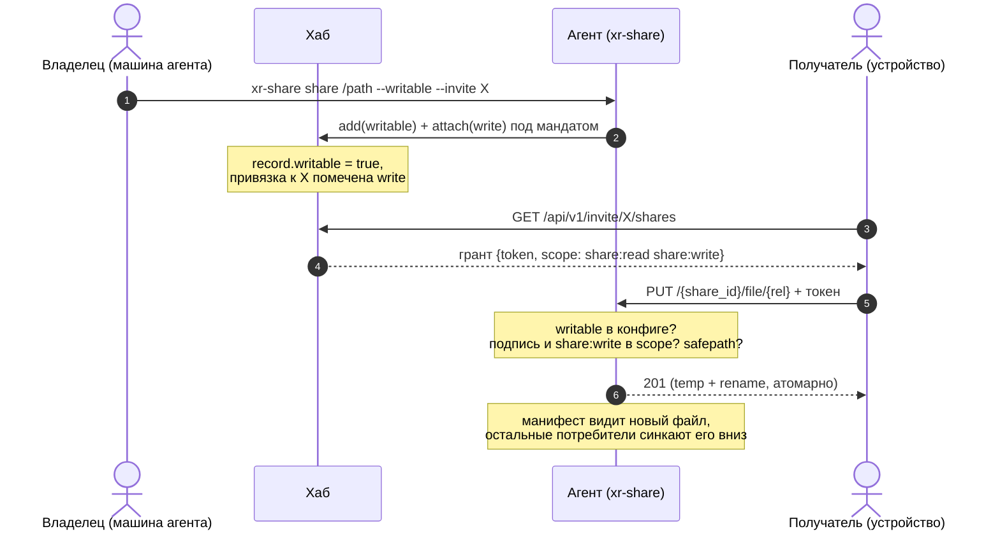

# LLD-28. Доступ к шаре на запись: write-скоуп гранта и приём записи агентом (XR-051)

**Статус:** Реализовано (XR-139)
**Область:** `xr-proto` (OAuth-вида поле `scope` в `ShareToken`, формат подписи
v2, write-привязки в `Invite`); `xr-hub` (флаг записи у шары и у привязки,
минт write-скоупа в грантах); `xr-share` (флаг `writable` в конфиге, эндпоинты
`PUT`/`DELETE` с атомарной заливкой и условными предусловиями `If-Match`,
фильтр временных файлов в манифесте, CLI `--writable` и харнесс `push`/`rm`);
`xr-core` (клиентские функции заливки и удаления поверх того же HTTP-стека с
pinned TLS и relay).
**Зависимости:** [LLD-19](19-file-sharing-agent.md) (шара, токены, гранты,
safepath); [LLD-23](23-share-relay-nat.md) (relay-путь и identity-TLS: запись
едет тем же каналом); [LLD-27](27-mux-flow-control.md) (flow control mux уже
покрывает направление потребитель -> агент); стык с
[LLD-25](25-invite-lifecycle.md) и XR-030 разобран в п. 3.6. Гейтит
[XR-052](../tasks/XR-052.md) (импорт по URL) и любые будущие правки шары с
устройства.

Сейчас шара строго read-only: агент отдаёт манифест и байты, а единственный
способ положить файл в шару это доступ к машине агента. Хочется, чтобы
доверенный получатель (в первую очередь сам владелец со своего телефона) мог
создавать, перезаписывать и удалять файлы в шаре удалённо. Модель доверия
LLD-19 не меняется: хаб остаётся индексом и подписантом вне data-path, агент
сам проверяет пропуска офлайн, байты идут напрямую (или через слепой relay).

---

## 0. Схема записи

Запись гейтится трижды: привязка инвайта должна быть write (хаб иначе минтит
токен только на чтение), запись шары на хабе должна быть writable (защита от
случайной привязки), и локальный конфиг агента должен разрешать запись
(компрометация хаба сама по себе записи не даёт).

## 1. Текущее состояние

- `ShareToken {share_id, exp}` скоупа не имеет: любой валидный токен открывает
  чтение манифеста и файлов, других операций у агента нет
  ([server.rs](../../xr-share/src/server.rs): роуты только `GET`).
- Привязка шары к инвайту это плоский список `Invite.share_ids`
  ([preset.rs](../../xr-proto/src/preset.rs)); грант (`ShareGrant`) несёт один
  read-токен.
- Токены эфемерны: `invite_shares` минтит свежие на каждый запрос грантов,
  долгоживущего стора токенов нет нигде. Формат можно ломать: единственная
  пара совместимости это старый бинарь агента против нового токена.
- Safepath (`resolve_within`) уже возвращает пути к ещё не существующим файлам
  (создан под 404 при чтении), то есть пригоден и для записи без изменений.
- Манифест-обход берёт только регулярные файлы, но не фильтрует служебные
  имена: полузаписанный временный файл попал бы в листинг.
- Relay сплайсит байты вслепую и метод HTTP не различает; identity-TLS
  терминируется на агенте. Направление потребитель -> агент по объёму до сих
  пор было копеечным (запросы), с заливкой оно становится полноценным потоком,
  оконный flow control для него уже реализован (LLD-27).

## 2. Целевое поведение

### 2.1 Опт-ин записи владельцем

- `xr-share share <dir> --writable [--invite X]` регистрирует шару с флагом
  записи: `writable = true` в `[[share]]` локального конфига, `writable: true`
  в `ShareRecord` хаба, привязка к инвайту помечается write.
- `--writable` допустим только для директории: шара-файл остаётся read-only
  (одиночный файл перезаписывать удалённо незачем, а модель «файл = весь
  корень» с PUT/DELETE не дружит). CLI отказывает с понятным текстом.
- Повторный `share` того же пути (сегодня он перерегистрирует шару) флаг
  обновляет; выключение записи это `share` без `--writable`.

### 2.2 Скоуп в токене, форма OAuth

- `ShareToken` получает поле `scope` в форме OAuth (RFC 6749 п. 3.3): строка
  имён скоупов через пробел, имена с сервисным префиксом. Сейчас имён два:
  `share:read` и `share:write`; хаб минтит `"share:read"` либо
  `"share:read share:write"`. Подписанные байты переходят на v2 со строкой
  скоупа внутри: `xr-share-token\nv2\n{share_id}\n{scope}\n{exp}`. Подделать
  scope нельзя, он покрыт подписью.
- Проверка агента как у OAuth resource server: операция разрешена, если её
  имя содержится в множестве; незнакомые имена игнорируются. Read-роуты
  требуют `share:read`, write-роуты `share:write`, имплицирования нет: гранту
  с правом записи хаб просто выписывает оба имени.
- Расширение по двум осям, обе без боли. Новая операция (например
  `share:import` для XR-052) это новое имя в множестве **без смены версии
  формата**: подпись кроет строку целиком, а эндпоинты под новую операцию
  существуют только в бинарях, которые её знают. Параметризованные
  ограничения (запись только в подпапку, квота) это **отдельные будущие поля
  токена** с бампом версии подписанных байтов, не значения scope: мини-язык
  внутри scope-строки не заводим.
- Формат ломаем без совместимости: v1-токены новый агент отвергает. Парк
  тестовый (пара агентов), токены минтятся заново при каждом запросе грантов,
  поэтому цена слома это одновременный выкат хаба и бинарей агентов (п. 5.6).
- Грант не меняется структурно: то же одно поле `token`. Потребителю не нужно
  жонглировать двумя токенами; право записи он видит, декодируя блоб (это
  base64 JSON) и ища `share:write` в scope.
- Ссылки, которые печатают `share`/`mint` для раздачи, несут только
  `share:read`: write-скоуп минтится единственным путём, в грантах
  `invite_shares` по write-привязке. `/share/mint` скоупом не расширяем:
  владельцу на своей машине HTTP для записи не нужен, а лишний канал выпуска
  write-скоупа это лишняя поверхность.

### 2.3 Приём записи агентом

Два новых роута, только v2 (легаси-алиасов не заводим):

- `PUT /{share_id}/file/{*rel}`: тело стримится во временный файл
  `.xr-part-<rand>` рядом с целью (тот же каталог, чтобы rename был на одной
  ФС), SHA-256 считается на лету. По завершении fsync и атомарный rename
  поверх цели. Ответ `201` для нового файла, `204` для перезаписи.
  Родительские каталоги создаются (containment уже проверен safepath'ом по
  полному пути). Заголовок `X-Xr-Sha256` опционален: при наличии агент сверяет
  посчитанный хеш и на расхождении отвечает `422`, не трогая цель. Посчитанный
  хеш сажается в `HashCache`, так что манифест сразу отдаёт свежий файл с
  хешем, без ленивого прогрева.
- `DELETE /{share_id}/file/{*rel}`: удаляет файл. `204` при успехе, `404` если
  нет, `409` на каталог (удаление каталогов рекурсивно не поддерживаем,
  пустые каталоги в модели манифеста невидимы и не мешают).

Общие правила обоих роутов:

- порядок проверок: шара существует (`404`) -> `writable` в конфиге агента
  (`403`) -> валидный токен этой шары с `share:write` в scope (`401`/`403`)
  -> safepath (`403`);
- условные предусловия против lost update (п. 3.7): `If-Match: <sha256>`
  выполняет операцию, только если текущее содержимое цели именно это
  (значение это хеш из манифеста, не ETag файлового сервера); у `PUT` вдобавок
  `If-None-Match: *` требует, чтобы цели ещё не было (создание без
  перетирания). Нарушенное предусловие даёт `412`, цель не тронута. Без
  заголовков операция безусловная (last-write-wins);
- компонент с зарезервированным префиксом `.xr-part-` отвергается в любом
  роуте, включая `GET` (никто не скачает и не подменит чужую недозаливку);
- `PUT` в существующий каталог и `DELETE` каталога это `409`;
- опциональный колпак `max_file_mb` в конфиге агента (по умолчанию без
  лимита, доверенный круг): превышение по Content-Length режется сразу
  `413`, без Content-Length по факту стриминга; `ENOSPC` и прочие IO-ошибки
  дают `507`/`500`, временный файл удаляется в любом исходе;
- запись логируется агентом (rel-путь, размер, исход), токен не логируется.

### 2.4 Потребительская сторона

- `xr-core`: `upload_file(grant, rel, local_path)` и
  `delete_file(grant, rel)` поверх того же HTTP-стека, что и синк: pinned
  identity-TLS, перебор адресов и relay как последний (порядок XR-050). Обе
  функции до сети проверяют scope токена гранта и возвращают понятную ошибку
  «нет права записи», если в нём нет `share:write`; обе принимают опциональный
  ожидаемый хеш и транслируют его в `If-Match`.
- Харнесс на десктопе, симметричный `pull`: `xr-share push --invite <t>
  --share <id|имя> <файл> [--to <rel>]` и `xr-share rm --invite <t> --share
  <id|имя> <rel>`. При перезаписи существующего пути `push` сам подставляет
  `If-Match` с хешем из только что полученного манифеста (обход через
  `--force`), так что молча затереть чужую свежую версию с харнесса нельзя.
  Это и инструмент проверки без устройства, и рабочий способ положить файл в
  чужую writable-шару с ноутбука.
- Android UI записи в этом LLD нет: экраны и UX правок шары с устройства едут
  отдельными задачами поверх готовых функций xr-core (первый потребитель это
  XR-052).

### 2.5 Relay и синк

- Relay не меняется вовсе: PUT/DELETE идут тем же identity-TLS-стримом внутри
  слепого сплайса, relay-токен гейтит транзит независимо от метода.
- Семантика синка не меняется: mirror так и течёт агент -> устройство. Залитый
  файл просто появляется в манифесте и доезжает до остальных потребителей
  штатным дифом; удалённый файл штатно удаляется у них локально. Разбор гонок
  и модель конфликтов целиком в п. 3.7.

## 3. Дизайн-решения

### 3.1 Scope внутри токена, формат ломаем

Первый набросок дизайна заводил отдельный write-токен со своим доменом
подписи ради совместимости со старыми участниками. На обсуждении решение
отменили: совместимость тут ничего не стоит (токены минтятся заново на каждый
запрос грантов, парк из пары тестовых агентов обновляется одной командой), а
отдельный токен дороже по всем осям: второе поле в гранте, жонглирование
двумя токенами у потребителя, две функции проверки у агента. Прецедент
`RelayToken` сюда не переносится: там домен-сепарация нужна, потому что токен
проверяет другая сторона (relay), здесь проверяющий один. Scope лежит внутри
подписанных байтов, так что дописать себе `share:write` без ключа хаба
невозможно.

### 3.2 Право записи у привязки, рубильник у владельца

Write это свойство пары «шара-инвайт» (`Invite.write_share_ids`): одну и ту же
папку можно раздать семье на чтение и себе на запись, инвайты-то разные.
Мастер-переключатель при этом остаётся у владельца в двух местах: `writable` в
записи хаба (хаб не минтит write-скоуп на шару, которую владелец не объявлял
писабельной) и `writable` в локальном конфиге агента (агент отказывает даже
предъявителю валидного `share:write`). Второй рубеж превращает компрометацию
хаба из «запись в любую шару» в «ничего»: подписать токен мало, нужен ещё
опт-ин на самой машине данных.

### 3.3 Атомарная заливка с зарезервированным префиксом

Временный файл в целевом каталоге плюс rename исключают полузаписанные файлы
под целевым именем. Префикс `.xr-part-` скипается манифест-обходом и
отвергается всеми роутами, поэтому недозаливка не видна потребителям и
недоступна снаружи ни на чтение, ни на подмену. Хеш считается на лету и
сажается в кеш, так что залитый файл сразу целиком описан в манифесте.

### 3.4 Никакого mkdir/move API

Манифест не знает пустых каталогов, каталоги материализуются вместе с первым
файлом при PUT. Переименование это PUT нового пути плюс DELETE старого (байты
едут повторно; ср. п. 7). Меньше поверхности на агенте, safepath проверяет
один путь на операцию.

### 3.5 Минт write-скоупа только через гранты

Один канал выпуска (`invite_shares`) вместо двух: проще ревизовать и
отзывать (detach write-привязки или TTL). `/share/mint` не расширяем.

### 3.6 Стык с LLD-25 и XR-030: слои не смешиваем, форма скоупа уже целевая

Наши токены и правда самодельный JWS, но у токена шары и у JWT из XR-030
разные роли, и от их сходства не следует, что аутентификацию надо брать
раньше:

- **Control plane** (кто ты для хаба): сегодня это владение инвайтом, в
  LLD-25 станет per-device мандатом, в XR-030 поверх встанет OIDC/JWT.
  LLD-19 п. 9.5 фиксирует: аутентификация меняется, не трогая data-path.
- **Data plane** (что можно у агента): узкая офлайн-проверяемая капабилити на
  одну шару. Она нужна при любой аутентификации, потому что хаб не на пути
  данных, а агент не должен понимать JWT экосистемы: иначе агенту в чужой
  квартире пришлось бы знать сессии, пользователей и группы хаба. Капабилити
  на одну шару это минимально необходимое знание.

Форма токена при этом сознательно взята OAuth/JWT-совместимой, чтобы переезд
был переносом, а не переделкой: `scope` это стандартный scope-клейм (строка
имён через пробел), `exp` уже unix-секунды как в JWT, `share_id` играет роль
`aud`. Сервисный префикс в именах (`share:read`, а не голое `read`) заранее
разводит скоупы будущих сервисов экосистемы в одном общем клейме
(`vpn:*`, `chat:*` встанут рядом без коллизий). Когда доедет JWT, scope-клейм
понесёт те же строки, а проверка агента «имя содержится в множестве» не
изменится дословно.

Что мигрирует, когда LLD-25 (а за ним XR-030) доедет: **только таблица «кому
write» на хабе**. `write_share_ids` с инвайта переезжает в scope мандата
(LLD-25 п. 6 держит `scope = share_ids` открытым вопросом, write-флаг ложится
туда естественно), и права начинают разруливаться тоньше инвайта, per-device
или per-identity. Формат токена, эндпоинты агента, safepath и клиент xr-core
при этой миграции не меняются. Привязка на инвайте здесь не технический долг,
а честное отражение того, что инвайт сегодня и есть идентичность.

### 3.7 Модель конфликтов: одна правда, атомарные операции, If-Match

Конфликтов в смысле «двух версий правды, которые надо мирить» в модели нет по
построению: источник правды один, файловая система агента. Синк это зеркало
строго вниз, запись это явная операция строго вверх; двусторонней фоновой
синхронизации, способной породить расхождение реплик, не существует. Merge,
CRDT и версии поэтому не нужны: файлы для системы это непрозрачные блобы,
семантика файлохранилища класса S3, не Dropbox.

Гонки разрешаются детерминированно:

- **PUT против PUT** одного пути: каждая заливка атомарна (temp + rename),
  последний rename побеждает целиком, перемешанного файла не бывает.
- **PUT против DELETE**: один из двух консистентных исходов, файл есть в новой
  версии либо файла нет.
- **PUT против чужого скачивания**: на Linux читатель держит старый inode и
  дочитывает старую версию; докачку через Range поверх подменённого файла
  ловит SHA-256-проверка потребителя, файл перекачивается.
- **Локальная правка в синк-папке устройства**: наверх сама не едет никогда и
  при следующем проходе зеркала затирается, сервер прав. Изменение вносится
  только явным PUT; это правило обязано доехать до UI будущих задач правок.

Остаётся lost update: взял v1, отредактировал, залил, а между делом кто-то
залил v2, и твой безусловный PUT её перетёр. Ответ это оптимистический
контроль через `If-Match` (п. 2.3): клиент передаёт хеш той версии, от которой
редактировал, агент сверяет с текущим содержимым (через `HashCache`) прямо
перед rename и на расхождении отвечает `412`, ничего не трогая. Проверка
предусловия и rename не склеены в одну атомарную операцию: микроскопическое
окно между ними принято осознанно, это оптимистическая проверка, а не замок.
Дефолт без заголовка остаётся last-write-wins: для владельца с телефона и
импорта по URL (новые файлы, не правки) это правильная цена простоты.

## 4. Изменения в коде

| Файл | Что меняется |
|---|---|
| `xr-proto/src/share.rs` | `ShareToken.scope` (OAuth-строка имён через пробел: `share:read`, `share:write`); `token_signing_bytes` переходит на v2 со строкой скоупа внутри, v1 не принимается; `verify_share_token` принимает требуемое имя скоупа и проверяет вхождение в множество; `ShareRecord.writable: bool` (`serde(default)`, старые JSON-записи читаются). |
| `xr-proto/src/preset.rs` | `Invite.write_share_ids: Vec<String>` (`serde(default)`); инвариант «write-список это подмножество share_ids» держат attach/detach хаба. |
| `xr-hub/src/api/share_v2.rs` | `AddShareReq.writable`; `AttachReq.write` (attach добавляет в оба списка, detach убирает из обоих); `invite_shares` минтит `"share:read share:write"` при write-привязке и writable-записи, иначе `"share:read"`; `add`/`mint` минтят только `"share:read"`. |
| `xr-hub/src/api/shares.rs` | Показ `writable` в админском списке шар (read-only колонка). |
| `xr-share/src/config.rs` | `ShareEntry.writable: bool` (`serde(default)`). |
| `xr-share/src/server.rs` | Роуты `PUT`/`DELETE /{share_id}/file/{*rel}`; проверка `share:write` и `writable`; стриминг в `.xr-part-<rand>` c SHA-256 на лету, fsync + rename, посев `HashCache`; предусловия `If-Match`/`If-None-Match` по `HashCache` (`412`); резерв префикса во всех роутах; `max_file_mb`. |
| `xr-share/src/manifest.rs` | Обход пропускает файлы с префиксом `.xr-part-`. |
| `xr-share/src/cli.rs` | `share --writable` (отказ для шары-файла); харнесс `push` / `rm` по образцу `pull`, `push` с авто-`If-Match` при перезаписи и `--force`; тексты `--help` новых команд и флага. |
| `xr-core/src/sync.rs` | `upload_file(grant, rel, path)` / `delete_file(grant, rel)` поверх существующего клиента (pinned TLS, direct -> relay); проверка scope гранта до сети; опциональный ожидаемый хеш -> `If-Match`. |
| `xr-share/README.md` | Раздел Endpoints: `PUT`/`DELETE` с порядком проверок (writable -> scope -> safepath), предусловиями `If-Match`/`If-None-Match` и резервом префикса `.xr-part-`; модель scope (`share:read`/`share:write`, кто и когда минтит write); команды `share --writable`, `push`, `rm` в примерах; снять оговорки «read-only» по тексту. |
| `configs/share.toml` | Задокументировать `writable` у `[[share]]` (дефолт false, только директории) и `max_file_mb`; заодно привести референс к форме v2 (сейчас он показывает только легаси-конфиг с одним каталогом). |
| `README.md` | Раздел «Файлообмен (xr-share)» и комментарий в дереве репозитория: «read-only» превращается в «чтение по умолчанию, запись по write-привязке инвайта». |
| `docs/ARCHITECTURE.md` | Строка LLD-28 в разделе 9; после реализации факты write-скоупа в разделы 4.1 и 4.7 плюс карта эндпоинтов агента. |

Правки доки (четыре последние строки таблицы) едут в той же задаче отдельным
docs-коммитом серии: задача без обновлённых README и референс-конфига не
закрыта, как и без тестов.

Тесты (Rust, без сети, кроме роутер-тестов axum как в `server.rs` сейчас):

- `test_token_scope_sign_verify`: `"share:read share:write"` проходит и
  read-, и write-проверку; `"share:read"` write-проверку не проходит;
  незнакомое имя в множестве не мешает проверке известных; подделанная
  scope-строка ломает подпись; протухший / чужая шара / чужой ключ -> reject;
  v1-блоб -> reject.
- `test_put_creates_and_overwrites`: PUT нового -> 201 и файл виден в
  манифесте с хешем; PUT поверх -> 204, содержимое заменено целиком.
- `test_put_requires_write_scope`: без токена 401, с токеном только
  `share:read` -> 403.
- `test_put_readonly_share_rejected`: `writable = false` -> 403 даже с
  валидным `share:write` (рубеж агента).
- `test_put_path_traversal_blocked`: `..`, абсолютный путь, симлинк-эскейп ->
  403; PUT с компонентом `.xr-part-` -> 403.
- `test_put_sha256_mismatch`: `X-Xr-Sha256` не сходится -> 422, цель не
  тронута, временный файл убран.
- `test_conditional_requests`: `If-Match` с текущим хешем -> замена;
  с чужим -> 412 и цель не тронута; `If-Match` по отсутствующей цели -> 412;
  `If-None-Match: *` поверх существующего -> 412, на новый путь -> 201;
  DELETE с несовпадающим `If-Match` -> 412, файл на месте.
- `test_put_cap_exceeded`: тело больше `max_file_mb` -> 413, мусора нет.
- `test_delete_file`: удаление -> 204 и файл пропал из манифеста; нет файла ->
  404; каталог -> 409.
- `test_manifest_skips_upload_temp`: `.xr-part-*` в шаре не листится.
- `test_file_share_not_writable`: PUT в шару-файл -> 403.
- Хаб: `test_grant_write_scope_only_for_write_binding` (write-привязка плюс
  writable-запись -> в гранте `share:read share:write`; read-привязка или
  `writable = false` -> только `share:read`); `test_attach_write_subset`
  (инвариант списков).
- `xr-core`: `test_upload_roundtrip` / `test_delete_via_grant` против
  тестового роутера; грант без `share:write` -> ошибка «нет права записи» до
  сети; ожидаемый хеш доезжает заголовком `If-Match`.

## 5. Риски и edge-кейсы

1. **Traversal на записи опаснее чтения** (запись вне шары это класс
   `authorized_keys`). Тот же двухслойный `resolve_within` плюс явные тесты на
   PUT/DELETE; родители создаются только после containment-проверки полного
   пути.
2. **Windows: rename поверх существующего файла падает** (в отличие от Unix).
   Фолбэк remove + rename с крошечным окном неатомарности; риск принят для
   Win-агента, на Linux атомарность полная.
3. **Полузаписанные файлы.** Закрыто префиксом `.xr-part-`: манифест их не
   видит, роуты не отдают; упавшая заливка оставляет только мусорный temp,
   который агент подчищает при старте (унаследованные от прошлого запуска).
4. **Диск переполнен.** `ENOSPC` -> 507, temp удалён; предварительной проверки
   свободного места не делаем (лишняя зависимость, гонка всё равно остаётся).
5. **Утечка токена с write-скоупом.** Тот же класс, что у read: TTL 7 дней, не
   логируется, отзыв через detach write-привязки или истечение; подпись не
   даёт применить его к другой шаре. В `?token=` для браузерных ссылок
   write-скоуп не попадает: по ссылкам раздаются токены только с `share:read`
   (п. 2.2).
6. **Слом формата токена.** Хаб, начав минтить v2, ломает чтение у старых
   бинарей агентов (v1-проверка отвергнет и read). Выкат одним заходом: сначала
   бинари агентов (пара машин), затем хаб; потребители получают свежие v2-токены
   автоматически при следующем запросе грантов, у них состояния нет.
7. **Гонки записи.** Разрешение детерминированное, дефолт last-write-wins на
   атомарных операциях, от lost update защищает опциональный `If-Match`;
   полный разбор в п. 3.7. Окно между проверкой предусловия и rename не
   атомарно и принято осознанно (оптимистическая проверка, не замок).
8. **Заливший тут же пересинкает свой файл.** mtime на агенте свежий, но хеш
   в манифесте есть сразу (посев кеша при заливке), а диф решает по хешу, так
   что повторного скачивания нет.

## 6. План проверки

Автотесты из п. 4 плюс ручной сценарий на проде:

1. На машине агента: `xr-share share <папка> --writable --invite <t>` (папка,
   уже привязанная к инвайту, перерегистрируется с флагом).
2. С ноутбука: `xr-share push --invite <t> --share <имя> report.pdf` -> файл
   появился в папке на машине агента; `pull`/приложение видят его в манифесте
   и скачивают, SHA-256 сходится.
3. `xr-share rm --invite <t> --share <имя> report.pdf` -> файл удалён на
   агенте, при синке пропал и на устройстве.
4. Инвайт без write-привязки: в гранте токен без `share:write`, `push`
   отказывает локально с текстом «нет права записи».
5. Токеном только с `share:read` по PUT (curl) -> 403; PUT `../evil` -> 403;
   PUT с чужим `If-Match` (curl) -> 412, файл не изменился.
6. Перезапись с харнесса: изменить файл на агенте после того, как `push`
   прочитал манифест, повторный `push` того же пути -> отказ по 412; с
   `--force` проходит.
7. Шара за NAT (relay-путь): `push` проходит через relay, файл доезжает.
8. `writable = false` в конфиге агента при write-гранте -> 403.
9. Дока сходится с поведением: `xr-share/README.md` описывает `PUT`/`DELETE`,
   scope и предусловия, `configs/share.toml` содержит `writable` и
   `max_file_mb` с комментариями, в корневом README шара больше не
   «read-only».
10. `cargo test --workspace` зелёный, 0 warnings.

## 7. Вне скоупа (отдельные задачи)

- **Импорт контента по URL** это XR-052 поверх этого фундамента (плагин
  качает на агенте и пишет через тот же локальный safepath-контур; в токене
  это будущее имя `share:import` без смены формата).
- **Android UI правок шары** (кнопки заливки/удаления, выбор файла, прогресс):
  отдельная задача поверх функций xr-core.
- **attach/detach как самостоятельные CLI-команды** и видимость привязок это
  XR-102; здесь write-флаг едет только через `share --writable`.
- **Перенос привязок на мандат/идентичность** едет с LLD-25/XR-030 (п. 3.6):
  здесь ничего не готовим заранее, миграция это одна таблица хаба.
- **Квоты и учёт записи на инвайт**: территория XR-075.
- **Двунаправленный синк с конфликтами**: не появляется; mirror остаётся
  однонаправленным, запись это явные операции.
- **Переименование/move как операция агента**: пока PUT+DELETE, вернёмся при
  живой боли (крупные файлы).
- **Корзина/версии перезаписанного**: запись перетирает без истории,
  осознанно; от случайного перетирания страхует `If-Match`, не история.

## 8. Открытые вопросы (закрыты в этом дизайне)

- *Scope в ShareToken или отдельный write-токен?* -> **scope-поле, формат v2
  без совместимости с v1**; отдельный токен был в первом наброске и отменён
  на обсуждении: парк тестовый, токены эфемерны, совместимость ничего не
  стоит (п. 3.1).
- *Форма scope: enum или OAuth-строка?* -> **OAuth-строка имён через пробел с
  сервисным префиксом** (`share:read share:write`): при переезде на JWT
  (XR-030) scope-клейм переносится дословно, новые операции добавляются без
  смены версии формата, параметры и ограничения остаются отдельными полями с
  бампом версии (п. 2.2, п. 3.6).
- *Не взять ли аутентификацию (XR-030/XR-122) раньше этой задачи?* -> **нет**:
  капабилити-слой агента от неё не зависит, а мигрирует потом только таблица
  привязок на хабе (п. 3.6).
- *Разрешение конфликтов записи?* -> **одна правда (ФС агента), атомарный
  last-write-wins по умолчанию, оптимистический `If-Match` по хешу манифеста
  в скоупе реализации**; merge, версии и двусторонний синк не появляются
  (п. 3.7).
- *Право записи на шаре или на привязке?* -> **на привязке**, с двойным
  мастер-рубильником владельца (запись хаба + конфиг агента) (п. 3.2).
- *Нужен ли mkdir/move API?* -> **нет**, каталоги через PUT, move как
  PUT+DELETE (п. 3.4).
- *Можно ли минтить write-скоуп через `/share/mint`?* -> **нет**, единственный
  канал это гранты инвайта (п. 3.5).
- *Запись в шару-файл?* -> **нет**, writable только у директорий (п. 2.1).
- *Проверять ли целостность заливки?* -> **да, опционально**: `X-Xr-Sha256`
  сверяется до rename, хеш сажается в кеш (п. 2.3).

## 9. После реализации (XR-139)

Дизайн лёг без крупных отклонений. Что уточнилось на реализации:

- `attach` на хабе идемпотентен по обеим осям: `--writable` добавляет привязку в
  `write_share_ids`, а повторный `share` без флага (обычный attach с
  `write=false`) её снимает. Так «выключение записи это share без `--writable`»
  (п. 2.1) держит инвариант `write_share_ids` подмножеством `share_ids` без
  отдельной команды; `detach` чистит обе оси.
- Стриминг тела `PUT` у агента идёт покадрово через `http-body-util`
  (`BodyDataStream`), а не буферизацией в память, чтобы крупный файл не держался
  целиком; колпак режется и по `Content-Length`, и по факту стрима. В `xr-core`
  `upload_file` стримит файл через `reqwest::Body::wrap_stream` +
  `tokio-util ReaderStream` (фича reqwest `stream`).
- `ShareTokenError` получил вариант `MissingScope` (подпись верна, но скоупа нет)
  отдельно от `BadSignature`, чтобы агент отвечал `403`, а не `401`.
- Показ `writable` в админке остался на уровне JSON записи (`admin_list_shares`
  отдаёт поле); колонку в SPA не собирали (встроенный бандл, отдельный пересбор).
- Харнесс `push`/`rm` вынесен в `xr-share/src/push.rs`, общие ureq-хелперы с
  `pull` подняты в `pub(crate)`.
