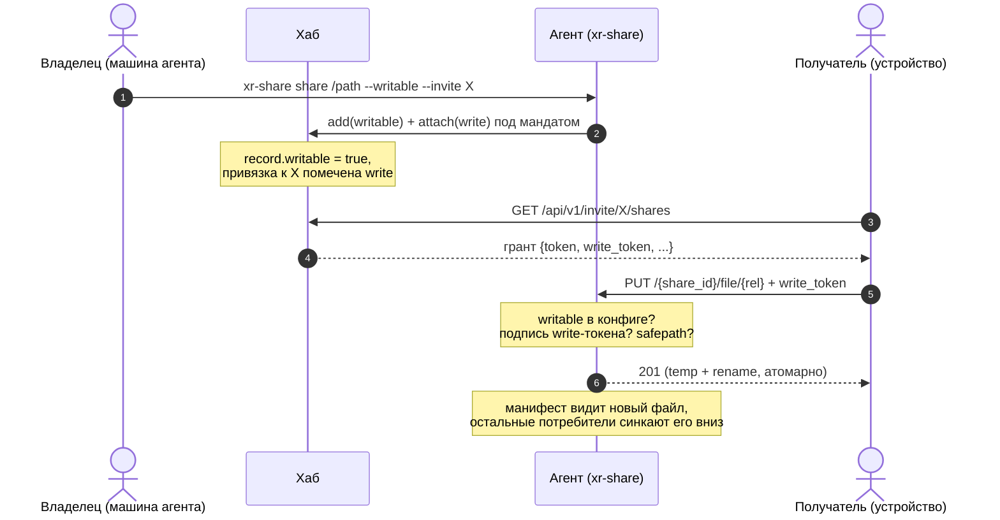

# LLD-28. Доступ к шаре на запись: write-скоуп гранта и приём записи агентом (XR-051)

**Статус:** Draft
**Область:** `xr-proto` (write-токен со своим доменом подписи, поле в
`ShareGrant`, write-привязки в `Invite`); `xr-hub` (флаг записи у шары и у
привязки, минт write-токенов в грантах); `xr-share` (флаг `writable` в конфиге,
эндпоинты `PUT`/`DELETE` с атомарной заливкой, фильтр временных файлов в
манифесте, CLI `--writable` и харнесс `push`/`rm`); `xr-core` (клиентские
функции заливки и удаления поверх того же HTTP-стека с pinned TLS и relay).
**Зависимости:** [LLD-19](19-file-sharing-agent.md) (шара, токены, гранты,
safepath); [LLD-23](23-share-relay-nat.md) (relay-путь и identity-TLS: запись
едет тем же каналом); [LLD-27](27-mux-flow-control.md) (flow control mux уже
покрывает направление потребитель -> агент). Гейтит
[XR-052](../tasks/XR-052.md) (импорт по URL) и любые будущие правки шары с
устройства.

Сейчас шара строго read-only: агент отдаёт манифест и байты, а единственный
способ положить файл в шару это доступ к машине агента. Хочется, чтобы
доверенный получатель (в первую очередь сам владелец со своего телефона) мог
создавать, перезаписывать и удалять файлы в шаре удалённо. Модель доверия
LLD-19 не меняется: хаб остаётся индексом и подписантом вне data-path, агент
сам проверяет пропуска офлайн, байты идут напрямую (или через слепой relay).

---

## 0. Схема записи

Запись гейтится трижды: привязка инвайта должна быть write (хаб иначе не
минтит write-токен), запись шары на хабе должна быть writable (защита от
случайной привязки), и локальный конфиг агента должен разрешать запись
(компрометация хаба сама по себе записи не даёт).

## 1. Текущее состояние

- `ShareToken {share_id, exp}` скоупа не имеет: любой валидный токен открывает
  чтение манифеста и файлов, других операций у агента нет
  ([server.rs](../../xr-share/src/server.rs): роуты только `GET`).
- Привязка шары к инвайту это плоский список `Invite.share_ids`
  ([preset.rs](../../xr-proto/src/preset.rs)); грант (`ShareGrant`) несёт один
  read-токен.
- Safepath (`resolve_within`) уже возвращает пути к ещё не существующим файлам
  (создан под 404 при чтении), то есть пригоден и для записи без изменений.
- Манифест-обход берёт только регулярные файлы, но не фильтрует служебные
  имена: полузаписанный временный файл попал бы в листинг.
- Relay сплайсит байты вслепую и метод HTTP не различает; identity-TLS
  терминируется на агенте. Направление потребитель -> агент по объёму до сих
  пор было копеечным (запросы), с заливкой оно становится полноценным потоком,
  оконный flow control для него уже реализован (LLD-27).

## 2. Целевое поведение

### 2.1 Опт-ин записи владельцем

- `xr-share share <dir> --writable [--invite X]` регистрирует шару с флагом
  записи: `writable = true` в `[[share]]` локального конфига, `writable: true`
  в `ShareRecord` хаба, привязка к инвайту помечается write.
- `--writable` допустим только для директории: шара-файл остаётся read-only
  (одиночный файл перезаписывать удалённо незачем, а модель «файл = весь
  корень» с PUT/DELETE не дружит). CLI отказывает с понятным текстом.
- Повторный `share` того же пути (сегодня он перерегистрирует шару) флаг
  обновляет; выключение записи это `share` без `--writable`.

### 2.2 Write-токен

- Новый тип `ShareWriteToken {share_id, exp, signature}` с собственным доменом
  подписи `xr-share-write\nv1\n{share_id}\n{exp}`. Домен-сепарация (как у
  `RelayToken`) гарантирует, что read-токен никогда не пройдёт проверку записи
  и наоборот, без всякой логики «scope подразумевает».
- Минтится только в грантах: `GET /api/v1/invite/{token}/shares` кладёт в
  `ShareGrant` поле `write_token` (опциональное, старый потребитель его
  игнорирует), когда привязка write и запись шары writable. TTL и `exp` те же,
  что у read-токена гранта.
- `POST /api/v1/share/mint` остаётся read-only: владельцу на своей машине HTTP
  для записи не нужен, а лишний канал выпуска write-токенов это лишняя
  поверхность.

### 2.3 Приём записи агентом

Два новых роута, только v2 (легаси-алиасов не заводим):

- `PUT /{share_id}/file/{*rel}`: тело стримится во временный файл
  `.xr-part-<rand>` рядом с целью (тот же каталог, чтобы rename был на одной
  ФС), SHA-256 считается на лету. По завершении fsync и атомарный rename
  поверх цели. Ответ `201` для нового файла, `204` для перезаписи.
  Родительские каталоги создаются (containment уже проверен safepath'ом по
  полному пути). Заголовок `X-Xr-Sha256` опционален: при наличии агент сверяет
  посчитанный хеш и на расхождении отвечает `422`, не трогая цель. Посчитанный
  хеш сажается в `HashCache`, так что манифест сразу отдаёт свежий файл с
  хешем, без ленивого прогрева.
- `DELETE /{share_id}/file/{*rel}`: удаляет файл. `204` при успехе, `404` если
  нет, `409` на каталог (удаление каталогов рекурсивно не поддерживаем,
  пустые каталоги в модели манифеста невидимы и не мешают).

Общие правила обоих роутов:

- порядок проверок: шара существует (`404`) -> `writable` в конфиге агента
  (`403`) -> валидный write-токен этой шары (`401`/`403`) -> safepath
  (`403`);
- компонент с зарезервированным префиксом `.xr-part-` отвергается в любом
  роуте, включая `GET` (никто не скачает и не подменит чужую недозаливку);
- `PUT` в существующий каталог и `DELETE` каталога это `409`;
- опциональный колпак `max_file_mb` в конфиге агента (по умолчанию без
  лимита, доверенный круг): превышение по Content-Length режется сразу
  `413`, без Content-Length по факту стриминга; `ENOSPC` и прочие IO-ошибки
  дают `507`/`500`, временный файл удаляется в любом исходе;
- запись логируется агентом (rel-путь, размер, исход), токен не логируется.

### 2.4 Потребительская сторона

- `xr-core`: `upload_file(grant, rel, local_path)` и
  `delete_file(grant, rel)` поверх того же HTTP-стека, что и синк: pinned
  identity-TLS, перебор адресов и relay как последний (порядок XR-050). Обе
  функции берут `write_token` из гранта и возвращают понятную ошибку, если его
  в гранте нет.
- Харнесс на десктопе, симметричный `pull`: `xr-share push --invite <t>
  --share <id|имя> <файл> [--to <rel>]` и `xr-share rm --invite <t> --share
  <id|имя> <rel>`. Это и инструмент проверки без устройства, и рабочий способ
  положить файл в чужую writable-шару с ноутбука.
- Android UI записи в этом LLD нет: экраны и UX правок шары с устройства едут
  отдельными задачами поверх готовых функций xr-core (первый потребитель это
  XR-052).

### 2.5 Relay и синк

- Relay не меняется вовсе: PUT/DELETE идут тем же identity-TLS-стримом внутри
  слепого сплайса, relay-токен гейтит транзит независимо от метода.
- Семантика синка не меняется: mirror так и течёт агент -> устройство. Залитый
  файл просто появляется в манифесте и доезжает до остальных потребителей
  штатным дифом; удалённый файл штатно удаляется у них локально. Конфликтов
  нет по построению: последняя запись побеждает, каждая атомарна.

## 3. Дизайн-решения

### 3.1 Отдельный токен, не поле scope в ShareToken

Поле `scope` внутри `ShareToken` потребовало бы v2-формата подписи и логики
совместимости на каждом верификаторе. Отдельный тип со своим доменом подписи
ничего не трогает в пути чтения (старые агенты и потребители не видят
разницы), а прецедент в системе уже есть: `RelayToken` живёт ровно так же.
Write-токен не даёт чтения: потребитель с write-привязкой всегда получает в
том же гранте и read-токен, имплицирование не нужно.

### 3.2 Право записи у привязки, рубильник у владельца

Write это свойство пары «шара-инвайт» (`Invite.write_share_ids`): одну и ту же
папку можно раздать семье на чтение и себе на запись, инвайты-то разные.
Мастер-переключатель при этом остаётся у владельца в двух местах: `writable` в
записи хаба (хаб не минтит write-токены на шару, которую владелец не объявлял
писабельной) и `writable` в локальном конфиге агента (агент отказывает даже
предъявителю валидного write-токена). Второй рубеж превращает компрометацию
хаба из «запись в любую шару» в «ничего»: подписать токен мало, нужен ещё
опт-ин на самой машине данных.

### 3.3 Атомарная заливка с зарезервированным префиксом

Временный файл в целевом каталоге плюс rename исключают полузаписанные файлы
под целевым именем. Префикс `.xr-part-` скипается манифест-обходом и
отвергается всеми роутами, поэтому недозаливка не видна потребителям и
недоступна снаружи ни на чтение, ни на подмену. Хеш считается на лету и
сажается в кеш, так что залитый файл сразу целиком описан в манифесте.

### 3.4 Никакого mkdir/move API

Манифест не знает пустых каталогов, каталоги материализуются вместе с первым
файлом при PUT. Переименование это PUT нового пути плюс DELETE старого (байты
едут повторно; ср. п. 7). Меньше поверхности на агенте, safepath проверяет
один путь на операцию.

### 3.5 Минт write-токенов только через гранты

Один канал выпуска (`invite_shares`) вместо двух: проще ревизовать и
отзывать (detach write-привязки или TTL). `/share/mint` не расширяем.

## 4. Изменения в коде

| Файл | Что меняется |
|---|---|
| `xr-proto/src/share.rs` | `ShareWriteToken` + `write_token_signing_bytes` (домен `xr-share-write`), пара sign/verify по образцу `ShareToken`; `ShareGrant.write_token: Option<String>` (`serde(default)`); `ShareRecord.writable: bool` (`serde(default)`, старые JSON-записи читаются). |
| `xr-proto/src/preset.rs` | `Invite.write_share_ids: Vec<String>` (`serde(default)`); инвариант «write-список это подмножество share_ids» держат attach/detach хаба. |
| `xr-hub/src/api/share_v2.rs` | `AddShareReq.writable`; `AttachReq.write` (attach добавляет в оба списка, detach убирает из обоих); `invite_shares` минтит `write_token` при write-привязке и writable-записи. |
| `xr-hub/src/api/shares.rs` | Показ `writable` в админском списке шар (read-only колонка). |
| `xr-share/src/config.rs` | `ShareEntry.writable: bool` (`serde(default)`). |
| `xr-share/src/server.rs` | Роуты `PUT`/`DELETE /{share_id}/file/{*rel}`; проверка write-токена и `writable`; стриминг в `.xr-part-<rand>` c SHA-256 на лету, fsync + rename, посев `HashCache`; резерв префикса во всех роутах; `max_file_mb`. |
| `xr-share/src/manifest.rs` | Обход пропускает файлы с префиксом `.xr-part-`. |
| `xr-share/src/cli.rs` | `share --writable` (отказ для шары-файла); харнесс `push` / `rm` по образцу `pull`. |
| `xr-core/src/sync.rs` | `upload_file(grant, rel, path)` / `delete_file(grant, rel)` поверх существующего клиента (pinned TLS, direct -> relay). |
| `docs/ARCHITECTURE.md` | Строка LLD-28 в разделе 9; после реализации факты write-скоупа в разделы 4.1 и 4.7 плюс карта эндпоинтов агента. |

Тесты (Rust, без сети, кроме роутер-тестов axum как в `server.rs` сейчас):

- `test_write_token_sign_verify`: валидный / чужой ключ / протухший / чужая
  шара -> reject; **read-токен не проходит как write и наоборот** (домены).
- `test_put_creates_and_overwrites`: PUT нового -> 201 и файл виден в
  манифесте с хешем; PUT поверх -> 204, содержимое заменено целиком.
- `test_put_requires_write_token`: без токена 401, с read-токеном 403.
- `test_put_readonly_share_rejected`: `writable = false` -> 403 даже с
  валидным write-токеном (рубеж агента).
- `test_put_path_traversal_blocked`: `..`, абсолютный путь, симлинк-эскейп ->
  403; PUT с компонентом `.xr-part-` -> 403.
- `test_put_sha256_mismatch`: `X-Xr-Sha256` не сходится -> 422, цель не
  тронута, временный файл убран.
- `test_put_cap_exceeded`: тело больше `max_file_mb` -> 413, мусора нет.
- `test_delete_file`: удаление -> 204 и файл пропал из манифеста; нет файла ->
  404; каталог -> 409.
- `test_manifest_skips_upload_temp`: `.xr-part-*` в шаре не листится.
- `test_file_share_not_writable`: PUT в шару-файл -> 403.
- Хаб: `test_grant_write_token_minted_only_for_write_binding` (write-привязка
  плюс writable-запись -> `write_token` есть; read-привязка или
  `writable = false` -> нет); `test_attach_write_subset` (инвариант списков).
- `xr-core`: `test_upload_roundtrip` / `test_delete_via_grant` против
  тестового роутера; грант без `write_token` -> ошибка «нет права записи».

## 5. Риски и edge-кейсы

1. **Traversal на записи опаснее чтения** (запись вне шары это класс
   `authorized_keys`). Тот же двухслойный `resolve_within` плюс явные тесты на
   PUT/DELETE; родители создаются только после containment-проверки полного
   пути.
2. **Windows: rename поверх существующего файла падает** (в отличие от Unix).
   Фолбэк remove + rename с крошечным окном неатомарности; риск принят для
   Win-агента, на Linux атомарность полная.
3. **Полузаписанные файлы.** Закрыто префиксом `.xr-part-`: манифест их не
   видит, роуты не отдают; упавшая заливка оставляет только мусорный temp,
   который агент подчищает при старте (унаследованные от прошлого запуска).
4. **Диск переполнен.** `ENOSPC` -> 507, temp удалён; предварительной проверки
   свободного места не делаем (лишняя зависимость, гонка всё равно остаётся).
5. **Утечка write-токена.** Тот же класс, что у read: TTL 7 дней, не
   логируется, отзыв через detach write-привязки или истечение; домен подписи
   не даёт применить его нигде, кроме записи одной шары.
6. **Старые участники.** Старый потребитель не знает `write_token` и просто
   читает; старый агент на PUT отвечает 405 (нет роута), харнесс показывает
   «агент не поддерживает запись, обновите xr-share».
7. **Одновременные PUT одного пути.** Каждая заливка атомарна, последняя
   побеждает; DELETE против PUT даёт один из двух консистентных исходов.
8. **Заливший тут же пересинкает свой файл.** mtime на агенте свежий, но хеш
   в манифесте есть сразу (посев кеша при заливке), а диф решает по хешу, так
   что повторного скачивания нет.

## 6. План проверки

Автотесты из п. 4 плюс ручной сценарий на проде:

1. На машине агента: `xr-share share <папка> --writable --invite <t>` (папка,
   уже привязанная к инвайту, перерегистрируется с флагом).
2. С ноутбука: `xr-share push --invite <t> --share <имя> report.pdf` -> файл
   появился в папке на машине агента; `pull`/приложение видят его в манифесте
   и скачивают, SHA-256 сходится.
3. `xr-share rm --invite <t> --share <имя> report.pdf` -> файл удалён на
   агенте, при синке пропал и на устройстве.
4. Инвайт без write-привязки: в гранте нет `write_token`, `push` отказывает
   локально с текстом «нет права записи».
5. Read-токеном по PUT (curl) -> 403; PUT `../evil` -> 403.
6. Шара за NAT (relay-путь): `push` проходит через relay, файл доезжает.
7. `writable = false` в конфиге агента при write-гранте -> 403.
8. `cargo test --workspace` зелёный, 0 warnings.

## 7. Вне скоупа (отдельные задачи)

- **Импорт контента по URL** это XR-052 поверх этого фундамента (плагин
  качает на агенте и пишет через тот же локальный safepath-контур).
- **Android UI правок шары** (кнопки заливки/удаления, выбор файла, прогресс):
  отдельная задача поверх функций xr-core.
- **attach/detach как самостоятельные CLI-команды** и видимость привязок это
  XR-102; здесь write-флаг едет только через `share --writable`.
- **Квоты и учёт записи на инвайт**: территория XR-075.
- **Двунаправленный синк с конфликтами**: не появляется; mirror остаётся
  однонаправленным, запись это явные операции.
- **Переименование/move как операция агента**: пока PUT+DELETE, вернёмся при
  живой боли (крупные файлы).
- **Корзина/версии перезаписанного**: запись перетирает без истории,
  осознанно.

## 8. Открытые вопросы (закрыты в этом дизайне)

- *Scope в ShareToken или отдельный токен?* -> **отдельный тип со своим
  доменом подписи**; путь чтения не трогаем (п. 3.1).
- *Право записи на шаре или на привязке?* -> **на привязке**, с двойным
  мастер-рубильником владельца (запись хаба + конфиг агента) (п. 3.2).
- *Нужен ли mkdir/move API?* -> **нет**, каталоги через PUT, move как
  PUT+DELETE (п. 3.4).
- *Можно ли минтить write-токен через `/share/mint`?* -> **нет**, единственный
  канал это гранты инвайта (п. 3.5).
- *Запись в шару-файл?* -> **нет**, writable только у директорий (п. 2.1).
- *Проверять ли целостность заливки?* -> **да, опционально**: `X-Xr-Sha256`
  сверяется до rename, хеш сажается в кеш (п. 2.3).
