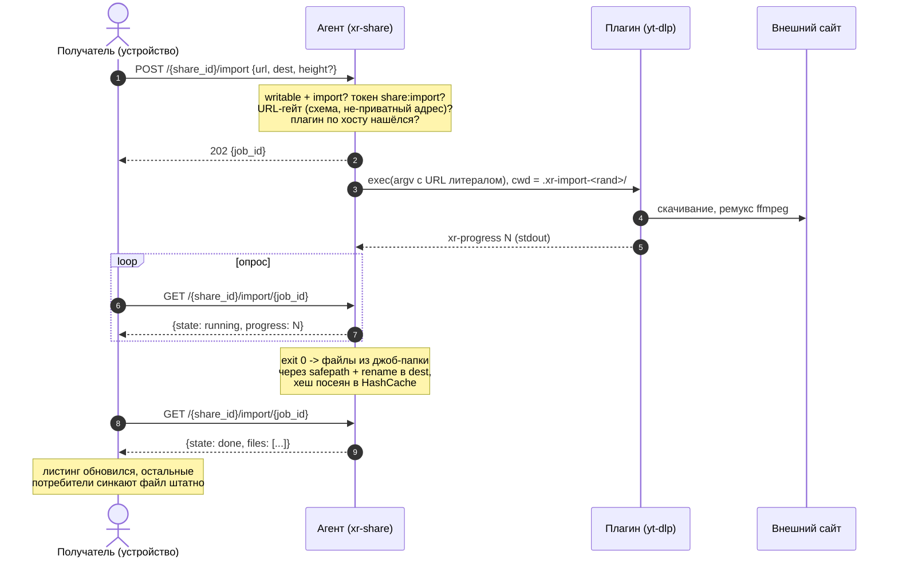

# LLD-29. Импорт контента по URL как плагин агента (XR-052)

**Статус:** Draft
**Область:** `xr-proto` (имя скоупа `share:import`); `xr-hub` (минт нового имени
в грантах); `xr-share` (реестр плагинов-фетчеров в конфиге, джобы импорта с
прогрессом, SSRF-гейт, песочница, флаг `share --import`, харнесс `import`);
`xr-core` (клиентские функции запуска и опроса джобы поверх direct/relay);
`xr-android-jni` + `xr-android` (кнопка «Импорт по URL» в папке writable-шары,
диалог ссылки, строка прогресса).
**Зависимости:** [LLD-28](28-share-write-scope.md) (запись в шару, реализована в
XR-139: скоупы в токене, safepath-контур записи, temp + rename, посев
`HashCache`); [LLD-19](19-file-sharing-agent.md) (шара, токены, гранты);
[LLD-23](23-share-relay-nat.md) (relay-путь: запуск и опрос джобы едут тем же
каналом). Стык с XR-102 (видимость привязок) и XR-075 (квоты) разобран в п. 7.

Сценарий: в writable-шаре зайти в папку, нажать «Импорт по URL», вставить
ссылку на страницу, и контент оказывается в этой папке под адекватным именем из
метаданных (например заголовок ролика). Качает не телефон, а агент: у него
постоянный канал, диск рядом с шарой и никакого фонового обрыва. Ядро xr-share
при этом остаётся тонким файлсервером: скачивание и разбор страниц делает
внешний плагин-фетчер (референс это обёртка yt-dlp + ffmpeg), который владелец
агента ставит и включает сам.

---

## 0. Схема импорта



Импорт гейтится так же трижды, как запись (LLD-28 п. 0): write-привязка
инвайта на хабе (иначе в гранте нет `share:import`), writable-запись шары на
хабе, и локальный опт-ин владельца на самой машине данных, который здесь
двойной: у шары включён `import`, и в конфиге есть хотя бы один плагин.

## 1. Текущее состояние

- Запись в шару работает (LLD-28/XR-139): `PUT`/`DELETE` со скоупом
  `share:write`, порядок гейтов, safepath, стриминг в `.xr-part-<rand>` с
  хешем на лету, fsync + атомарный rename, посев `HashCache`, колпак
  `max_file_mb`. Пишут харнесс `push`/`rm` и `xr-core::upload_file`;
  Android UI записи ещё нет, импорт станет его первым кусочком.
- Скоуп-механика готова к расширению: scope это OAuth-строка имён через
  пробел внутри подписанных байтов v2, новое имя не требует смены версии
  формата, и `share:import` в LLD-28 п. 2.2 зарезервировано заранее именно
  под эту задачу. Проверка агента (`scope_contains`) уже игнорирует
  незнакомые имена.
- Агент сам наружу не ходит: исходящие соединения только к хабу
  (субкоманды владельца) и к relay (реверс-туннель). Скачивание из
  интернета это новый класс поведения, отсюда и опт-ин, и песочница.
- Зарезервирован только файловый префикс `.xr-part-`: обход манифеста
  пропускает такие файлы, роуты их отвергают. Служебных *каталогов* у
  агента пока нет, обход каталоги не фильтрует.
- Долгих операций у агента нет: все запросы отвечают в пределах секунд.
  Импорт ролика живёт минутами, в один HTTP-запрос (тем более через relay)
  он не помещается.

## 2. Целевое поведение

### 2.1 Модель: импорт это запись руками агента

Импорт концептуально тот же `PUT`, только байты приносит не клиент, а плагин
на машине агента. Поэтому весь пишущий контур переиспользуется: тот же
safepath, тот же temp + rename, тот же посев хеша, тот же `max_file_mb` на
каждый публикуемый файл. Переиспользуется именно код локальной публикации:
в собственный HTTP-API агент не ходит, по сети ездят только запуск джобы и
прогресс (п. 2.5), а байты ложатся в шару локальным rename (п. 2.7). Права выводятся из права записи (п. 2.2), результат
для потребителей неотличим от заливки: файл появляется в манифесте и штатно
доезжает синком до остальных устройств.

### 2.2 Скоуп `share:import`

- Новое имя в scope-строке, без бампа версии подписанных байтов (LLD-28
  п. 2.2). Константа `SCOPE_IMPORT = "share:import"` в `xr-proto`.
- Хаб минтит его вместе с `share:write`: грант write-привязки по
  writable-записи несёт `"share:read share:write share:import"`. Отдельной
  оси привязки «import без write» не заводим: импорт это подвид записи, а
  когда понадобится раздавать их врозь, поменяется только минт на хабе,
  агент и формат не тронутся (форматы ломать можно, парк тестовый).
- Роуты импорта требуют `share:import`. Ссылки и `/share/mint` как несли
  только `share:read`, так и несут.

### 2.3 Конфиг агента: реестр плагинов и опт-ин шары

```toml
# Плагины-фетчеры (агент-глобально). Нет ни одного блока - импорта нет.
[import]
timeout_min = 30        # предел жизни джобы (по умолчанию 30)
max_total_mb = 4096     # предел суммарного выхлопа джобы (опционально)
sandbox = "auto"        # auto | none: обёртка systemd-run, п. 3.5

[[import.plugin]]
name = "yt-dlp"
# Суффиксы хоста; "*" делает плагин catch-all (yt-dlp знает тысячи сайтов).
patterns = ["youtube.com", "youtu.be", "*"]
max_height = 1080       # планка владельца: выше этого не качаем никому
cmd = "yt-dlp"
args = [
  "--no-playlist", "--newline",
  "-f", "bv*[height<={height}]+ba/b[height<={height}]",
  "--progress-template", "download:xr-progress %(progress._percent_str)s",
  "-o", "%(title).200B [%(id)s].%(ext)s",
  "{url}",
]
```

- Плагин это внешняя команда: `cmd` + `args`, где элемент, равный `{url}`,
  заменяется ссылкой **как отдельный литеральный аргумент argv**. Никакого
  shell, никакой интерполяции внутри строк: `{url}` посреди аргумента не
  подставляется, это ошибка конфига при старте.
- `{height}` это второй плейсхолдер, качество: подставляется эффективная
  высота кадра (п. 2.5). В отличие от `{url}` ему можно стоять внутри
  аргумента, потому что подставляется не пользовательская строка, а целое
  число, провалидированное агентом.
- Шара включает импорт полем `import = true` в `[[share]]` (default false),
  допустимо только вместе с `writable`. CLI: `xr-share share <dir> --writable
  --import`; повторный `share` без флага выключает, как у `--writable`.
- «Шара одной командой» сохраняется: если `[import]` в конфиге ещё нет,
  `share --import` сам вписывает референс-блок ровно в виде выше (yt-dlp
  catch-all, планка 1080p) и проверяет, что `yt-dlp` и `ffmpeg` находятся в
  `PATH`; если нет, отказывает с подсказкой, чем их поставить, а не включает
  заведомо нерабочий импорт. Ручная правка конфига остаётся для тонкой
  настройки (свои плагины, другая планка), а не для включения.
- Конфиг агента и так пишет только владелец машины; добавление плагина это
  осознанное решение уровня «поставить программу», защищать конфиг от самого
  владельца не требуется.

### 2.4 Контракт плагина

Вход: argv с URL, рабочая директория это пустая приватная джоб-папка
`.xr-import-<rand>/` в корне шары (тот же диск, что и цель: финальный rename
атомарен). Плагин обязан писать только в cwd.

Выход: код 0 и файлы в cwd. После успешного выхода агент публикует **регулярные
файлы верхнего уровня** джоб-папки, имена даёт плагин (у yt-dlp это заголовок
ролика из шаблона `-o`). Скрытые файлы (имя с точки) не публикуются: это
отсекает кеши и недокачки самих инструментов. Подпапки не публикуются тоже.

Прогресс (опционально): строки `xr-progress <число>` в stdout, число это
процент; агент парсит их лениво (первое число в хвосте строки, `%` и пробелы
терпимы, что удобно под `--progress-template` yt-dlp). Остальной stdout
игнорируется, хвост stderr (последние 4 КиБ) агент держит для текста ошибки.
Плагин без прогресс-строк работает, просто состояние будет «running» без
процентов.

### 2.5 HTTP API джоб

Три роута, только v2, все под гейтами импорта (п. 2.6):

- `POST /{share_id}/import`, тело `{"url": "...", "dest": "видео/сериалы",
  "height": 1080}` (`dest` это каталог внутри шары относительно корня, пустая
  строка это корень; `height` опционален, желаемая высота кадра). Ответ
  `202 {"job_id": "..."}`; id случайный, 8 байт hex.
- Качество считается так: эффективная высота это `min(height, max_height)`
  плагина; без `height` в запросе берётся сама планка. Валидация: целое в
  диапазоне 144..4320, иначе `400`. В плагин без `{height}` в args параметр
  просто не попадает (не-видео плагину он ни к чему).
- `GET /{share_id}/import/{job_id}` -> `{"state": "queued|running|done|failed",
  "progress": 42.5 | null, "files": ["видео/сериалы/Имя.mp4"], "error": "..."}`
  (`files` только у done, `error` только у failed).
- `DELETE /{share_id}/import/{job_id}`: отмена. Процессу SIGKILL (группе),
  джоб-папка удаляется, ответ `204`. Отмена завершённой джобы просто убирает
  её из таблицы.

Джобы живут в памяти агента: параллельно исполняется одна (остальные в
очереди, глубина 4, сверх этого `429`), завершённые видны ещё час и
вычищаются. Рестарт агента забывает таблицу (п. 3.7): опрос пропавшей джобы
отвечает `404`, недоделанные `.xr-import-*` подметаются при старте вместе с
`.xr-part-*`.

### 2.6 Порядок гейтов и валидация URL

Как у записи, плюс два новых рубежа после токена:

1. шара существует (`404`);
2. `writable` и `import` в конфиге агента, и есть хоть один плагин (`403`);
3. токен этой шары с `share:import` (`401`/`403`);
4. `dest` проходит safepath как каталог внутри шары, компоненты с префиксом
   `.xr-` отвергаются (`403`);
5. URL-гейт (`400`): схема только `http`/`https`; хост резолвится, и **все**
   его адреса обязаны быть вне приватных и специальных диапазонов (для v4:
   loopback, RFC1918, link-local, CGNAT, multicast/broadcast; для v6:
   loopback, ULA, link-local, v4-mapped с теми же правилами). Литеральный
   IP-хост проверяется теми же списками;
6. роутинг по плагинам (`422` «нет плагина под этот URL»): хост сравнивается
   с `patterns` как суффикс по границе меток (`youtu.be` матчит и
   `www.youtu.be`), самый длинный суффикс побеждает, `"*"` ловит остаток.

URL-гейт закрывает наивный SSRF: импорт страницы админки роутера или
соседнего LAN-хоста по приватному адресу дал бы готовый read-примитив во
внутреннюю сеть владельца (результат ложится в шару и читается автором
запроса). Редиректы и DNS rebinding после старта плагина закрывает песочница
на Linux (п. 3.5), на Windows это принятый остаточный риск (п. 5.1).

### 2.7 Публикация результата

По выходу плагина с кодом 0 агент для каждого публикуемого файла: проверяет
имя (одна компонента из `read_dir`, не скрытая, без префикса `.xr-`),
сверяет с `max_file_mb` (`failed`, если файл больше), считает SHA-256,
делает fsync и rename в `dest` (родители уже созданы к старту джобы), сеет
`HashCache`. Rename поверх существующего имени перетирает его: та же
семантика last-write-wins, что у безусловного `PUT` (LLD-28 п. 3.7),
случайные коллизии заголовков редки, а история не ведётся нигде. Джоб-папка
удаляется в любом исходе; частично опубликованная джоба (диск кончился на
втором файле) отдаёт `failed` с перечислением того, что успело
опубликоваться, в `error`.

Ненулевой код, таймаут (`timeout_min`), превышение `max_total_mb` (размер
джоб-папки проверяется раз в несколько секунд по ходу скачивания) или отмена
дают `failed`/пропажу без публикации чего-либо.

### 2.8 Потребительская сторона

- `xr-core`: `import_url(grant, url, dest, height) -> job_id`,
  `import_status(grant, job_id) -> ImportStatus`,
  `import_cancel(grant, job_id)` поверх того же `direct_then_relay`, что и
  запись. До сети проверяется `share:import` в скоупе гранта с понятной
  ошибкой «нет права импорта».
- JNI: `nativeImportUrl` / `nativeImportStatus` / `nativeImportCancel`
  тонкими обёртками (бизнес-логики в Kotlin нет, как обычно).
- Android UI (минимум контролов, тексты фиксируются здесь): в папке шары,
  грант которой несёт `share:import`, в тулбаре появляется действие
  «Импорт по URL». Диалог: поле «Ссылка», ряд чипов качества «720p» /
  «1080p» / «Максимум» (default «1080p»; «Максимум» не шлёт `height`, то
  есть упирается в планку владельца), кнопки «Импортировать» и «Отмена».
  Выше планки чипы не обрежешь (устройство планку не знает), поэтому выбор
  это пожелание сверху вниз: попросил 720p, получишь не выше 720p. После
  запуска в списке файлов сверху строка задачи: «Импорт:
  N%» (или «Импорт...» без процентов) с крестиком-отменой; опрос раз в
  2 секунды, пока экран открыт (фонового сервиса не заводим: качает агент,
  уход с экрана скачивание не прерывает, вернувшись, пользователь увидит
  готовый файл в листинге). По done строка исчезает и листинг обновляется;
  по failed показывается текст ошибки агента («Нет плагина под эту ссылку»,
  «Агент перезапустился, задание потерялось» для `404` по известной джобе,
  прочее как есть).
- Харнесс на десктопе: `xr-share import --invite <t> --share <id|имя> <url>
  [--to <rel>] [--height <n>]` запускает джобу и поллит до конца, печатая
  прогресс; это
  инструмент проверки без устройства, симметричный `push`/`pull`.

## 3. Дизайн-решения

### 3.1 Плагин это внешний exec, ядро остаётся тонким

yt-dlp и ffmpeg не линкуются и не вендорятся: агент зовёт внешнюю команду,
которую владелец поставил пакетным менеджером и вписал в конфиг. Агент без
единого плагина ведёт себя ровно как сегодня (роуты импорта отвечают `403`),
бинарь не тяжелеет ни на байт, кросс-сборка под Windows/musl не страдает.
Обновление плагина (сайты ломают yt-dlp регулярно) это `pip install -U` у
владельца, без релиза xr-share. Интерфейс «argv внутрь, файлы в cwd наружу»
не привязан к yt-dlp: обёртка над gallery-dl, curl или своим скриптом
вписывается тем же блоком конфига.

### 3.2 Процесс на джобу, без плагин-демона

Никакого долгоживущего плагин-процесса, сокетов и RPC: одна джоба это один
запуск команды до выхода. Изоляция джоб друг от друга бесплатная (свой cwd,
своя группа процессов), отмена это kill группы, утечь между джобами нечему.
Цена (старт интерпретатора на джобу) на фоне минут скачивания не видна.

### 3.3 Роутинг по суффиксам хоста, не по regex

Regex в конфиге это лишняя выразительность с граблями (ReDoS, экранирование,
непрозрачные матчи по всему URL). Суффикс хоста по границе меток покрывает
реальную задачу («этот плагин для этих сайтов»), сравнивается тривиально и
не ошибается на `evil-youtube.com`. Catch-all `"*"` покрывает хвост, потому
что референс-плагин и так универсален.

### 3.4 SSRF-защита слоями, а не одной проверкой

URL приходит от пользователя, а исполняется с машины в чужой квартире, изнутри
её LAN. Первый слой это гейт до запуска (схема, резолв, приватные диапазоны,
п. 2.6): он дешёвый, кроссплатформенный и отсекает прямые попытки. Второй слой
это сетевая песочница процесса плагина (п. 3.5): она закрывает то, что гейту
принципиально не видно, редирект на приватный адрес и DNS rebinding после
проверки, потому что запрет живёт на уровне ядра и не зависит от того, что и
когда резолвит плагин. Ответы плагин никому не пересылает, но результат
попадает в шару и читается автором запроса, поэтому SSRF здесь считаем
read-примитивом, а не слепым.

### 3.5 Песочница по возможности: systemd-run на Linux, честный отказ на Windows

При `sandbox = "auto"` агент на Linux оборачивает команду в `systemd-run
--scope --collect` со свойствами `IPAddressAllow=any` плюс `IPAddressDeny`
со списком тех же приватных и специальных диапазонов, что в гейте п. 2.6
(loopback, link-local, multicast, RFC1918, CGNAT, v6 ULA): deny побеждает,
интернет плагину можно, в LAN и на локалхост нельзя, фильтр держит ядро
(cgroup eBPF). Туда же `MemoryMax` разумным колпаком. Файловую изоляцию
scope-юнит не даёт, она остаётся на контракте cwd и непривилегированном
пользователе агента; этого достаточно, потому что плагин у нас не
враждебный, враждебен URL. Если systemd-run недоступен (Windows, голый Linux
без systemd), агент один раз пишет в лог, что импорт работает без песочницы,
и полагается на гейт п. 2.6; это и есть «по возможности» из постановки
задачи. `sandbox = "none"` выключает обёртку явно (отладка, экзотические
дистрибутивы).

### 3.6 Асинхронные джобы с поллингом, не долгий запрос и не пуш

Импорт живёт минутами, HTTP-запрос столько не живёт, особенно через relay с
его таймаутами и обрывами мобильной сети. Поллинг раз в пару секунд
переживает смену сети и перезаход на экран без какого-либо состояния на
устройстве (job_id восстановим повторным POST, идемпотентность не нужна:
повторный импорт того же URL просто перезапишет тот же файл). SSE/WebSocket
через relay-сплайс работали бы, но добавили бы класс долгоживущих стримов
ради экономии копеечных GET.

### 3.7 Джобы эфемерны, таблица в памяти

Персистить очередь джоб на диск незачем: джоба это минуты, её потеря при
рестарте агента стоит одного повторного нажатия, а файл-результат либо уже
опубликован (виден в манифесте), либо честно отсутствует. Клиент отличает
эти исходы листингом, `404` по известной джобе переводится в понятный текст.

### 3.8 Резервируется неймспейс `.xr-`, не второй точечный префикс

Джоб-папкам нужен свой резерв (недокачка не должна ни листиться, ни
скачиваться, ни перетираться чужим PUT). Вместо пары независимых резервов
(`.xr-part-` для файлов, `.xr-import-` для каталогов) обход манифеста и
роуты начинают отвергать/пропускать **любую компоненту с префиксом `.xr-`**:
одна проверка, и все будущие служебные имена агента уже зарезервированы.
Пользовательских файлов с таким префиксом в природе не водится, а `.xr-part-`
автоматически внутри нового правила.

### 3.9 Качество выбирает импортирующий, планку держит владелец

Прибить качество в конфиге шары было бы плохим UX: импортирует не владелец, а
держатель инвайта, и это ему решать, нужен ролик в 720p или в лучшем виде.
Полностью отдать выбор устройству тоже нельзя, диск и канал не его. Поэтому
качество это параметр джобы (пожелание), а `max_height` в конфиге это планка
(предел), эффективная высота их минимум. В плагин при этом не попадает ни
одного байта пользовательского ввода кроме URL-литерала: высота проходит
валидацию «целое в диапазоне» и подставляется числом, произвольных аргументов
с устройства не существует как класса. Прочая параметризация (субтитры,
только аудио, контейнер) сознательно не открывается: каждый новый параметр
это новая поверхность, вернёмся по живой боли (п. 7).

### 3.10 Референс-конфиг вписывает сама команда включения

Шара делается одной командой, и импорт не должен ломать это свойство
требованием «сначала попиши TOML». `share --import` при отсутствии `[import]`
вписывает референс-блок сам (конфиг агента команда `share` и так
переписывает), а заодно fail-fast проверяет наличие `yt-dlp` и `ffmpeg` в
`PATH`: честный отказ с подсказкой лучше шары, у которой импорт «включён», но
каждая джоба падает. Сами бинари агент не ставит и не обновляет (п. 7):
установка инструментов это территория владельца и его пакетного менеджера.

## 4. Изменения в коде

| Файл | Что меняется |
|---|---|
| `xr-proto/src/share.rs` | Константа `SCOPE_IMPORT = "share:import"`. Формат токена не меняется. |
| `xr-hub/src/api/share_v2.rs` | `invite_shares` минтит `"share:read share:write share:import"` там, где сейчас минтит write (writable-запись + write-привязка). |
| `xr-share/src/config.rs` | `ImportConfig { timeout_min, max_total_mb, sandbox }` + `Vec<ImportPlugin> { name, patterns, max_height, cmd, args }` (`[import]` / `[[import.plugin]]`); `ShareEntry.import: bool` (`serde(default)`); валидация при старте: `{url}` только отдельным элементом args, `import` только при `writable`. |
| `xr-share/src/import.rs` (новый) | Реестр джоб (таблица в памяти, очередь глубины 4, одна активная); URL-гейт (схема, резолв, приватные диапазоны v4/v6); роутинг по суффиксам хоста; зажим высоты `min(height, max_height)` и подстановка `{height}` числом; запуск процесса (argv-литерал, cwd = `.xr-import-<rand>/`, группа процессов, обёртка systemd-run при `sandbox = auto`); парс `xr-progress`; таймаут, кап `max_total_mb`, отмена; публикация (санитайз имени, `max_file_mb`, SHA-256 + fsync + rename, посев `HashCache`); подметание `.xr-import-*` при старте. |
| `xr-share/src/server.rs` | Роуты `POST /{id}/import`, `GET`/`DELETE /{id}/import/{job_id}` с гейтами п. 2.6; резерв компонент `.xr-` во всех роутах (обобщение проверки `.xr-part-`). |
| `xr-share/src/manifest.rs` | Обход пропускает любые компоненты с префиксом `.xr-` (файлы и каталоги), `UPLOAD_TEMP_PREFIX` остаётся частным случаем. |
| `xr-share/src/cli.rs` | Флаг `share --import` (только с `--writable`, повторный `share` без флага выключает); бутстрап `[import]`-блока при первом включении + проверка `yt-dlp`/`ffmpeg` в `PATH` с отказом и подсказкой; субкоманда `import` (запуск + поллинг с печатью прогресса, `--height`); тексты `--help`. |
| `xr-core/src/sync.rs` | `import_url` / `import_status` / `import_cancel` поверх `direct_then_relay`; проверка `share:import` в скоупе гранта до сети; `height` опциональным параметром. |
| `xr-android-jni/src/lib.rs` | `nativeImportUrl` (с `height`) / `nativeImportStatus` / `nativeImportCancel`. |
| `xr-android` (files UI) | Действие «Импорт по URL» в папке шары с `share:import` в гранте; диалог ссылки с чипами качества (720p/1080p/Максимум); строка прогресса с отменой и опросом раз в 2 с; обновление листинга по done; тексты из п. 2.8. |
| `xr-share/README.md` | Раздел про импорт: контракт плагина (argv, cwd, `xr-progress`, файлы верхнего уровня), роуты и гейты, конфиг с референсом yt-dlp, песочница и её отсутствие на Windows. |
| `configs/share.toml` | Блоки `[import]` и `[[import.plugin]]` с рабочим yt-dlp-примером и комментариями (включая `--no-playlist`, `max_height` и `{height}`-шаблон в `-f` и почему), `import` у `[[share]]`; тот же блок служит источником бутстрапа в `cli.rs`. |
| `docs/ARCHITECTURE.md` | Строка LLD-29 в разделе 9; после реализации факты импорта в раздел 4.7 (карта эндпоинтов агента, модель плагинов). |

Правки доков едут в той же задаче отдельным docs-коммитом серии.

Тесты (Rust, без сети; плагин в тестах это исполняемый скрипт, который тест
пишет сам: печатает прогресс, кладёт файлы, спит или падает по сценарию):

- `test_import_scope_minted_with_write` (хаб): write-привязка + writable ->
  в scope гранта есть `share:import`; read-привязка -> нет.
- `test_import_config_parse`: `[[import.plugin]]` и `share.import`
  парсятся и переживают roundtrip; `{url}` внутри строки, а не отдельным
  элементом -> ошибка старта; `import = true` без `writable` -> ошибка.
- `test_url_guard`: схемы `file`/`ftp` -> 400; loopback-, LAN- и
  link-local-адреса литералом (v4 и v6) -> 400; хост, резолвящийся в
  приватный адрес -> 400; нормальный публичный URL проходит.
- `test_plugin_routing`: длиннейший суффикс побеждает, матч по границе меток
  (`evil-youtube.com` не матчит `youtube.com`), `"*"` ловит остаток, без
  матча 422.
- `test_import_happy_path`: POST -> 202, статус running с прогрессом из
  `xr-progress`, по exit 0 файл в dest, виден в манифесте с хешем,
  джоб-папка удалена, статус done с путём.
- `test_import_gates`: шары нет -> 404; `import = false` или нет плагинов ->
  403; токен без `share:import` -> 403; без токена -> 401; `dest` с `..`
  или `.xr-` -> 403.
- `test_import_failures`: ненулевой выход -> failed с хвостом stderr;
  таймаут -> failed, процесс убит, папка удалена; превышение
  `max_total_mb` по ходу -> failed; файл больше `max_file_mb` -> failed,
  ничего не опубликовано.
- `test_import_height`: запрошенная высота выше `max_height` зажимается до
  планки; запрос без `height` подставляет планку; нечисловая/вне диапазона ->
  400; плагин без `{height}` в args принимает джобу с `height` как есть.
- `test_import_bootstrap`: `share --import` на конфиге без `[import]`
  вписывает референс-блок (и он парсится обратно); при отсутствии бинарей в
  `PATH` отказ с подсказкой, конфиг не тронут.
- `test_import_cancel`: DELETE убивает процесс, папка удалена, статус 404.
- `test_import_output_filter`: скрытые файлы и подпапки не публикуются;
  выход плагина с именем `.xr-хитрость` не публикуется.
- `test_manifest_skips_xr_namespace`: каталог `.xr-import-*` с содержимым не
  листится; `GET`/`PUT` по пути с компонентой `.xr-` -> 403 (регресс для
  `.xr-part-` остаётся зелёным).
- `xr-core`: `test_import_roundtrip` против тестового роутера (запуск,
  опрос, done); грант без `share:import` -> ошибка до сети.

## 5. Риски и edge-кейсы

1. **SSRF остаётся главным риском.** Гейт до запуска + сетевая песочница на
   Linux (п. 3.4-3.5). На Windows после гейта редирект/rebinding на
   приватный адрес возможен: риск принят, задокументирован в README, круг
   держателей write-инвайтов доверенный. Усиление (свой резолвер-прокси
   перед плагином) отложено до живой необходимости.
2. **Плагин исполняет произвольный код по определению.** Это не эскалация:
   команду в конфиг вписывает владелец машины руками, ровно как ставит сам
   yt-dlp. Агент не скачивает и не обновляет плагины сам, никакой
   «магазин плагинов» не заводится.
3. **Диск и ресурсы.** Долгая загрузка жрёт диск и канал владельца:
   `max_total_mb` с проверкой по ходу, `timeout_min`, одна активная джоба,
   `MemoryMax` в песочнице. `ENOSPC` при публикации -> failed, temp убран.
4. **Имя из метаданных коллидирует с существующим файлом.** Last-write-wins
   как у безусловного PUT (п. 2.7); `[%(id)s]` в референс-шаблоне yt-dlp
   делает повтор маловероятным, а повторный импорт того же URL намеренно
   идемпотентен по результату.
5. **Рестарт агента посреди джобы.** Таблица пропала, `.xr-import-*`
   подметён при старте, клиент по `404` показывает «задание потерялось»;
   опубликованного наполовину не бывает, публикация пофайлово атомарна.
6. **yt-dlp протух.** Сайты ломают его регулярно; это операционная забота
   владельца (обновить пакет), агент лишь честно показывает stderr-хвост в
   ошибке джобы.
7. **Прогресса нет или он врёт.** Контракт прогресса необязательный:
   состояние running без процентов легально, UI показывает неопределённый
   индикатор. Ремукс-фаза ffmpeg процентов не даёт, полоска у конца может
   стоять заметное время.
8. **Плейлист вместо ролика.** Референс-конфиг ставит `--no-playlist`;
   контракт «все верхнеуровневые файлы публикуются» с плейлистом тоже
   корректен, просто файлов будет много и долго. Кап `max_total_mb`
   ограничивает урон от случайной ссылки на плейлист-гигант.
9. **Юр-сторона.** Скачивает машина владельца по явной команде держателя
   инвайта, хаб в пути данных не участвует (модель LLD-19 не меняется), у
   агента нет ни каталога контента, ни автоматики. Ответственность и выбор
   источников на людях, инструмент нейтрален.

## 6. План проверки

Автотесты п. 4 плюс ручной сценарий на стенде (агент с yt-dlp + ffmpeg,
шара `--writable --import` на write-инвайте):

1. С ноутбука: `xr-share import --invite <t> --share <имя>
   <ссылка на короткий ролик>` -> прогресс бежит, по завершении файл с
   заголовком ролика лежит в папке шары, `pull`/приложение видят его и
   скачивают, SHA-256 сходится.
2. С телефона: в папке writable-шары действие «Импорт по URL», вставить
   ссылку, строка прогресса, по завершении файл в листинге. Уйти с экрана
   посреди импорта, вернуться: файл доехал.
3. `--to подпапка` кладёт в подпапку, создавая её.
4. Качество: чип «720p» даёт файл не выше 720 строк; «Максимум» при планке
   1080 в конфиге даёт не выше 1080 (проверить `ffprobe`/свойствами файла).
5. `share --import` на агенте с чистым конфигом вписывает референс-блок
   сам; без yt-dlp в `PATH` отказывает с подсказкой установки.
6. Ссылка на страницу без видео (или с опечаткой) -> джоба failed с
   внятным текстом из stderr yt-dlp.
7. URL с приватным адресом (например админка роутера) -> 400 сразу; ссылка
   с редиректом на приватный адрес на Linux-агенте -> джоба failed
   (песочница режет соединение).
8. Инвайт без write-привязки: действия импорта в UI нет, харнесс
   отказывает до сети текстом «нет права импорта»; токен с
   `share:read share:write` без import (сминченный руками) по POST -> 403.
9. Шара без `--import` -> 403; конфиг без плагинов -> 403.
10. Отмена: крестик на строке прогресса (и `DELETE` харнесса) убивает
    скачивание, мусора в шаре и `.xr-import-*` не остаётся.
11. Рестарт агента посреди импорта: temp подметён, телефон показывает
    «задание потерялось», повторный импорт проходит.
12. Relay-путь: тот же импорт с телефона на шаре за NAT.
13. Дока сходится с поведением: README агента описывает контракт плагина и
    гейты, `configs/share.toml` содержит рабочий референс yt-dlp.
14. `cargo test --workspace` зелёный, 0 warnings.

## 7. Вне скоупа (отдельные задачи)

- **Раздача права импорта отдельно от записи** (своя ось привязки на хабе):
  минт поменяется в одном месте, когда появится живая нужда; агент готов.
- **Параметризация джобы дальше качества** (субтитры, только аудио, выбор
  контейнера): каждый параметр это новая поверхность агента и новый контрол
  UI; высота покрывает главный кейс, остальное по живой боли (п. 3.9).
- **Фоновый сервис импорта на Android** (уведомление с прогрессом при
  закрытом приложении): качает агент, устройству следить не обязательно;
  вернёмся при живой боли.
- **Квоты и учёт импорта на инвайт**: территория XR-075, сюда же счётчики
  «кто сколько накачал».
- **Видимость привязок и `--import` в `list`**: уедет в XR-102 вместе с
  attach/detach.
- **Резолвер-прокси перед плагином** (полное закрытие rebinding на всех
  платформах): по живой необходимости, риск 1.
- **Каталог/маркетплейс плагинов, авто-установка yt-dlp**: не заводится
  сознательно, установка инструментов остаётся за владельцем.

## 8. Открытые вопросы (закрыты в этом дизайне)

- *Качать на устройстве или на агенте?* -> **на агенте**: канал, диск и
  аптайм там, телефон только запускает и смотрит прогресс (п. 2.1, 3.6).
- *Отдельный скоуп или хватит `share:write`?* -> **отдельное имя
  `share:import`**, зарезервированное ещё в LLD-28; сегодня минтится вместе
  с write, но развязка потом не тронет ни формат, ни агента (п. 2.2).
- *Как звать плагин: демон/RPC или процесс на джобу?* -> **процесс на
  джобу**, argv-литерал без shell, файлы наружу через cwd (п. 2.4, 3.2).
- *Роутинг URL по regex?* -> **нет, суффиксы хоста** плюс catch-all
  (п. 3.3).
- *Как защищаться от SSRF, если качает чужой бинарь?* -> **слоями**: гейт
  схема/резолв/приватные диапазоны до запуска, cgroup-запрет приватных
  адресов через systemd-run на Linux, честно принятый остаток на Windows
  (п. 3.4, 3.5, риск 1).
- *Долгий HTTP-запрос, SSE или поллинг?* -> **джоба + поллинг**: переживает
  relay и смену сети без состояния на устройстве (п. 3.6).
- *Персистить ли очередь джоб?* -> **нет**, in-memory, потеря стоит одного
  нажатия (п. 3.7).
- *Второй зарезервированный префикс?* -> **нет, резервируется неймспейс
  `.xr-` целиком** одной проверкой (п. 3.8).
- *Что публиковать из выхлопа плагина?* -> **регулярные не-скрытые файлы
  верхнего уровня джоб-папки**, имена от плагина после санитайза, перезапись
  как у безусловного PUT (п. 2.4, 2.7).
- *Кто выбирает качество видео?* -> **импортирующий с устройства, в пределах
  планки владельца**: `height` в джобе как пожелание, `max_height` плагина
  как предел, эффективная высота их минимум; в argv уходит только
  провалидированное число через `{height}` (п. 2.5, 3.9).
- *Как конфиг плагинов появляется при «шаре одной командой»?* -> **бутстрап
  референс-блока самим `share --import`** с fail-fast проверкой бинарей в
  `PATH`; установка yt-dlp/ffmpeg остаётся за владельцем (п. 2.3, 3.10).
