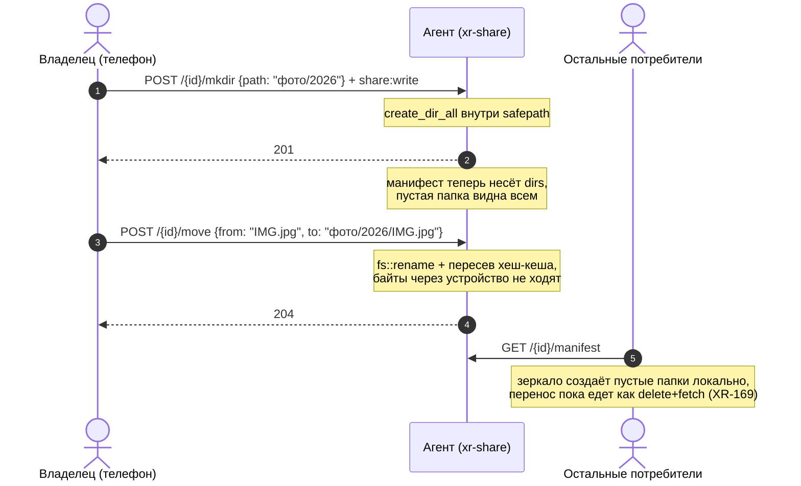

# LLD-32. Структурирование шары с устройства: директории в манифесте, mkdir/move/copy у агента (XR-168)

**Статус:** Draft
**Область:** `xr-proto` (список директорий в `ShareManifest`); `xr-share`
(обход манифеста, эндпоинты `mkdir`/`move`/`copy`, пересев хеш-кеша, харнесс
`mkdir`/`mv`/`cp`); `xr-core` (клиентские операции структуры, зеркалирование
пустых директорий в синке); `xr-android-jni` (`nativeMkdir`/`nativeMove`/
`nativeCopy`, `dirs` в JSON манифеста); `xr-android` (создание папки,
перемещение/копирование/переименование, пикер целевой папки).
**Зависимости:** [LLD-19](19-file-sharing-agent.md) (шара, токены, safepath);
[LLD-28](28-share-write-scope.md) (write-контур: scope `share:write`, гейты
записи, атомарная заливка); [LLD-29](29-share-url-import.md) (стык с
импорт-джобами и неймспейсом `.xr-`); [LLD-23](23-share-relay-nat.md)
(relay-путь: операции едут тем же каналом). Оптимизация синка под серверный
move вынесена в XR-169 и эту работу не гейтит.

Write-контур LLD-28 позволяет из приложения только пополнять шару: файл
ложится в открытую папку, и на этом всё. Хочется наводить в шаре порядок прямо
с устройства: создавать директории любой вложенности, перемещать, копировать
и переименовывать файлы и сами директории. Модель доверия не
меняется: те же три гейта записи (write-привязка инвайта, writable-запись
хаба, writable в конфиге агента), тот же safepath, хаб и минтинг не трогаются.

---

## 0. Схема

## 1. Текущее состояние

- Манифест перечисляет только regular files: `build_manifest` и
  `build_listing` ([manifest.rs](../../xr-share/src/manifest.rs)) пропускают
  всё остальное, тест `manifest_skips_symlinks_and_dirs` это фиксирует.
  Директория существует лишь как префикс пути файла, пустая директория
  потребителю невидима вовсе. «Создать папку» без расширения модели
  бессмысленно: папка пропадает из вида, пока в неё не положат файл.
  Sentinel-файл мусорил бы шару, а служебный неймспейс `.xr-` вырезается из
  манифеста целиком, так что честный путь один: директории как сущности
  манифеста.
- У агента нет серверных операций структуры: `PUT` создаёт родителей через
  `create_dir_all`, `DELETE` берёт только файл (на директорию 409), ни move,
  ни copy, ни mkdir в [server.rs](../../xr-share/src/server.rs) не существует.
  Гонять move через скачивание и перезаливку с телефона не вариант: двойной
  трафик через устройство и потеря атомарности.
- Safepath (`resolve_within` в [safepath.rs](../../xr-share/src/safepath.rs))
  уже возвращает пути к ещё не существующим файлам и режет `.xr-`-компоненты
  на любом уровне, то есть пригоден для всех трёх операций без изменений.
- `HashCache` агента ключуется абсолютными путями
  ([manifest.rs](../../xr-share/src/manifest.rs), `hashed`/`seed`): после
  переноса файла запись кеша остаётся под старым ключом, и листинг отдавал бы
  пустые sha256 до ленивого прогрева.
- Зеркало потребителя дифает строго по файлам: `plan_with_selection`
  ([sync.rs](../../xr-core/src/sync.rs)) не знает директорий, а
  `prune_empty_dirs` после удаления файла вычищает опустевших родителей, что
  прямо противоречит зеркалированию пустых папок.
- В JNI-мосту ([lib.rs](../../xr-android-jni/src/lib.rs)) write-обёрток нет
  вообще: `upload_file`/`delete_file` из LLD-28 наружу не проброшены, новые
  функции структуры станут первыми. Образец сигнатуры это блок импорта
  (`nativeImportUrl`: адреса и порт отдельными аргументами,
  `grant_from_parts`, ответ `{"ok":true}` либо `{"error":...}`).
- В приложении дерево строится в Kotlin из префиксов путей (`explorerLevel` в
  [Share.kt](../../xr-android/app/src/main/java/com/xrproxy/app/model/Share.kt)),
  гейт по scope существует только для импорта (`ShareConfig.canImport`),
  аналога `canWrite` нет. Тексты экрана Files хардкодятся литералами в
  composable, ресурсов строк нет.

## 2. Целевое поведение

### 2.1 Директории в манифесте

- `ShareManifest` получает второе поле `dirs: Vec<String>`: отсортированные
  относительные пути **всех** директорий шары, пустых в том числе, в той же
  форме, что и `path` у файлов (forward slash, без ведущего слеша). Обход
  `walk_share` уже отдаёт директории, сейчас их отбрасывает фильтр
  `is_file()`; резерв `.xr-` продолжает вырезаться прунингом на уровне обхода.
  Корень шары в список не входит, шара-файл несёт пустой список.
- `#[serde(default)]` на `dirs`: манифест старого агента парсится с пустым
  списком (потребитель живёт от префиксов, как сейчас), лишнее поле в JSON
  старый потребитель игнорирует. Слоя совместимости сверх этого не заводим,
  парк тестовый.
- Механизм подписи манифеста (XR-046) не меняется: подпись кроет точные байты
  тела, директории попадают под неё автоматически.
- Листается и хешированный манифест, и мгновенный листинг (`build_listing`):
  обе ветки берут директории из одного обхода.

### 2.2 Эндпоинты агента

Три новых v2-роута под тем же scope `share:write`, новый scope не нужен, хаб
и минтинг не трогаем. Порядок гейтов одинаков с `PUT`/`DELETE` (LLD-28
п. 2.3): шара существует (404) -> `writable` в конфиге агента (403) -> токен
с `share:write` (401/403) -> safepath каждого пути запроса (403). Шара-файл
не writable по построению, для неё все три операции дают 403.

- `POST /{share_id}/mkdir`, тело `{path}`: создаёт директорию со всей
  вложенностью разом, как `create_dir_all`. 201 при создании, 204 если такая
  директория уже есть (идемпотентность), 409 если путь или его компонент
  занят файлом.
- `POST /{share_id}/move`, тело `{from, to}`: `fs::rename`, работает для
  файла и директории; `to` это полный новый путь, включая имя, так что
  переименование это тот же move. 204 при успехе, 404 если `from` не
  существует, 409 если `to` занят (файлом или директорией), 409 при попытке
  переместить директорию внутрь самой себя (`to` лежит под `from`).
  Перезаписи нет: занятая цель освобождается явным `DELETE` перед move.
  Особый случай регистронечувствительной ФС (mac/Windows-агент): если занятый
  `to` резолвится в тот же самый объект, что и `from`, это смена регистра
  имени, rename выполняется.
- `POST /{share_id}/copy`, тело `{from, to}`: копия файла или директории
  (блокирующая работа в `spawn_blocking`). 201 при успехе, 404 если `from`
  нет, 409 если `to` занят или директория копируется внутрь самой себя.
  Файл копируется как у заливки: во временное имя `.xr-part-<rand>` рядом с
  целью, затем rename. Директория копируется рекурсивно в служебную
  `.xr-copy-<rand>` рядом с целью и публикуется одним rename по завершении:
  неймспейс `.xr-` невидим манифесту и недостижим через роуты, так что
  полукопия не видна потребителям ни при каких обстоятельствах, а упавшая
  копия оставляет только служебный мусор, который агент подчищает при
  старте, как недозаливки LLD-28. Симлинки внутри поддерева пропускаются
  (манифест их не листит), вложенный `.xr-`-мусор не копируется. Прогресса
  у операции нет, длительность пропорциональна объёму; оборванный по
  таймауту клиентский запрос копию не отменяет, она доезжает и появляется
  в манифесте.

Проверка занятости `to` и сама операция не склеены в атом: микроскопическое
окно между ними принято осознанно, как у `If-Match` в LLD-28 п. 3.7
(оптимистическая проверка, не замок). IO-ошибки маппятся как у write-путей
(`io_status`: `ENOSPC` -> 507, остальное 500), ответ несёт честный текст.

### 2.3 Хеш-кеш агента

Ключи `HashCache` абсолютные, поэтому:

- move файла пересеивает запись на новый путь без пересчёта (содержимое не
  менялось, mtime при rename сохраняется);
- move директории перевешивает префикс у всех записей под старым путём;
- copy файла сеет цель хешем источника (`hash_of(from)`: тёплый кеш отдаёт
  без чтения, холодный хеширует один раз) с метаданными свежей копии; copy
  директории сеет так каждый скопированный файл поддерева.

Иначе листинг после операции отдаёт пустые sha256 до ленивого прогрева, и
потребители перекачивали бы файлы, которые у них уже есть.

### 2.4 Зеркало пустых директорий в синке

- `SyncPlan` расширяется списками `mkdir` и `rmdir`. Желаемый набор
  директорий: директории манифеста, накрытые selection (то же правило
  `path_selected`, что у файлов), плюс родители желаемых файлов (файл может
  быть выбран точечно, его цепочка родителей обязана существовать).
- Локальный скан начинает отдавать и директории; `mkdir` это желаемые,
  которых нет локально, `rmdir` это локальные, которых нет в желаемом наборе.
- Применение: `mkdir` перед скачиваниями (дёшево, а родителей файлов
  `download_entry` и так создаёт), `rmdir` после удалений, в глубину.
  Удаление только `remove_dir` (нерекурсивное): непустая директория
  переживает попытку, та же консервативность, что у миграции хранилища.
- Слепой `prune_empty_dirs` после удаления файла становится избыточным и
  вредным (снёс бы желаемую опустевшую папку): вычистку опустевших родителей
  берёт на себя фаза `rmdir`, прунинг остаётся только в подметании
  осиротевших `.part` и учится не трогать желаемые директории.
- Семантика зеркала не меняется: сервер прав, локально созданная в
  синк-папке директория при следующем проходе удаляется, как и локальный
  файл. Серверный move у потребителя пока оборачивается delete+fetch
  (перекачивание зеркала); превращение этой пары в локальный перенос это
  XR-169 поверх готового серверного move.

### 2.5 Клиент: xr-core, JNI, приложение

- `xr-core`: `mkdir(grant, path, timeout)`, `move_entry(grant, from, to,
  timeout)`, `copy_entry(grant, from, to, timeout)` в write-блоке `sync.rs`
  по структуре `upload_file`: проверка `share:write` в scope гранта до сети
  (`ERR_NO_WRITE_SCOPE`), перебор адресов LAN -> public -> relay
  (`direct_then_relay`), anti-wrong-host проверка агента. Ошибки агента
  транслируются с машинным префиксом и человеческим текстом, как у импорта.
- `xr-android-jni`: `nativeMkdir`/`nativeMove`/`nativeCopy` в стиле
  импорт-блока (`addr`, `port`, `tokenJson`, `agentPubkey`, `relayJson`,
  пути, `timeoutMs`; `grant_from_parts`; ответ `{"ok":true}` либо
  `{"error":...}`); `nativeFetchManifest` начинает отдавать `dirs` в JSON.
- Приложение (контролы видны только при `share:write` в гранте, новый
  `ShareConfig.canWrite` рядом с `canImport`):
  - кнопка «Создать папку» в шапке проводника (рядом с импортом), создаёт в
    текущей директории;
  - long-press по файлу: в существующий диалог сведений добавляются действия
    «Переместить», «Копировать», «Переименовать»;
  - long-press по папке (сейчас не занят): те же три действия;
  - «Переместить» и «Копировать» открывают пикер целевой папки: диалог по
    дереву директорий, построенному по одному списку `dirs` (файлы и
    счётчики пикеру не нужны), навигация с крошками, подтверждение кнопкой
    «Сюда»;
  - «Переименовать» это move в ту же директорию под новым именем, отдельного
    эндпоинта нет;
  - `explorerLevel` строит папки из объединения явных `dirs` и префиксов
    файлов, пустая папка показывается с нулём файлов.
- Тексты UI (согласованы в рамках ревью этого LLD, урок XR-049):
  - диалог создания: заголовок «Новая папка», поле «Название», кнопки
    «Создать» / «Отмена»;
  - действия: «Переместить», «Копировать», «Переименовать»;
  - пикер: заголовок «Куда переместить?» / «Куда скопировать?», кнопки
    «Сюда» / «Отмена»;
  - диалог переименования: заголовок «Переименовать», поле «Новое имя»,
    кнопки «Переименовать» / «Отмена»;
  - тосты: «Папка создана», «Перемещено», «Скопировано», «Переименовано»,
    ошибки полным текстом агента без машинного префикса.
- Android без автотестов: вся логика (диф, желаемые наборы, операции)
  тестируется в Rust, Kotlin остаётся тонким UI.

### 2.6 Харнесс

Подкоманды `xr-share mkdir --invite <t> --share <id|имя> <путь>`,
`xr-share mv ... <from> <to>`, `xr-share cp ... <from> <to>` рядом с
`push`/`rm`, на тех же ureq-хелперах и выборе шары по инвайту
([push.rs](../../xr-share/src/push.rs)). Это и инструмент проверки без
устройства, и рабочий способ навести порядок в чужой writable-шаре с ноутбука.

## 3. Дизайн-решения

### 3.1 Отдельный список dirs, а не признак у entry

`ShareManifestEntry` несёт `size`/`mtime`/`sha256`, у директории ни одного из
них нет по смыслу: признак `is_dir` у entry заставил бы каждого потребителя
фильтровать вырожденные записи и обнулять поля. Отдельный список оставляет
инвариант «entry это файл» нетронутым: диф синка, скачивание, If-Match и
все существующие тесты продолжают жить на `entries`, директории добавляются
рядом, а не внутри.

### 3.2 В списке все директории, не только пустые

Вариант «листить только пустые» экономил бы байты, но дерево потребителя
собиралось бы из двух источников (префиксы файлов плюс пустые директории), а
желаемый набор синка терял бы простое свойство «директория желаема тогда и
только тогда, когда она в манифесте под selection». Полный список делает
манифест единственным источником структуры и работает в каждом запросе: из
него дерево получает пустые папки, а пикер целевой папки строится по нему
одному, без прохода по файлам. Цена это по строке пути на директорию, на
реальных шарах пренебрежимо.

### 3.3 Move и copy на агенте, а не через устройство

Скачивание плюс перезаливка с телефона это двойной трафик через самое узкое
звено и окно, в котором файл существует в двух местах или ни в одном.
`fs::rename` на агенте атомарен внутри ФС и не трогает байты; copy остаётся
на агенте по той же причине. Клиент дёргает одну операцию и перечитывает
манифест.

### 3.4 Без перезаписи и без If-Match у операций структуры

Занятая цель это 409 всегда: молчаливая перезапись при move теряла бы файл
целиком, а не версию (у PUT перезапись хотя бы оставляет содержимое под тем
же путём). Перезапись выражается явной парой DELETE + move, и на DELETE
уже есть опциональный `If-Match` из LLD-28. Самим структурным операциям
оптимистические предусловия не нужны: они не перетирают содержимое.

### 3.5 Переименование это move

Отдельный rename-эндпоинт дублировал бы move с ограничением «та же
директория» и вторым набором проверок. UI-действие «Переименовать» собирает
`to` из старой директории и нового имени; агенту разница не видна.

### 3.6 mkdir идемпотентен

Повторный mkdir существующей директории отвечает 204, а не 409: у операции
нет содержимого, которое можно было бы потерять, а идемпотентность прощает
ретраи клиента после сетевого обрыва. 409 остаётся за настоящим конфликтом,
когда путь занят файлом.

## 4. Изменения в коде

| Файл | Что меняется |
|---|---|
| `xr-proto/src/share.rs` | `ShareManifest.dirs: Vec<String>` c `serde(default)`; doc-комментарий про форму путей. |
| `xr-share/src/manifest.rs` | `walk_share` перестаёт отбрасывать директории: `build_manifest`/`build_listing` собирают `dirs` (сортировка, корень вне списка); `build_*_for_file` отдают пустой список; `HashCache::rekey(from, to)` и `rekey_prefix(from, to)` для move. |
| `xr-share/src/server.rs` | Роуты `POST /{id}/mkdir`, `POST /{id}/move`, `POST /{id}/copy` (v2-only); общий гейт как у `handle_put`; тела операций (`create_dir_all`, занятость `to`, запрет move и copy внутрь себя, случай смены регистра, копия файла через `.xr-part-`, рекурсивная копия директории через staging `.xr-copy-<rand>` + rename, всё блокирующее в `spawn_blocking`); подчистка осиротевших `.xr-copy-` при старте рядом с подчисткой недозаливок; пересев/перевес хеш-кеша; логирование операций (пути и исход, без токена). |
| `xr-share/src/push.rs` (или соседний модуль) | Харнесс `mkdir`/`mv`/`cp`: выбор шары по инвайту, проверка scope до сети, человеческие тексты ошибок по кодам. |
| `xr-share/src/main.rs` | Подкоманды `Mkdir`/`Mv`/`Cp` в `enum Commands` и диспетч. |
| `xr-core/src/sync.rs` | `SyncPlan.mkdir`/`rmdir` и их вывод в `plan_with_selection` (желаемые директории: манифест под selection плюс родители желаемых файлов); локальный скан директорий; применение mkdir до fetch и rmdir после delete (в глубину, `remove_dir`); `prune_empty_dirs` уходит из delete-ветки и учится не трогать желаемое в подметании `.part`; функции `mkdir`/`move_entry`/`copy_entry` поверх `direct_then_relay` с проверкой scope до сети. |
| `xr-android-jni/src/lib.rs` | `nativeMkdir`/`nativeMove`/`nativeCopy` (сигнатура импорт-стиля, `grant_from_parts`, `{"ok":true}`/`{"error":...}`, журнал `source="files"`); `dirs` в JSON `nativeFetchManifest` и полей плана в `nativePlanSync`/`nativeSyncShare`. |
| `xr-android` (`NativeBridge.kt`, `ShareRepository.kt`, `Share.kt`, `FilesViewModel.kt`, `FilesScreen.kt`) | Три `external fun` + обёртки репозитория; `ShareConfig.canWrite`; `dirs` в модели манифеста и `explorerLevel`; методы VM и состояния диалогов; кнопка «Создать папку», действия по long-press, пикер целевой папки, тексты из п. 2.5. |
| `xr-share/README.md` | Три строки в таблице Endpoints; раздел про операции структуры (гейты, коды, отсутствие перезаписи, идемпотентный mkdir); `dirs` в описании манифеста; команды `mkdir`/`mv`/`cp` в примерах. |
| `README.md` | В разделе файлообмена: держатель write-инвайта не только кладёт и удаляет файлы, но и наводит порядок (папки, перенос, копирование). |
| `docs/ARCHITECTURE.md` | Строка LLD-32 в разделе 9; после реализации: `dirs` манифеста в разделе 4.1, карта эндпоинтов агента в 4.7, операции структуры в описании синка 4.2. |
| `configs/share.toml` | Не меняется: новых ключей конфигурации нет. |

Правки доки едут в той же задаче отдельным docs-коммитом серии; правка без
обновлённых README не закрыта, как и правка без тестов.

Тесты (Rust, без сети; роутер-тесты axum как в `server.rs` сейчас):

- `xr-proto`: манифест без `dirs` десериализуется в пустой список; сериализация
  детерминирована (сортировка).
- `manifest.rs`: пустая и непустая директории попадают в `dirs`, файлы в
  `entries`, как раньше; `.xr-`-директории не листятся; шара-файл отдаёт
  пустой `dirs`; обновить `manifest_skips_symlinks_and_dirs` (симлинки
  по-прежнему вне, директории теперь в `dirs`, а не пропадают);
  `rekey`/`rekey_prefix` переносят записи кеша.
- `server.rs`: `test_mkdir_creates_nested` (201, видна в манифесте, повторный
  mkdir 204, поверх файла 409); `test_structure_requires_write_scope` (для
  всех трёх: без токена 401, только `share:read` 403, `writable = false`
  403, шара-файл 403); `test_structure_path_traversal_blocked` (`..`,
  абсолютный, `.xr-` в любом конце, для move оба конца); `test_move_file`
  (204, старый путь ушёл из манифеста, новый с прежним sha256 сразу, без
  прогрева); `test_move_dir` (переезд поддерева, хеши на месте, пустая
  директория переезжает как пустая); `test_move_conflicts` (`from` нет 404,
  `to` занят 409 и цел, директория внутрь себя 409); `test_copy_file`
  (201, sha256 цели совпадает с источником сразу; занятый `to` 409);
  `test_copy_dir` (рекурсивная копия: содержимое и хеши поддерева без
  прогрева, пустая вложенная директория скопирована, симлинк пропущен,
  staging `.xr-copy-` не виден в манифесте, копия внутрь самой себя 409).
- `xr-core`: `plan_mirrors_empty_dirs` (mkdir/rmdir в плане с selection и
  без; родители точечно выбранного файла не сносятся; локальная лишняя
  директория уходит в rmdir); применение плана создаёт и удаляет пустые
  директории, непустая переживает `rmdir`; подметание `.part` не трогает
  желаемую пустую директорию; `mkdir`/`move_entry`/`copy_entry` против
  тестового роутера, грант без `share:write` даёт ошибку до сети.

Это новая функциональность, регрессионного бага нет: тесты фиксируют новое
поведение по пирамиде (юнит на диф и кеш, интеграционные на роуты и клиент).

## 5. Риски и edge-кейсы

1. **Traversal на move опаснее прочего: два пути в одном запросе.** Оба конца
   идут через `resolve_within` независимо, тесты кроют оба; `.xr-` ловится
   там же, так что undelivered-заливки и джобы импорта недостижимы ни как
   `from`, ни как `to`.
2. **Конкуренция с импорт-джобой.** Джоба публикует результат в путь, взятый
   на старте: move директории под активной джобой воскресит старый путь через
   `create_dir_all`. Фиксируем как известное поведение, гейт не городим:
   джобы короткие, окно узкое.
3. **Move директории с недозаливкой внутри.** `.xr-part-*` переезжает вместе
   с директорией, финальный rename той заливки падает, PUT отвечает 500,
   клиент повторяет. Мусорный temp подчищается при старте агента, как в
   LLD-28.
4. **Windows-агент: rename файла, который сейчас раздаётся ридеру,** падает с
   sharing violation. Отдаём честную ошибку (500 с текстом), клиент повторит;
   на Linux ридер держит старый inode и дочитывает спокойно.
5. **Rename через границу ФС** (симлинк-поддиректория на другом томе даёт
   `EXDEV`): честная ошибка, фолбэк copy+delete не городим до живой боли.
6. **Окно проверки занятости `to`.** Проверка и rename не атомарны; на Linux
   rename молча перезаписал бы цель, появившуюся в окне. Принято осознанно,
   зеркально окну `If-Match` из LLD-28 п. 3.7.
7. **Синк после серверного move перекачивает зеркало** (delete+fetch по
   дифу путей). Известная цена, оптимизация в XR-169; пустые директории при
   этом зеркалятся уже правильно.
8. **Копия большой директории без прогресса.** Запрос висит, пока
   копируются байты; с телефона в мобильной сети он может оборваться по
   таймауту, копия на агенте при этом доедет и опубликуется, клиент увидит
   результат по следующему манифесту. Диск кончился на середине -> 507,
   staging убран целиком. При живой боли операция переезжает на джобу с
   поллингом, механика у импорта уже есть.
9. **Старый потребитель против нового агента** не видит пустых директорий и
   не умеет структурных операций, но читает и синкает файлы как раньше
   (лишнее поле JSON игнорируется). Старый агент против нового потребителя:
   `dirs` пуст, поведение сегодняшнее. Одновременного выката не требуется.

## 6. План проверки

Автотесты из п. 4 плюс сценарий на проде (харнесс с ноутбука + приложение):

1. `xr-share mkdir --invite <t> --share <имя> "docs/новая"` -> 201, папка
   появилась на диске агента, `pull`-листинг и приложение видят её пустой.
2. `xr-share mv --invite <t> --share <имя> report.pdf "docs/новая/report.pdf"`
   -> файл переехал на агенте без перекачки байтов, листинг сразу отдаёт его
   с прежним sha256.
3. `mv` директории целиком, `cp` файла и `cp` директории с поддеревом:
   содержимое и хеши на местах, полукопия по ходу не видна в листинге;
   `mv` в занятый путь -> отказ с текстом про 409; `mv` и `cp` директории
   внутрь самой себя -> отказ.
4. Синк на устройстве: пустая папка появилась локально; после её удаления на
   агенте (`rmdir` руками владельца) следующая синхронизация убрала её и
   локально.
5. В приложении с write-грантом: создать папку в текущей директории,
   переместить файл через пикер, скопировать, переименовать файл и папку;
   тосты и обновлённое дерево соответствуют. На read-only гранте контролов
   нет.
6. Инвайт без write-привязки: `xr-share mkdir` отказывает локально до сети с
   текстом «нет права записи».
7. Дока сходится с поведением: таблица Endpoints в `xr-share/README.md`
   несёт три новых роута, корневой README упоминает наведение порядка.
8. `cargo test --workspace` зелёный, 0 warnings.

## 7. Вне скоупа (отдельные задачи)

- **Локальный перенос зеркала при серверном move** (delete+fetch с
  совпадающим sha превращается в rename): XR-169.
- **Заливка локального файла с устройства** (SAF-пикер, стрим в PUT):
  XR-170; JNI-стиль write-обёрток задаётся здесь, XR-170 его переиспользует.
- **Прогресс и отмена у копии директории** (джоба с поллингом, как у
  импорта): при живой боли на больших папках, синхронный вариант уже
  атомарен через staging.
- **Квоты и учёт записи**: территория XR-075.
- **Двусторонний синк**: не появляется, зеркало остаётся однонаправленным.

## 8. Открытые вопросы (закрыты в этом дизайне)

- *Директории отдельным списком или признаком у entry?* -> **отдельный
  список `dirs`**: инвариант «entry это файл» не трогается (п. 3.1).
- *Все директории или только пустые?* -> **все**: манифест как единственный
  источник структуры, простое правило желаемого набора у синка (п. 3.2).
- *Перезапись при move/copy?* -> **нет, 409**: перезапись это явный DELETE
  (с его `If-Match`) перед операцией (п. 3.4).
- *Copy директории?* -> **да, синхронно**: рекурсивная копия в staging
  `.xr-copy-<rand>` с публикацией одним rename, без прогресса; джоба с
  поллингом откладывается до живой боли (п. 2.2, риск 8). Пересмотрено на
  согласовании: первый драфт разрешал копию только файла.
- *Отдельный rename-эндпоинт?* -> **нет**, переименование это move (п. 3.5).
- *Нужен ли новый scope?* -> **нет**, операции структуры это запись,
  `share:write` покрывает; минтинг и хаб не меняются.
- *If-Match на структурных операциях?* -> **нет**: содержимое они не
  перетирают, конфликт занятости решает 409 (п. 3.4).
