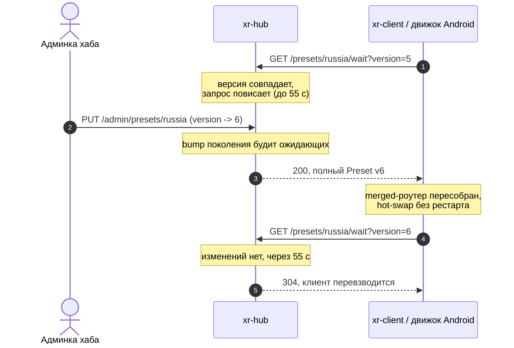

# LLD-33. Мгновенный подхват правил хаба: long-poll поверх цикла рефреша (XR-174)

**Статус:** Draft
**Область:** `xr-hub` (ручка ожидания `GET /presets/{name}/wait`, поколение
изменений в `AppState`); `xr-core` (`PresetCache::wait_for_update`, общий цикл
`watch_loop`, движок Android переезжает на него); `xr-client` (замена своего
inline-цикла на общий); справочные конфиги и ARCHITECTURE.
**Зависимости:** [LLD-01](01-control-plane.md) (хаб, пресеты, версии); стык с
[LLD-16](16-manual-server-hub-rules.md) (ручные серверы получат тот же канал,
когда подпишутся на пресет) и XR-180 (живое применение локальных правил,
чинится отдельно).

Добавил правило на хаб, и ресурс открывается сразу: и под роутером с
xr-client, и на Android. Горячая подмена роутера уже есть у обоих, вся
задержка сидит в пятиминутном опросе. Убираем её long-poll'ом: клиент висит
на запросе со своей версией пресета, хаб отвечает мгновенно при публикации
новой.

---

## 0. Схема



## 1. Текущее состояние

- Горячая подмена правил работает: xr-client и движок Android держат `Router`
  за `RwLock<Arc<Router>>`, фоновый цикл при новой версии пресета собирает
  merged-роутер и свапает его без рестарта туннеля
  ([xr-client/src/main.rs:199](../../xr-client/src/main.rs#L199),
  [xr-core/src/engine.rs:272](../../xr-core/src/engine.rs#L272)). Циклы
  почти дословно дублируют друг друга.
- Вся задержка в опросе: `fetch_if_stale` гоняется раз в
  `hub_refresh_interval_secs`, дефолт 300 секунд
  ([xr-proto/src/config.rs:353](../../xr-proto/src/config.rs#L353)), Android
  жёстко подставляет те же 300
  ([VpnViewModel.kt:1253](../../xr-android/app/src/main/java/com/xrproxy/app/ui/VpnViewModel.kt#L1253)).
  В худшем случае правило доезжает через пять минут.
- `PresetCache::refresh` ([xr-core/src/presets.rs:84](../../xr-core/src/presets.rs#L84))
  сначала тянет список сводок, сравнивает `version` числом (`remote <= local`
  считается «актуально», откат версии не доезжает вовсе), затем забирает
  полный пресет. Условными запросами не пользуется.
- Хаб наполовину готов: `GET /api/v1/presets` отдаёт ETag из суммы версий,
  `GET /presets/{name}` отвечает 304 по `If-None-Match`
  ([xr-hub/src/api/presets.rs:17](../../xr-hub/src/api/presets.rs#L17)), `PUT`
  из админки инкрементит `version`
  ([presets.rs:109](../../xr-hub/src/api/presets.rs#L109)). Пуша к клиентам
  нет, изменение никого не будит.
- Мгновенный путь один: кнопка «Обновить сейчас» на карточке пресета Android.
  Причём `nativeRefreshPreset`
  ([xr-android-jni/src/lib.rs:938](../../xr-android-jni/src/lib.rs#L938))
  обновляет только дисковый кэш своим временным `PresetCache`; живой роутер
  подхватит изменение на следующем тике фонового цикла. На роутере мгновенного
  пути нет вообще, только рестарт сервиса.

## 2. Дизайн

### 2.1 Механизм: long-poll

Из трёх кандидатов брифа берём long-poll.

- Частый условный опрос (интервал в секунды) на Android будит радио и ест
  батарею, в Doze интервалы расползаются. Отпадает.
- Push через туннель требует новой связности хаб-сервер-клиент, которой нет
  (туннель идёт к xr-server, не к хабу). Для этой задачи перебор; подписанная
  команда `apply_preset` из LLD-20 живёт поверх реестра XR-025 и решает
  другую задачу (управление флотом), long-poll её не заменяет и не блокирует.
- SSE против long-poll выигрыша не даёт: то же висящее HTTP-соединение, но со
  стриминговым парсингом и капризами буферизации на промежуточных прокси.
  Long-poll это обычный запрос-ответ, ложится на существующий `reqwest` и
  существующий цикл рефреша без новых сущностей.
- WebSocket дал бы постоянный двунаправленный канал, но здесь он не нужен:
  событие одно («пресет изменился»), направление одно, случается оно редко,
  соединение висело бы сутками впустую. Цена при этом заметная. На клиенте
  новая зависимость и свой цикл жизни соединения (ping/pong, реконнект со
  своим backoff, ресинк после обрыва, который всё равно сводится к «клиент
  приносит свою версию», то есть к той же ручке wait, только внутри WS). На
  хабе учёт живых соединений и отлов полуоткрытых, тот самый класс
  зомби-состояний, с которым проект борется таймаутами. Плюс idle-соединение
  под NAT надо греть пингами, а long-poll обновляется каждые ~55 секунд сам
  и живость клиента проверяет заодно. Богатый постоянный канал появится в
  другой плоскости (исходящий poll реестра с командами, LLD-17/LLD-20).

### 2.2 Ручка ожидания на хабе

`GET /api/v1/presets/{name}/wait?version=N&timeout_secs=S` в публичном
роутере ([xr-hub/src/api/mod.rs:40](../../xr-hub/src/api/mod.rs#L40)).
Семантика:

- пресета с таким именем нет: сразу 404;
- версия пресета отличается от `N` (именно «отличается», не «больше»: откат
  и пересоздание тоже должны доезжать): сразу 200 с полным `Preset` и ETag,
  как у `get_preset`;
- версия совпадает: запрос висит до изменения либо `S` секунд (дефолт 55,
  потолок 60), по таймауту 304 без тела.

Реализация: в `AppState` появляется `tokio::sync::watch::Sender<u64>` с
поколением пресетов, `create_preset`/`update_preset`/`delete_preset` бампают
его после записи. Обработчик в цикле снимает версию из мапы и уходит в
`select` на `changed()` и остаток дедлайна. Канал общий на все пресеты:
bump будит всех ожидающих, чужие подписчики сверяют свою версию и
перевзводятся, это копеечная работа.

Нагрузка: висящий запрос это одна tokio-задача и одно соединение, на парке
даже в сотни клиентов запас у axum огромный. Отдельных лимитов на ожидающих
не заводим, потолок держит существующий лимит соединений ОС.

### 2.3 Клиент: `PresetCache::wait_for_update`

Новый метод рядом с `refresh`: `wait_for_update(&mut self, hold: Duration)`
с тем же исходом `Result<RefreshOutcome, String>`. Дёргает ручку ожидания с
версией своего кэша (кэша нет: `version=0`, хаб сразу отдаст текущий пресет,
бутстрап достаётся бесплатно). 200 разбирается как `Preset`, сохраняется на
диск и в память, исход `Updated`; 304 это `UpToDate`; остальное `Err` той же
номенклатуры, что у `refresh` (`network`, `http_NNN`, `bad preset`).

Таймаут reqwest ставится `hold + 15s`: клиентское ожидание обязано пережить
серверное удержание, иначе клиент рвёт собственные запросы. Старый хаб без
ручки отдаст SPA-заглушку (200 с HTML), парс упадёт в `Err`, цикл уйдёт в
деградированный опрос. Специальную детекцию не городим: парк тестовый, хаб
обновляется первым (принцип «форматы ломаем, слоёв совместимости не
заводим»).

### 2.4 Общий цикл `watch_loop`

Оба inline-цикла (xr-client и движок) заменяются одной функцией в
`xr-core/src/presets.rs`:

```rust
pub async fn watch_loop(
    mut cache: PresetCache,
    fallback_interval: Duration,
    shutdown: impl Future<Output = ()>,
    mut on_rules: impl FnMut(&RoutingConfig),
)
```

Логика: по кругу `wait_for_update`. `Updated` дёргает `on_rules` (вызывающий
собирает `Router::from_merged` и свапает свой `RwLock`); `UpToDate` сразу
перевзводит ожидание; `Err` уводит в деградированный режим: пауза с
backoff (5 с, удвоение, потолок `fallback_interval`), на каждом пробуждении
старый `fetch_if_stale` (обновления продолжают доезжать с сегодняшней
скоростью) и попытка вернуться на long-poll; успешное ожидание сбрасывает
backoff. Завершение через `select` с `shutdown`: движок передаёт свой
`shutdown_rx`, xr-client живёт вечно и передаёт `std::future::pending()`.

### 2.5 Android и батарея

Механизм целиком в нативном цикле, Kotlin не меняется. Цикл живёт только при
поднятом туннеле, а туннель и так держит mux-keepalive раз в 25 секунд:
висящий запрос с ответом раз в ~55 секунд радио не будит чаще, чем оно уже
просыпается. В Doze VPN-сервис остаётся жив; если сеть в фоне порезана и
ожидание рвётся, канал деградирует в тот же 300-секундный опрос, хуже
сегодняшнего не становится.

Кнопка «Обновить сейчас» остаётся: в деградированном режиме и для ручных
серверов (LLD-16) она по-прежнему единственный мгновенный путь. Хардкод 300
в `VpnViewModel` остаётся как интервал деградированного опроса.

### 2.6 Конфигурация

Новых ручек нет: long-poll включён всегда и сам откатывается в опрос при
недоступности. `hub_refresh_interval_secs` остаётся, но меняет смысл с
«период доставки правил» на «период опроса в деградированном режиме»;
комментарий в `configs/client.toml` переписывается.

## 3. Изменения в коде

- `xr-hub/src/state.rs`: поколение пресетов (`watch::Sender<u64>` в
  `AppState`, инициализация в `hydrate` и тестовых стейтах).
- `xr-hub/src/api/presets.rs`: обработчик `wait_preset`, bump поколения в
  `create_preset`/`update_preset`/`delete_preset`.
- `xr-hub/src/api/mod.rs`: маршрут `/presets/{name}/wait` в публичном блоке.
- `xr-core/src/presets.rs`: `wait_for_update`, `watch_loop`.
- `xr-core/src/engine.rs`: inline-цикл заменяется на `watch_loop` с
  `shutdown_rx` и callback'ом со свапом `ctx.router`.
- `xr-client/src/main.rs`: то же с `pending()` вместо shutdown.
- `configs/client.toml`: комментарий у `refresh_interval_secs` про
  деградированный режим.

## 4. Тесты

- `xr-hub` (oneshot-роутер, как в тестах `api/mod.rs`): при несовпадении
  версии ручка отвечает сразу 200 с пресетом; при совпадении и
  `timeout_secs=0` сразу 304 (быстрый детерминированный кейс таймаута);
  ожидание, запущенное параллельно с `PUT`, просыпается и приносит новую
  версию; неизвестное имя даёт 404.
- `xr-core` (мок-сервер по образцу `serve_once` в presets.rs): 200 с
  пресетом даёт `Updated` и дисковый кэш; 304 даёт `UpToDate`; HTML вместо
  JSON (SPA-заглушка старого хаба) даёт `Err`.
- `watch_loop`: детерминированно, без sleep наугад: мок-хаб на каналах
  проверяет, что `Updated` дёргает `on_rules`, а `Err` уводит в ветку
  `fetch_if_stale` и backoff (мок-часы `tokio::time::pause`).
- Регрессионного теста нет: фича, не багфикс.

## 5. Документация

- `docs/ARCHITECTURE.md`: в описании хаба (раздел 4) появляется ручка
  ожидания, в модели доставки правил (раздел 6) пятиминутный опрос меняется
  на «long-poll с откатом в опрос»; строка LLD-33 в таблице раздела 9.
- `configs/client.toml`: см. раздел 3.

## 6. Границы и связи

- XR-180 (локальные правила не действуют на живом туннеле): чинится отдельно.
  После этого LLD merged-роутер пересобирается при каждом `Updated`, но
  `local_overrides` по-прежнему снимок на момент старта движка, и добавленное
  пользователем правило само по себе цикл не будит.
- XR-118 (resume из устаревшего lastConfigJson): смежная дыра жизненного
  цикла сервиса, вне рамок.
- XR-020 / LLD-16: серверы, добавленные вручную, получают мгновенную доставку
  автоматически, как только подписываются на пресет; этот LLD круг
  подписчиков не расширяет.
- LLD-20 (`apply_preset` командой): другой слой (управление флотом поверх
  реестра), не пересекается.

## 7. Развилки

Решено в этом LLD, на подтверждение при согласовании:

1. Long-poll, не SSE, не WebSocket, не частый опрос и не push через туннель
   (п. 2.1).
2. Ручка ожидания отвечает сразу полным пресетом, а не только номером версии:
   минус один round trip на каждое обновление.
3. Сравнение версий на неравенство, не на «больше»: откат пресета админом
   доезжает так же мгновенно, как и новая версия.
4. Новых конфиг-ручек нет, `refresh_interval_secs` становится интервалом
   деградированного режима.
5. Совместимость со старым хабом отдельно не детектится: ошибка парса уводит
   в деградированный опрос, этого достаточно.
6. Тайминги: удержание на хабе 55 с (потолок 60), клиентский таймаут
   `hold + 15s`, backoff деградации от 5 с до `refresh_interval_secs`.

## 8. Сценарий проверки реализации

Черновик для задачи-реализации; проверка по exit-IP, не по HTTP 200.

1. Добавить домен в пресет на хабе.
2. В пределах нескольких секунд, без рестартов и без кнопки «Обновить
   сейчас»: новое соединение с LAN-устройства под роутером уходит через
   прокси (exit-IP сменился), ресурс открывается на Android.
3. Деградация: погасить хаб, убедиться, что туннель живёт, а клиент пишет
   про откат в опрос; поднять хаб, убедиться, что long-poll вернулся и
   следующее изменение доезжает мгновенно.
