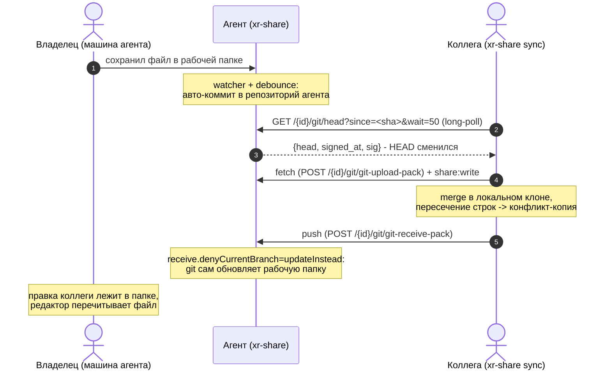

# LLD-33. Совместное редактирование текстовых шар: git как движок синка (XR-178)

**Статус:** Draft
**Область:** `xr-share` (флаг `git` у шары, репозиторий агента с авто-коммитом,
smart-HTTP-транспорт спавном системного git, подписанный HEAD с long-poll,
харнесс `sync` на libgit2 с авто-коммитом, merge и конфликт-копиями, web-морда
шары третьей фазой); `xr-proto` (домен подписи HEAD); `xr-core` и `xr-android`
только в третьей фазе (история и мелкая правка с устройства).
**Зависимости:** [LLD-19](19-file-sharing-agent.md) (шара, токены, гранты);
[LLD-28](28-share-write-scope.md) (write-контур: scope `share:write`, гейты
записи, `If-Match`); [LLD-23](23-share-relay-nat.md) (relay-путь и
identity-TLS: git-байты едут тем же каналом); [LLD-29](29-share-url-import.md)
(прецедент внешнего бинаря за опт-ином, неймспейс `.xr-`); стык с
[LLD-32](32-share-structure.md) (структурные операции в той же рабочей папке)
и XR-129 (режимы доступа и кеш вердикта direct/relay) разобран в п. 2.7.

Живой сценарий: пошарить коллеге папку с md-файлами и править их вместе.
Каждый работает в своём редакторе с локальными файлами, синк и разрешение
конфликтов происходят сами, руками правки переносятся только когда обе
стороны тронули одни и те же строки. Модель асинхронная, чужих курсоров нет.
Движок синхронизации не изобретаем: та же семантика трёхстороннего merge, что
и в отброшенном MVP на diffy, уже двадцать лет живёт в git, а вместе с ней
бесплатно приезжают история, дифф, офлайн-работа и полная свобода редакторов.
Изобретаем только обвязку. Модель доверия LLD-19 не меняется: хаб остаётся
индексом вне data-path, агент проверяет токены офлайн, байты идут напрямую
или через слепой relay.

---

## 0. Схема

## 1. Текущее состояние

- Синк шары строго однонаправленный: mirror агент -> устройство
  ([sync.rs](../../xr-core/src/sync.rs), `plan_with_selection`/`apply_plan`),
  запись это явные операции `PUT`/`DELETE` (LLD-28). Локальная правка в
  синк-папке потребителя наверх не едет и затирается зеркалом; модель
  конфликтов LLD-28 п. 3.7 честно фиксирует: двусторонней синхронизации,
  способной породить расхождение реплик, не существует. Для совместного
  редактирования этого мало: правка коллеги должна сама уезжать вверх и
  сама приезжать к остальным.
- Контур «правь через 412» уже есть: `PUT` с `If-Match` по хешу манифеста
  ([server.rs](../../xr-share/src/server.rs), `put_file`). Но это протокол
  одиночной заливки, а не редактирования: при 412 клиенту нечем мириться,
  кроме как перечитать файл и перенести правки руками, и работает это только
  из нашего клиента, а не из привычного редактора.
- Роуты агента ([server.rs](../../xr-share/src/server.rs), `router`): manifest,
  file (GET/PUT/DELETE), import; git-транспорта нет. Токен принимается
  заголовком или `?token=` (`extract_token`), гейты записи трёхслойные
  (write-привязка инвайта, `writable` записи хаба, `writable` конфига агента).
- Подпись манифеста (XR-046) уже даёт образец авторитета данных на
  plain-HTTP прямом пути: detached ed25519 в заголовке
  (`manifest_signing_bytes` в [share.rs](../../xr-proto/src/share.rs)),
  потребитель проверяет по pinned `agent_pubkey` из гранта. Для git-контура
  нужен аналог: у fetch нет манифеста, авторитетом станет подписанный HEAD.
- Десктопный харнесс ([pull.rs](../../xr-share/src/pull.rs),
  [push.rs](../../xr-share/src/push.rs)) это one-shot команды на `ureq`,
  прямой путь без relay (relay-fallback харнесса остался за XR-103);
  долгоживущего цикла синка на десктопе нет вовсе.
- Прецедент внешнего бинаря у агента есть: импорт (LLD-29) зовёт yt-dlp и
  ffmpeg, `share --import` проверяет их в `PATH` при включении. Git на машине
  агента встаёт в тот же ряд: опт-ин фичи проверяет зависимость честно.
- Служебный неймспейс `.xr-` зарезервирован целиком (LLD-29): манифест-обход
  его вырезает, роуты отвергают. Репозиторий в рабочей папке держать нельзя,
  а временные файлы контура записи (`.xr-part-*`, `.xr-import-*`) не должны
  попадать в историю.

## 2. Целевое поведение

### 2.1 Опт-ин git у шары

- `xr-share share <dir> --writable --git [--invite X]` включает git-контур:
  `git = true` у `[[share]]` в конфиге агента. Флаг допустим только вместе с
  `--writable` и только для директории (совместное редактирование это запись
  по определению); нарушение режется в CLI с понятным текстом, как у
  `--import`.
- При включении CLI проверяет `git` в `PATH` (и печатает версию), создаёт
  репозиторий агента (п. 2.2), если его ещё нет, и коммитит текущее
  содержимое папки первым коммитом. Git в `PATH` это честная зависимость
  опт-ин фичи, тот же ряд, что yt-dlp у импорта; ставить git обязан владелец
  агента, но git-пользователем ему быть не нужно: репозиторий не виден в
  рабочей папке и обслуживается агентом.
- Выключение (`share` без `--git`) закрывает транспорт и останавливает
  авто-коммит; репозиторий с историей остаётся на диске (данные пользователя
  не удаляем), повторное включение его переиспользует. `unshare` ведёт себя
  так же, путь для ручной чистки печатается в выводе.
- Хаб и минтинг не меняются вовсе: git-контур целиком за уже существующим
  scope `share:write`, новых полей у `ShareRecord` и грантов нет. Признак
  «шара с историей» потребитель узнаёт не от хаба, а от агента (п. 2.4:
  ручка HEAD отвечает 200, а не 403).

### 2.2 Репозиторий агента и авто-коммит

- Репозиторий живёт в данных агента: `<state_dir>/git/<share_id>` как
  `GIT_DIR` с `core.worktree = <корень шары>`. Рабочая папка остаётся чистой
  (ни `.git`, ни служебных файлов), индекс и объекты лежат у агента.
  Конфигурация репозитория при создании: ветка `main`,
  `receive.denyCurrentBranch = updateInstead` (п. 3.4),
  `receive.denyNonFastForwards = true` (историю не переписываем),
  `receive.maxInputSize` из колпака п. 2.6.
- Авто-коммит: watcher (`notify`) на рабочей папке с debounce около 2 секунд
  тишины плюс страховочный скан раз в 5 минут (watcher на сетевых ФС
  ненадёжен). Коммит это `add -A` + `commit` спавном git с `GIT_DIR` /
  `GIT_WORK_TREE`; автор `<hostname> <hostname@xr-share>` (переопределяется
  ключом `git_author` в конфиге агента), subject перечисляет до трёх
  затронутых путей, дальше «и ещё N».
- Что не коммитится: `$GIT_DIR/info/exclude` держит строку `.xr-*` (весь
  служебный неймспейс: недозаливки, джобы импорта) и автоматически ведомые
  строки файлов крупнее колпака (п. 2.6). Ничего из этого в историю не
  попадает, при этом манифест-контур такие файлы раздаёт как раньше.
- Все изменения рабочей папки проходят одним циклом, откуда бы ни пришли:
  правка владельца в редакторе, `PUT`/`DELETE` с устройства, публикация
  импорт-джобы, будущие mkdir/move LLD-32. Отдельного «коммита поверх PUT»
  нет, watcher не различает источники.
- Авто-коммит и приём push сериализованы мьютексом на шару: пока идёт
  receive-pack, коммит ждёт, и наоборот.
- Обслуживание: после каждого приёма push агент зовёт `git gc --auto`
  (амортизированно дёшево, держит репозиторий компактным).

### 2.3 Git-транспорт агента

Smart HTTP поверх того же axum-роутера, три роута, v2-only:

- `GET /{share_id}/git/info/refs?service=git-upload-pack|git-receive-pack`:
  спавн `git upload-pack --stateless-rpc --advertise-refs` (соответственно
  `receive-pack`), ответ с pkt-line шапкой `# service=...` и штатным
  `Content-Type: application/x-git-*-advertisement`.
- `POST /{share_id}/git/git-upload-pack` (fetch/clone) и
  `POST /{share_id}/git/git-receive-pack` (push): тело запроса стримится в
  stdin процесса, stdout стримится в ответ. `Content-Encoding: gzip` тела
  распаковывается агентом (штатный git-клиент жмёт запросы; наш харнесс нет,
  но транспорт обязан принимать обоих).
- Порядок гейтов как у write-роутов LLD-28: шара существует (404) -> `git`
  включён у шары (403) -> `writable` в конфиге (403) -> токен этой шары с
  `share:write` (401/403). Путей в запросах нет, safepath не участвует;
  `{share_id}` резолвится в `GIT_DIR`, не в рабочую папку.
- Весь транспорт, включая fetch, требует `share:write` (решение брифа):
  git-контур это инструмент соавторов, читатели живут манифестом. Протокол
  v0 достаточен, заголовок `Git-Protocol` не пробрасываем; процессу даётся
  дедлайн (5 минут), по истечении группа процессов убивается, как у
  импорт-плагинов.
- Побочный бонус конструкции: git-гик среди соавторов может работать с шарой
  обычным git-клиентом (`git clone http://...:port/{share_id}/git` с токеном
  в заголовке `Authorization`), харнесс не обязателен.
- После успешного receive-pack git сам материализует push в рабочую папку
  (updateInstead, п. 3.4); манифест-контур увидит новые mtime и лениво
  прогреет хеши, как при любой локальной правке. Смена HEAD будит long-poll
  подписчиков (п. 2.4).

### 2.4 Подписанный HEAD и long-poll

- `GET /{share_id}/git/head?since=<sha>&wait=<sec>`: ответ
  `{head, signed_at, sig}`, где `sig` это detached ed25519 identity-ключом
  агента над доменом `xr-share-git-head\nv1\n{share_id}\n{signed_at}\n{head}`
  (`git_head_signing_bytes` в `xr-proto`, рядом с
  `manifest_signing_bytes`). Гейт тот же, что у транспорта (share:write; на
  шаре без git ответ 403, это и есть признак «истории нет»).
- С параметрами `since` и `wait` (потолок 60 с) запрос висит до смены HEAD
  либо до таймаута: реализация на `tokio::sync::watch`, кормят его
  авто-коммит и receive-pack. Один висящий запрос вместо частого polling;
  через relay это один длинный стрим, mux его переживает штатно.
- Потребитель проверяет подпись по pinned `agent_pubkey` из гранта и после
  fetch сверяет, что `refs/heads/main` равен подписанному HEAD. Этого
  достаточно для авторитета всей истории: остальное гарантирует
  хеш-связность git-объектов (п. 3.5). Роль та же, что у подписи манифеста
  на прямом plain-HTTP пути (XR-046), заодно это anti-wrong-host проверка
  кандидата адреса.

### 2.5 Харнесс `xr-share sync`

- `xr-share sync --invite <t> --share <id|имя> <dir> [--name <имя>]
  [--once]`: долгоживущий цикл (Ctrl-C останавливает), `--once` делает один
  проход для скриптов и проверок. Первый запуск в пустую или несуществующую
  папку клонирует шару; непустая папка без клона этой шары даёт отказ с
  понятным текстом (молча мешать локальные файлы с историей нельзя).
- Внутри libgit2 (`git2` с vendored-сборкой): status, add, commit, fetch,
  merge, push без git в `PATH` у коллеги. Gitoxide отброшен (п. 3.2), сам
  git-бинарь коллеге не нужен, у него обычный клон с `.git` (владелец его
  папки он сам, прятать нечего).
- Цикл симметричен агентскому: watcher + debounce и страховочный скан ->
  локальные изменения коммитятся (автор из `--name`, по умолчанию hostname;
  колпак и `.xr-*` как в п. 2.2, плюс собственный `.git`); параллельная
  таска висит на long-poll HEAD -> расхождение тянет fetch -> merge ->
  push. Отвергнутый non-fast-forward push (успели раньше) это не ошибка, а
  сигнал повторить fetch-merge-push. Сетевые сбои и «агент офлайн» ждут с
  экспоненциальным бэкофом, протухший грант перезапрашивается по инвайту.
- Merge: fast-forward просто выставляет рабочую копию; настоящий merge идёт
  через git2 с диффом на уровне строк. Непересекающиеся правки сливаются
  сами и коммитятся merge-коммитом. Пересечение по строкам не сливается:
  для конфликтного файла берётся локальная версия, встречная кладётся рядом
  файлом `<имя> (конфликт <автор> <sha7>)<расширение>`, копия входит в тот
  же merge-коммит, в лог пишется громкая строка. Обе версии доезжают до
  всех участников, никто не теряет правку молча; разбор ручной, как и
  обещано (п. 3.4).
- Транспорт: перебор кандидатов как у `direct_then_relay` (LAN раньше
  публичного, relay последним; авторитет кандидата проверяет подписанный
  HEAD). Прямой путь: libgit2 ходит на `http://<адрес>/{share_id}/git` с
  токеном через `custom_headers`. Relay-путь: локальный мост, слушающий
  loopback и несущий байты identity-TLS-стримом через relay (существующие
  `relay_client` + `relay_tls` из xr-proto), libgit2 видит тот же
  loopback-HTTP и о relay не знает. TLS остаётся в нашем rustls-коде с
  pinned-verifier, libgit2 собирается без TLS-бэкендов вовсе.
- Весь блок за cargo-фичей `sync` (default on): git2 это vendored C-сборка,
  лёгкая сборка агента без харнесса остаётся доступной, как с фичей `relay`
  (XR-105).

### 2.6 Только текст: колпак размера

История растёт вечно, большие бинарники в неё класть нельзя, и это отсекается
честно, а не примечанием в доке:

- Колпак `git_max_file_mb` (default 10) в конфиге агента; файлы крупнее не
  коммитятся ни агентом, ни харнессом (дефолт общий, зашит константой в
  `xr-proto`). Такие файлы не пропадают: они живут в рабочей папке и едут
  манифест-контуром (pull, приложение, обычный mirror), просто вне истории
  и вне git-клона коллеги. Типовой случай это результат импорт-джобы
  (видео): в git-шаре он раздаётся как раньше, историю не раздувает.
- Рубеж на приёме: `receive.maxInputSize` режет аномально большой pack
  (значение с запасом от колпака), отказ доезжает до харнесса честным
  текстом git.
- Md-файлы со скриншотами и мелкими вложениями под колпак проходят: цель
  отсечь гигабайты, а не картинки.

### 2.7 Стыки: контур записи, LLD-32, XR-129

- Контур `If-Match` из LLD-28 не отменяется: одиночный `PUT` (заливка
  XR-170, правка из web п. 2.8) живёт как жил, git-коммит поверх делает
  агентский цикл. Семантика зеркала xr-core тоже не меняется: git-шара
  остаётся обычной шарой для читателей.
- LLD-32 (когда доедет): mkdir/move/copy меняют рабочую папку, авто-коммит
  их подхватывает, move крупного поддерева git сожмёт rename-детектом.
  Известное расхождение: пустые директории git не хранит, в клон коллеги
  они не приедут (манифест и зеркало приложения их видят). Фиксируем как
  ограничение, sentinel-файлы не подкладываем.
- XR-129: ручка HEAD не подменяет будущий `/health` (health без auth и про
  достижимость, HEAD под грантом и про данные). Кеш вердикта direct/relay
  из XR-129 харнессу пригодится, но не нужен заранее: цикл выбирает путь
  один раз на сессию и перевыбирает по обрыву.

### 2.8 Web и приложение (третья фаза)

Web-морды у шары сегодня нет вообще (ссылка `xrshare://` понятна только
приложению), поэтому фаза не «утоньшает» страницу, а заводит тонкую:

- `GET /{share_id}/web?token=...`: одностраничник, вшитый в бинарь агента
  (без CDN и внешних запросов): дерево файлов из манифеста, рендер md на
  клиенте. С read-токеном это просмотр текущего состояния поверх уже
  существующих роутов manifest/file.
- С write-токеном страница дополнительно показывает историю и дифф и даёт
  точечную правку: textarea -> тот же `PUT` с `If-Match` (при 412 страница
  предлагает перечитать). Под это два JSON-роута под `share:write`:
  `GET /{share_id}/git/log?path=&limit=` и
  `GET /{share_id}/git/diff?from=&to=&path=` (спавн git log/diff).
- Правило LLD-28 «в раздаваемых ссылках только `share:read`» не трогается:
  write-ссылку печатает не минт, а сам держатель write-гранта из уже
  выданного ему токена (`xr-share weblink --invite ... --share ...`; в
  приложении пункт «Открыть в браузере»). Новых каналов выпуска write-скоупа
  не появляется.
- Android: экран истории (тот же `git/log` через JNI) и мелкая правка
  текстового файла (редактор-поле -> `PUT` с `If-Match`). Основная работа
  остаётся в редакторе на компе, приложение это посмотреть и подправить.

### 2.9 Фазы реализации

Реализация режется на три задачи, каждая со своим выкатом и проверкой:

1. **Агент** (п. 2.1-2.4, 2.6): опт-ин, репозиторий, авто-коммит, транспорт,
   подписанный HEAD. Проверяется штатным git-клиентом с ноутбука, харнесс не
   нужен.
2. **Харнесс** (п. 2.5): `xr-share sync` целиком, включая relay-мост и
   конфликт-копии.
3. **Web и приложение** (п. 2.8): страница шары, log/diff-роуты, `weblink`,
   экраны Android.

## 3. Дизайн-решения

### 3.1 Настоящий git, а не свой велосипед

Write-контур уже позволял MVP «текстовое поле в web, при 412 трёхсторонний
merge через diffy». Отброшен не из-за merge (семантика та же diff3), а из-за
редактора: его пришлось бы изобретать, а привычный инструмент у каждого свой.
Git закрывает всё разом: тот же трёхсторонний merge, история, офлайн-работа,
свобода редакторов, двадцать лет эксплуатации. Изобретаем только обвязку:
опт-ин, транспорт за нашим грантом, авто-коммит и политику конфликтов.

### 3.2 Git CLI у агента, libgit2 у харнесса, gitoxide отброшен

Три кандидата из брифа разложились по ролям:

- **Агент: спавн системного git.** Серверная сторона smart HTTP это
  `upload-pack`/`receive-pack` со `--stateless-rpc`, готовые и вечные; ни
  gitoxide, ни libgit2 серверную сторону не реализуют, а городить переговоры
  pack-протокола самим это ровно тот велосипед, от которого уходим. `git
  http-backend` (CGI) дал бы то же самое, но через CGI-обвязку с меньшим
  контролем над гейтами; спавним pack-процессы напрямую. Зависимость от git
  в `PATH` честно объявляется на опт-ине, прецедент yt-dlp уже есть.
- **Харнесс: libgit2 (`git2`, vendored).** Коллеге ставить git не нужно,
  бинарь самодостаточен. Нужны status/commit/fetch/merge/push; у gitoxide
  на момент дизайна нет push, а харнесс пушит ежеминутно, так что gitoxide
  отброшен по факту, без идеологии. Возврат к нему возможен точечной заменой,
  протокол тот же.
- TLS в libgit2 не включаем: прямой путь plain HTTP (авторитет у подписи
  HEAD), relay-путь терминируется нашим rustls-мостом (п. 2.5). Пиннинг
  живёт в одном месте, в `relay_tls`, а не дублируется в C-библиотеке.

### 3.3 Push прямо в main, разбор на стороне опоздавшего

Одна ветка `main`, консьюмеры пушат в неё напрямую; non-fast-forward push
отвергается штатно, и мириться обязан тот, кто опоздал: fetch, merge у себя,
push снова. Никаких per-client веток и серверных merge: у каждой развилки
ровно один участник, который видит обе стороны (его локальная и свежая
main), и это единственное место, где merge вообще возможен без сервера-судьи.
Гонка «оба пушат одновременно» сходится за конечное число повторов: каждый
отказ означает, что чей-то push прошёл.

### 3.4 updateInstead вместо своего merge на агенте

Рабочая папка владельца это checkout `main`, и git умеет обновлять её при
push сам: `receive.denyCurrentBranch = updateInstead`. Грязная папка (владелец
правит прямо сейчас, авто-коммит ещё не сработал) заставит git отвергнуть
push; через пару секунд debounce превратит правку владельца в коммит, и
повторный push коллеги пройдёт обычным циклом (merge на его стороне, п. 3.3).
Своего кода слияния у агента нет вовсе: агент только коммитит, все merge
делают харнессы. Окно отказа мало и разрешается тем же ретраем, что и
non-fast-forward.

### 3.5 Подписанный HEAD как авторитет всей истории

Прямой путь остаётся plain HTTP, а у fetch нет манифеста, который можно
подписать. Вместо этого подписывается одна величина: SHA головного коммита.
Хеш-связность git тянет авторитет на всё остальное: каждый объект адресуется
хешем, достижимым от подписанного HEAD, подменить историю MITM не может, не
сломав подпись. Это то же решение, что XR-046 для манифеста, перенесённое на
git-объектную модель. SHA-1 у git hardened (sha1dc), в модели доверенного
круга с подписанным HEAD этого достаточно (п. 5.8).

### 3.6 Конфликт-копии, а не маркеры

Маркеры `<<<<<<<` в файле выглядят привычно, но в самосинкающейся системе
ядовиты: авто-коммит сохранённого файла с маркерами разъехался бы по всем
участникам как обычный контент, и «разрешением» конфликта молча становился
бы битый текст. Конфликт-копия (модель SparkleShare) безопаснее: обе версии
это целые файлы, обе в истории и на виду у обеих сторон, синк не
останавливается, а битого контента не существует. Имя копии несёт автора и
короткий SHA встречного коммита, поэтому повторные merge одной и той же
развилки детерминированно дают то же имя, дубли не плодятся.

### 3.7 Long-poll вместо частого polling

«Коллега сохранил, вторая сторона узнала» требует секунд, а не минут. Частый
poll манифеста дорог (обход папки на каждый запрос) и всё равно даёт лаг.
Ручка HEAD с `since`/`wait` держит один висящий запрос: ответ приходит в
момент коммита, стоимость простоя это один открытый стрим. Пуш-канал от
агента (регистрация обратных вызовов) был бы второй сигнальной системой со
своей адресацией и NAT-проблемами; long-poll получает то же самое поверх
уже существующего транспорта.

### 3.8 Весь git-контур под share:write

Fetch формально чтение, но отдаёт полную историю, включая удалённое и
перезаписанное, то есть больше, чем read-потребителю обещано манифестом.
Git-контур это инструмент соавторов: у них write-грант есть по определению.
Читатели продолжают жить манифестом и зеркалом, для них git-шара неотличима
от обычной. Отдельный scope `share:history` не заводим, пока нет живого
запроса «читать историю без права писать».

## 4. Изменения в коде

| Файл | Что меняется | Фаза |
|---|---|---|
| `xr-proto/src/share.rs` | `git_head_signing_bytes(share_id, signed_at, head)` (домен `xr-share-git-head\nv1`), `sign_git_head`/`verify_git_head` рядом с манифестными; константа дефолта колпака `GIT_MAX_FILE_MB`. | 1 |
| `xr-share/src/config.rs` | `ShareEntry.git: bool` (`serde(default)`, только вместе с `writable`); `git_author`, `git_max_file_mb` в агентском блоке. | 1 |
| `xr-share/src/cli.rs` | `share --git`: валидация (только директория, только с `--writable`), проверка git в `PATH`, инициализация репозитория и первый коммит; тексты `--help`; `unshare` печатает путь остающегося репозитория. | 1 |
| `xr-share/src/gitrepo.rs` (новый) | Обвязка репозитория агента: init (worktree-конфигурация, exclude), авто-коммит (спавн add/commit, фильтр колпака, subject), watcher + debounce + страховочный скан, мьютекс шары, watch-канал HEAD, `git gc --auto`. | 1 |
| `xr-share/src/server.rs` | Роуты `/{id}/git/info/refs`, `/{id}/git/git-upload-pack`, `/{id}/git/git-receive-pack` (спавн со стримингом обоих направлений, gunzip тела, дедлайн, гейты п. 2.3); `/{id}/git/head` (long-poll, подпись). | 1 |
| `xr-share/src/sync_cmd.rs` (новый, фича `sync`) | Харнесс `xr-share sync`: clone/адопция папки, цикл watcher+long-poll, commit/fetch/merge/push через git2, конфликт-копии, перебор кандидатов адресов, relay-мост (loopback + identity-TLS поверх `relay_client`/`relay_tls`), бэкофы, перезапрос гранта. | 2 |
| `xr-share/src/main.rs` | Подкоманды `Sync` (фича `sync`) и `Weblink`; диспетч. | 2, 3 |
| `xr-share/Cargo.toml` | Фича `sync` (default on): `git2` (vendored, без TLS-бэкендов), `notify`, `tokio-rustls`; фича переиспользует `relay`-типы xr-proto. | 2 |
| `xr-share/src/server.rs` (фаза 3) | `GET /{id}/web` (вшитый одностраничник), `GET /{id}/git/log`, `GET /{id}/git/diff` (спавн git log/diff, share:write). | 3 |
| `xr-core/src/sync.rs`, `xr-android-jni`, `xr-android` | JNI `nativeGitLog`, экран истории, мелкая правка через существующий PUT-контур с `If-Match`; «Открыть в браузере» из write-гранта. | 3 |
| `xr-share/README.md` | Раздел «Git-синк»: опт-ин, роуты и гейты, подписанный HEAD, харнесс `sync`, конфликт-копии, колпак, зависимость от git на агенте. | 1-3 |
| `configs/share.toml` | `git`, `git_author`, `git_max_file_mb` с комментариями. | 1 |
| `README.md` | В разделе файлообмена: совместное редактирование текстовых шар через git-синк. | 2 |
| `docs/ARCHITECTURE.md` | Строка LLD-33 в разделе 9; после реализации факты в 4.7 (роуты git, подписанный HEAD) и в раздел про xr-share. | 1-3 |

Тесты (Rust; серверные это роутер-тесты axum как в `server.rs`; тесты
транспорта требуют git в `PATH`, на dev-машинах и CI он есть):

- `test_git_share_optin`: `--git` без `--writable` отказ; для шары-файла
  отказ; без git в `PATH` отказ с понятным текстом; включение создаёт
  репозиторий и первый коммит.
- `test_git_transport_gates`: лестница 404/403/401/403 для всех трёх роутов
  и head (git выключен, writable выключен, нет токена, только `share:read`).
- `test_git_clone_push_roundtrip`: clone тестового агента настоящим git,
  локальный коммит, push -> файл материализован в рабочей папке и виден в
  манифесте; правка файла в папке -> авто-коммит -> fetch видит новый
  коммит.
- `test_autocommit_filters`: `.xr-part-*` и файл крупнее колпака не попадают
  в коммит, но остаются в манифесте; subject перечисляет пути.
- `test_updateinstead_dirty`: push при грязной папке отвергнут, после
  авто-коммита повторный push проходит.
- `test_head_signed_longpoll`: подпись HEAD сходится с pinned-ключом; ответ
  с `since`=текущий висит и просыпается по коммиту; чужой ключ ломает
  проверку.
- `test_sync_roundtrip` (фича `sync`): два харнесса против одного тестового
  агента; правка на A доезжает до B без действий; непересекающиеся правки
  обеих сторон сливаются сами.
- `test_sync_conflict_copy`: пересечение по строкам даёт конфликт-копию с
  детерминированным именем на обеих сторонах, обе версии в истории, цикл
  не останавливается.
- `test_sync_refuses_nonclone_dir`: непустая посторонняя папка -> отказ.
- `test_sync_no_write_scope`: грант без `share:write` -> ошибка до сети.

Это новая функциональность, регрессионного бага нет: тесты фиксируют
поведение по пирамиде (юнит на подпись и фильтры, интеграционные на
транспорт и цикл).

## 5. Риски и edge-кейсы

1. **Git на Windows-агенте.** Git for Windows штатно даёт `git` в `PATH`;
   пути с юникодом и `core.worktree` там работают, но фаза 1 проверяется на
   Win-агенте отдельно (п. 6). Отказ при включении честный: нет git, нет
   `--git`.
2. **Непрерывная правка у владельца.** Пока владелец держит файл грязным
   дольше debounce-окна, push коллег отвергается (updateInstead). Окно
   короткое, харнесс ретраит с бэкофом; вечная блокировка невозможна,
   авто-коммит рано или поздно срабатывает.
3. **История растёт вечно.** Принято по построению (текстовая шара, колпак
   на файл); `git gc --auto` держит упаковку. Обрезка истории (shallow,
   переписывание) сознательно не поддерживается:
   `receive.denyNonFastForwards` защищает согласованность клонов.
4. **Приватность истории.** Удалённый из папки файл остаётся в истории и
   доступен любому write-соавтору навсегда. Для владельца это фиксируется
   в README крупно; «право на забвение» потребовало бы переписывания
   истории у всех и в скоуп не входит.
5. **Watcher ненадёжен** (сетевые ФС, пропуски inotify). Страховочный скан
   раз в 5 минут догоняет пропущенное с обеих сторон.
6. **Write-токен в URL для web-правки** оседает в истории браузера. TTL
   токена 7 дней; `weblink` печатает предупреждение. Тот же класс риска,
   что у read-ссылок LLD-28, с большим правом; принято для доверенного
   круга.
7. **Кросс-сборка git2** (vendored C) может болеть на экзотических целях;
   фича `sync` отключаема, агентская сторона от git2 не зависит вовсе.
8. **SHA-1.** Git использует hardened SHA-1 (sha1dc), коллизионная атака
   детектируется; злоумышленник в модели это MITM без write-гранта, ему
   подпись HEAD не преодолеть. Миграция git на SHA-256-репозитории возможна
   позже, формат у нас не зафиксирован наружу.
9. **Гонка авто-коммита и структурных операций LLD-32.** Move поддерева в
   момент коммита даст в худшем случае два коммита подряд (промежуточное
   состояние), история останется корректной: add -A атомарен на уровне
   снимка индекса, мьютекс шары сериализует с receive-pack.
10. **Пустые директории** в git-клоне не появляются (п. 2.7); зеркало
    приложения и манифест их видят. Расхождение зафиксировано как
    ограничение модели git.

## 6. План проверки

Автотесты из п. 4 плюс сценарии на проде по фазам.

Фаза 1 (агент, проверка штатным git с ноутбука):

1. `xr-share share <папка> --writable --git --invite <t>` на машине агента:
   репозиторий создан вне папки, первый коммит содержит текущие файлы.
2. `git clone http://<агент>:8443/<share_id>/git` с `Authorization: Bearer`
   (токен из гранта) -> клон приехал; правка + push -> файл появился в
   рабочей папке агента и в манифесте.
3. Правка файла в папке на агенте -> в клоне `git fetch` видит авто-коммит
   с subject из путей.
4. Токеном только `share:read` любой git-роут -> 403; на шаре без `--git`
   -> 403; `curl /{id}/git/head` -> подпись сходится с `agent_pubkey`
   гранта.
5. Файл в 100 МБ в папке: в манифесте есть, в истории нет.

Фаза 2 (харнесс, две машины):

1. `xr-share sync --invite <t> --share <имя> ~/docs` на двух машинах:
   правка md на A появляется на B за секунды без действий; обратная правка
   другого файла едет на A. Шара за NAT: то же через relay.
2. Конфликт: обе машины правят одну строку -> на обеих остаются две версии
   (файл + конфликт-копия с автором и sha7), громкая строка в логе, синк
   живёт.
3. `--once` в пустую папку клонирует, в постороннюю непустую отказывает.

Фаза 3 (web и приложение):

1. Read-ссылка открывает просмотр md в браузере без истории; `weblink` из
   write-гранта открывает историю, дифф и правку; правка со страницы
   коммитится и доезжает до синка коллеги.
2. В приложении: экран истории показывает коммиты, мелкая правка файла
   уезжает PUT'ом и доезжает до клона.

Каждая фаза: `cargo test --workspace` зелёный, 0 warnings; README и
референс-конфиг сходятся с поведением.

## 7. Вне скоупа (отдельные задачи)

- **CRDT** (automerge/loro) как следующая ступень, если эксплуатация
  покажет частые пересечения (абзацы одной длинной строкой): осознанно не
  сейчас, git-модель проще и покрывает заявленный сценарий.
- **Реалтайм с чужими курсорами**: модель асинхронная по требованию.
- **Ветки, PR-флоу, ревью**: одна ветка main, это синк, а не форж.
- **Переписывание истории и «право на забвение»**: см. риск 4.
- **Git LFS / смешанный режим крупных файлов в истории**: крупные файлы
  живут манифест-контуром (п. 2.6), этого достаточно.
- **Автозапуск харнесса как сервиса** на машине коллеги (`service`-обвязка
  как у агента): при живом спросе.
- **Оптимизация зеркала под серверный move** (XR-169) и структурные
  операции LLD-32: независимые линии, стык описан в п. 2.7.
- **Подпись коммитов** участниками: авторитет держат транспортные гейты и
  подписанный HEAD; per-invite идентичность в коммитах дождётся линии
  XR-030/XR-073.

## 8. Открытые вопросы (закрыты в этом дизайне)

- *Smart HTTP через `git http-backend` или встроенный gitoxide?* -> **ни
  то, ни другое дословно**: спавн `upload-pack`/`receive-pack
  --stateless-rpc` напрямую (без CGI-обвязки), у харнесса libgit2, потому
  что gitoxide на момент дизайна не умеет push (п. 3.2).
- *Нужен ли git на машинах участников?* -> **только на машине агента**
  (честная зависимость опт-ина, прецедент yt-dlp); коллеге хватает
  самодостаточного харнесса на libgit2 (п. 3.2).
- *Где живёт репозиторий?* -> **в данных агента** (`GIT_DIR` с
  `core.worktree` на папку шары): рабочая папка чистая, bare-вариант из
  брифа уточнён до worktree-конфигурации ради updateInstead (п. 3.4).
- *Кто мирит расхождения?* -> **всегда опоздавший харнесс** (п. 3.3);
  у агента своего merge нет, git обновляет папку сам (п. 3.4).
- *Маркеры конфликта или копии?* -> **конфликт-копии**: маркеры в
  самосинкающейся системе разъезжаются как битый контент (п. 3.6).
- *Как узнавать об обновлении?* -> **long-poll подписанного HEAD**
  (`since`/`wait`), не частый poll и не пуш-канал (п. 3.7).
- *Какой scope у git-транспорта?* -> **share:write целиком, включая
  fetch**: история это привилегия соавторов, читатели живут манифестом
  (п. 3.8); хаб и минтинг не тронуты.
- *Чем ограничить «только текст»?* -> **колпаком размера файла** (default
  10 МБ, `receive.maxInputSize` на приёме): крупное живёт в шаре вне
  истории, отдельная пометка «текстовая шара» не нужна (п. 2.6).
- *Откуда авторитет истории на plain HTTP?* -> **подписанный HEAD**
  identity-ключом агента, хеш-связность git тянет остальное (п. 3.5).
- *Как правка из web не ломает правило «в ссылках только read»?* ->
  **write-ссылку печатает держатель write-гранта из своего токена**
  (`weblink`), новых каналов минта нет (п. 2.8).
