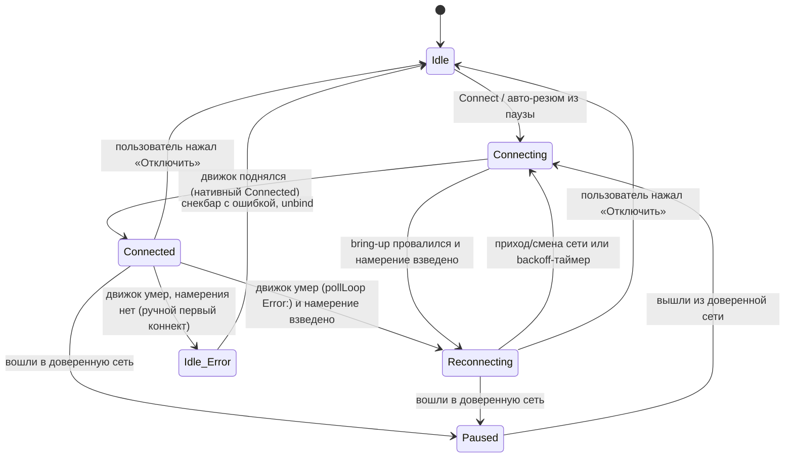

# LLD-34. Переподключение Android-клиента: фаза Reconnecting и вечный авто-ретрай (XR-132)

**Статус:** Draft
**Область:** `xr-android` (сервис `XrVpnService`: фаза, флаг намерения, цикл
ретрая; `VpnViewModel` и `MainActivity`: маппинг фазы и UI); `xr-core`
(`reconnect.rs`, чистое расписание backoff под юнит-тесты); `xr-android-jni`
(тонкий мост `nativeReconnectDelayMs`).
**Зависимости:** [LLD-02](02-android-reliability.md) (сервис как источник
правды, binder, `ConnectPhase`, `pollLoop`, foreground-уведомление);
[LLD-15](15-android-trusted-networks.md) (пауза, авто-резюм, вотчер сети
`maybeEvaluate`, `transitionMutex`, `tearTunnelDown` без снятия колбэков);
[LLD-10](10-client-multi-vps-failover.md) (граница: `ServerPool` failover'ит
**внутри живого движка**, ретраю это трогать нельзя); стык с XR-095 и XR-183
(`noNetwork`, grace-окно после авиарежима) и XR-049 (override «включить здесь»).
**Связанные документы:** задача [XR-132](../tasks/XR-132.md);
[ARCHITECTURE.md раздел 4.6, раздел 7.2](../ARCHITECTURE.md).

Живой сценарий: дома VPN на паузе (доверенная сеть), пользователь выходит из
дома, телефон в кармане. Авто-резюм пробует поднять туннель, коннект к серверу
не удался (аплинк ещё не устаканился, сервер временно недоступен), и всё молча
разваливается. Уведомление снимается, на экране «Отключено», трафик идёт
напрямую. Человек настроил доверенные сети ради «вне дома защита сама», а
приложение выглядит выключенным, как будто он сам его выключил. Чиним двумя
вещами: отдельной фазой переподключения, которая держится и видна, и вечным
авто-ретраем по приходу сети с backoff.

---

## 0. Схема

`Idle_Error` это сегодняшнее поведение (`Error` -> снекбар -> `Idle` -> unbind),
и оно остаётся только для **ручного первого коннекта**, который так и не
поднялся. Все прочие потери туннеля, где подключаться решила система, уходят в
`Reconnecting`.

## 1. Текущее состояние

Цепочка провала авто-резюма по коду:

- Уход из доверенной сети:
  [`maybeEvaluate`](../../xr-android/app/src/main/java/com/xrproxy/app/service/XrVpnService.kt#L983-L986)
  в ветке `Paused` зовёт `requestResume("сеть сменилась на недоверенную")` ->
  `publish(Connecting)` -> `bringTunnelUp`.
- Синхронный провал подъёма:
  [`bringTunnelUp`](../../xr-android/app/src/main/java/com/xrproxy/app/service/XrVpnService.kt#L456-L480)
  при `establish() == null` (TUN не встал) или ошибке `nativeStart` делает
  `publish(Phase.Error)` -> `stopInternal()` ->
  `stopForeground(STOP_FOREGROUND_REMOVE)` -> `stopSelf()`. Сервис умирает,
  постоянное уведомление снимается, колбэки сети отвязываются.
- Более частый путь: `nativeStart` возвращает успех сразу (проверка сервера
  внутри движка асинхронная), `bringTunnelUp` оптимистично публикует
  `Connected`, а через несколько секунд warmup пула проваливается, движок
  ставит `VpnState::Error("Сервер недоступен: ...")`
  ([engine.rs:346-348](../../xr-core/src/engine.rs#L346-L348)), и
  [`pollLoop`](../../xr-android/app/src/main/java/com/xrproxy/app/service/XrVpnService.kt#L556-L565)
  по префиксу `Error:` делает тот же полный снос с `stopSelf()`.
- В UI [Error маппится в Idle](../../xr-android/app/src/main/java/com/xrproxy/app/ui/VpnViewModel.kt#L1188),
  текст ошибки уходит в
  [снекбар](../../xr-android/app/src/main/java/com/xrproxy/app/ui/VpnViewModel.kt#L1225-L1231)
  (живёт пару секунд), затем `unbindAndClear()`. Экран показывает «Отключено»,
  визуально неотличимое от ручного выключения.

Ретраев коннекта на уровне Kotlin нет вовсе. Failover существует только внутри
живой сессии движка (пул серверов, резерв, breaker LLD-10), как только движок
отдал `Error:` или не поднялся, заново никто не пробует.

Асимметрия, принятая при разборе задачи: при ручном «Подключить» падение в
`Idle` со снекбаром допустимо, пользователь смотрит на кнопку, которую нажал.
При авто-резюме решение подключаться приняла система, значит и держать ретрай
обязана она.

На что ещё опираемся:

- Живая сессия без аплинка не рушится: `noNetwork` (XR-183) держит движок
  поднятым, `enterNoNetwork`/`exitNoNetwork` ловят пропажу и возврат физической
  сети. Это про **живой** движок, которому нужен re-bind.
- `tearTunnelDown` рвёт движок и TUN, но **оставляет колбэки сети**
  зарегистрированными (в отличие от `stopInternal`), ровно как у паузы.
- Все переходы туннеля сериализованы `transitionMutex`.
- Пинок по включению экрана (`reevaluateTrustedNetwork`) уже есть для паузы: в
  дозе колбэки коалесятся, а `delay()` замерзает вместе с CPU.

## 2. Целевое поведение

### 2.1 Фаза Reconnecting

Девятое значение в `XrVpnService.Phase` и восьмое в `ConnectPhase`:
`Reconnecting`. Намерение быть подключённым есть, туннель мёртв, трафик идёт
напрямую, сервис сам пробует подняться. Ключевое отличие от `Paused`: пауза это
намеренно напрямую и всё в порядке, `Reconnecting` это ненамеренно напрямую,
обрати внимание. Отличие от `Connecting`: та фаза переходная (крутилка на
секунды, политики нет), `Reconnecting` долгоживущая, со своими текстами, цветом
и владением ретраем.

### 2.2 Намерение быть подключённым

Провальные ветки выбирают между старым Error-путём и переподключением по одному
volatile-флагу `stayUp` («должны быть подключены»):

- Взводится, когда `pollLoop` впервые видит **нативный** `Connected` (движок
  прошёл warmup, туннель реально работал), и при каждом авто-подъёме:
  `requestResume` из вотчера сети и отложенный resume после авиарежима
  (`scheduleGraceResume`) ставят его до `bringTunnelUp`.
- Снимается при любом пользовательском стопе: `stopFromUi` (кнопка, action
  уведомления, `ACTION_STOP`), `onRevoke` (право на VPN отобрали), и на старте
  свежего ручного Connect (`ACTION_START`), чтобы прошлое намерение не перетекло
  в новую сессию.

Считать «первый Connected» по нативному состоянию, а не по оптимистичной
публикации `Phase.Connected` из `bringTunnelUp`, принципиально: ручной Connect к
мёртвому серверу публикует Connected на пару секунд до вердикта warmup, и если
бы флаг взводился там, ручной провал тоже уходил бы в ретрай, ломая асимметрию
из п. 1. Авто-резюм взводит флаг явно и заранее, поэтому его провал уходит в
`Reconnecting`, даже если warmup упал до нативного Connected.

Обе провальные точки (`bringTunnelUp` при `establish`/`nativeStart`, ветка
`Error:` в `pollLoop`) сводятся к одному помощнику: `stayUp` ->
`enterReconnecting(msg)`, иначе прежний путь Error + `stopSelf`.

### 2.3 Вход в переподключение

`enterReconnecting(msg)` делает `tearTunnelDown()` (движок и TUN сносятся,
сетевые колбэки остаются, как у паузы), `publish(Phase.Reconnecting, errorMessage
= msg)`, обновляет уведомление и планирует ретрай. Ни `stopForeground`, ни
`stopSelf` не зовутся. `publish` для `Reconnecting` сохраняет `errorMessage`
(сейчас он живёт только у `Error`), чтобы причина была видна на экране, а не
мелькала снекбаром в пустоту.

### 2.4 Ретрай: события сети плюс backoff

Ретрай это не слепой таймер, а два источника пинков поверх уже существующего
вотчера:

- **Таймер с backoff.** `retryJob` в scope сервиса ждёт задержку из расписания
  (2.7), делает попытку, при провале переходит к следующей задержке. Расписание
  экспоненциальное от 5 с с удвоением до потолка 5 минут. Успех и реальная смена
  сети сбрасывают номер попытки на ноль.
- **Приход и смена сети.** В `maybeEvaluate` добавляется ветка
  `Phase.Reconnecting`: реальная смена дефолтной сети (взведённый `pendingSwitch`,
  тот же дебаунс, что у re-bind) и выход из «сети нет» дают немедленную попытку
  со сбросом backoff. Поток `onCapabilitiesChanged` той же сети попыток не
  плодит. Пинок screen-on (`reevaluateTrustedNetwork`) в фазе `Reconnecting`
  тоже пробует сразу: в дозе таймер заморожен, а пинок по экрану поднимает
  туннель в момент, когда пользователь смотрит на телефон.
- **Мёртвая зона.** При `noNetwork` (пустой набор физических аплинков, XR-183)
  таймер не взводится вовсе: попытки без аплинка жгут батарею и гарантированно
  проваливаются. `enterNoNetwork` снимает `retryJob`, возврат сети будит попытку
  через колбэк.

Сама попытка идёт под `transitionMutex`, только если фаза всё ещё
`Reconnecting`. Перед подъёмом проверяется `shouldAutoPause(currentRawSsid)`:
если сеть стала доверенной, идём в `doPause`, а не поднимаем туннель (тот же
гейт, что у первого коннекта). Иначе зовём `bringTunnelUp` в «тихом» режиме:
промежуточные `Connecting`/`Finalizing` не публикуются и уведомление не
перерисовывается, чтобы шторка не мигала «Подключение -> Переподключение» каждые
несколько минут. Наружу выходит либо `Connected` (успех), либо остаёмся в
`Reconnecting` со следующим интервалом. Первый подъём авто-резюма (из паузы)
остаётся громким, как сейчас: там переходные фазы честны и коротки.

### 2.5 Стык с доверенными сетями, паузой и failover движка

- Возврат в доверенную сеть в фазе `Reconnecting` даёт `doPause`, а не ретрай:
  дома роутер сам проксирует. `doPause` снимает `retryJob` (как снимает пробу и
  grace-resume) и сбрасывает `stayUp` (пауза это намеренно). Уход из паузы снова
  идёт через `requestResume`, взводит `stayUp` и при провале честно возвращается
  в `Reconnecting`.
- Failover пула внутри живого движка не трогаем: `Reconnecting` живёт только
  поверх мёртвого движка (вход строго после `tearTunnelDown`), при фазе
  `Connected` ретрая не существует. Между серверами и в Direct уводит `ServerPool`
  (LLD-10) сам, без пересоздания сервиса. Границы не пересекаются: движок жив ->
  им занят пул, движок мёртв -> им занят `Reconnecting`.
- `restrictedNetwork` ретрай не гейтит: проба ограничений отвечает на вопрос
  «доступны ли заблокированные ресурсы напрямую», а ретрай ходит к нашему
  серверу, это разные адресаты. Зацикливание в сети, где заведомо не подняться,
  ограничено потолком backoff (пара TCP-коннектов раз в 5 минут), сама попытка и
  есть самая честная проба.
- Grace-окно после авиарежима (XR-095) не меняется: отложенный resume зовёт тот
  же `requestResume`, провал уводит в `Reconnecting`.

### 2.6 UI и уведомление

Сервис:

- Текст уведомления для `Reconnecting`: «Переподключение, трафик идёт напрямую»;
  при `noNetwork`: «Нет сети, подключусь при возврате связи» (в тон
  существующему «Нет сети, VPN восстановится сам»). Action «Отключить» остаётся,
  канал тихий, `setOnlyAlertOnce` подавляет шум перерисовок.

ViewModel:

- Маппинг `Phase.Reconnecting -> ConnectPhase.Reconnecting`, строка состояния
  `"Reconnecting..."`. `errorMessage` сервиса едет в новое поле
  `VpnUiState.reconnectError` (показывается только в этой фазе).
- В `Reconnecting` VM не отвязывается от сервиса (unbind остаётся у `Idle`/`Error`)
  и не эмитит снекбар: причина живёт в состоянии и видна, пока не починится, а не
  пару секунд.

Главный экран (`ConnectionSection`,
[MainActivity.kt](../../xr-android/app/src/main/java/com/xrproxy/app/ui/MainActivity.kt)):

- Статус «Переподключение» цветом `error` (единственная фаза «внимание, защита не
  работает, хотя должна»), под ним `bodyMedium` того же цвета «Трафик идёт
  напрямую», ниже `bodySmall`/`outline` последняя ошибка из `reconnectError`.
  Компактные строки по образцу паузы и «через X (резерв)», без новой карточки и
  новых контролов: действие живёт в главной кнопке, а она в этой фазе это
  «Отключить» (снимает намерение, честный Idle).
- `ShieldArrowIcon`: `Reconnecting` анимируется как переходные фазы (пульс), но
  без «подключённого» состояния; ветка в существующем `when`.

### 2.7 Граница тестирования: расписание в Rust, оркестрация в Kotlin

Правило проекта (бизнес-логику Android тестируем юнитами в Rust, тонкий слой
платформенной склейки сознательно без юнитов) ложится сюда так же, как в LLD-15
легло `ssid_matches`:

- **Rust (`xr-core/src/reconnect.rs`, покрыто юнитами):** чистая функция
  расписания `reconnect_delay_ms(attempt: u32) -> u64` (экспонента от
  `RECONNECT_BACKOFF_START_MS = 5_000` с удвоением до `RECONNECT_BACKOFF_CAP_MS
  = 300_000`, числа зашиты константами). Единственная завязанная на время логика
  здесь и есть, и она проверяется как чистая арифметика по номеру попытки, без
  `sleep` и без прокрутки часов.
- **Kotlin (тонкая обвязка, проверяется на устройстве):** `retryJob` в `scope`,
  колбэки сети и screen-on, `transitionMutex`, публикация фазы. По той же
  причине, что в LLD-02 раздел 6 и LLD-15 раздел 8: это склейка с платформенными API
  (`ConnectivityManager`, корутины, foreground), где юнит проверял бы свой же
  мок. Детерминизм даёт то, что решение «завести таймер или ждать колбэк»
  считается по чистым входам (есть аплинк или нет, номер попытки), а исполнение
  этих входов платформенное и событийное, без слепого `sleep`.

Вынести именно расписание в Rust дёшево: один extern-мост в ряд с
`nativeNormalizeSsid`, а взамен завязанная на время логика становится
детерминированно тестируемой, как требует бриф. Обвязка сети и таймера остаётся
Kotlin device-verify, как весь Android-слой проекта.

## 3. Дизайн-решения

### 3.1 Отдельная фаза, а не флаг поверх Connecting или Error

`Error` семантически транзитный и сворачивается в `Idle` со снекбаром, это
«сдались». `Connecting` короткая и без политики. `Paused` это «намеренно и
хорошо». Живучее переподключение не равно ни одному из них: оно долгоживущее,
владеет ретраем, несёт свой текст и цвет. Свернуть его в существующую фазу
означало бы либо соврать про состояние защиты, либо размазать особые случаи по
всем потребителям фазы. Поэтому своё значение в обоих enum.

### 3.2 Ретрай только поверх мёртвого движка

Движок уже умеет failover между серверами и Direct-fallback (LLD-10), не
пересоздавая VPN-сервис. Дублировать это в Kotlin поверх живой сессии значило бы
драться за один и тот же выбор. Граница по живости движка: вход в `Reconnecting`
строго после `tearTunnelDown`, при `Connected` ретрая нет. Пересечения по
построению не существует.

### 3.3 Намерение по нативному Connected, а не по оптимистичной публикации

Разбор в 2.2. Ключ в том, что ручной Connect к мёртвому серверу проходит через
оптимистичный `Phase.Connected` до вердикта warmup; если бы `stayUp` взводился
там, ручной провал уходил бы в ретрай и ломал асимметрию. Нативный `Connected` в
`pollLoop` это честный сигнал «туннель работал», а авто-резюм взводит намерение
явно и заранее.

### 3.4 Ретрай по событиям сети, backoff вторым эшелоном

Голый периодический таймер будит радио в мёртвой зоне и жжёт батарею там, где
подняться нельзя. Приход и смена аплинка это событие, которое с большой
вероятностью и чинит коннект, поэтому оно первичный триггер, а backoff вторичен
на случай «сеть есть, сервер ещё лежит». Потолок 5 минут держит вечный ретрай
дешёвым; стартовые 5 с покрывают главный живой случай «аплинк ещё не готов».
Пинки по смене сети и screen-on срезают латентность до секунд в типичном
использовании, так что большой потолок не мешает.

### 3.5 Тихий режим повторной попытки

Повторный `bringTunnelUp` не публикует промежуточные `Connecting`/`Finalizing`:
иначе уведомление мигало бы «Подключение -> Переподключение» на каждой попытке,
раздражая при неизменном по сути состоянии. Первый подъём из паузы остаётся
громким, там переходы честны и коротки.

### 3.6 Расписание backoff в Rust ради детерминированных тестов

Разбор границы в 2.7. Бриф требует делать тесты, завязанные на время,
детерминированными без `sleep`; чистая `reconnect_delay_ms(attempt)` в `xr-core`
это ровно такой тест, а прецедент `trusted.rs` показывает, что JNI-мост под одну
функцию дёшев. Контраргумент «логика тривиальна, JNI дороже» честен, но потолок
и удвоение это как раз то место, где легко ошибиться в границе (off-by-one на
потолке), и один extern-мост эту границу закрывает тестом раз и навсегда.

## 4. Изменения в коде

| Файл | Что меняется |
|---|---|
| [xr-core/src/reconnect.rs](../../xr-core/src/reconnect.rs) (новый) | `reconnect_delay_ms(attempt: u32) -> u64`: экспонента от `RECONNECT_BACKOFF_START_MS` с удвоением до `RECONNECT_BACKOFF_CAP_MS`, константы рядом. Юнит-тесты расписания. |
| [xr-core/src/lib.rs](../../xr-core/src/lib.rs) | `pub mod reconnect;` и реэкспорт функции для JNI. |
| [xr-android-jni/src/lib.rs](../../xr-android-jni/src/lib.rs) | `nativeReconnectDelayMs(attempt: jint) -> jlong` рядом с `nativeSsidMatches`: тонкий мост без состояния. |
| [jni/NativeBridge.kt](../../xr-android/app/src/main/java/com/xrproxy/app/jni/NativeBridge.kt) | `external fun nativeReconnectDelayMs(attempt: Int): Long`. |
| [service/XrVpnService.kt](../../xr-android/app/src/main/java/com/xrproxy/app/service/XrVpnService.kt) | `Phase.Reconnecting`; флаг `stayUp` и точки его взведения/снятия (2.2); `enterReconnecting` + `retryJob` + счётчик попытки; провальные ветки `bringTunnelUp` и `pollLoop` через общий помощник; тихий режим `bringTunnelUp` для ретраев; ветка `Reconnecting` в `maybeEvaluate` (пауза в доверенной, попытка по `pendingSwitch`); снятие `retryJob` в `doPause`/`stopInternal`/`enterNoNetwork`; пинок ретрая из `reevaluateTrustedNetwork`; `publish` сохраняет `errorMessage` для `Reconnecting`; тексты уведомления; проверка `shouldAutoPause` перед повторной попыткой. |
| [ui/VpnViewModel.kt](../../xr-android/app/src/main/java/com/xrproxy/app/ui/VpnViewModel.kt) | `ConnectPhase.Reconnecting`, маппинг фазы и строки состояния, поле `VpnUiState.reconnectError`, unbind и снекбар не срабатывают в `Reconnecting`. |
| [ui/MainActivity.kt](../../xr-android/app/src/main/java/com/xrproxy/app/ui/MainActivity.kt) | Ветки `Reconnecting` в `statusText`/`statusColor`, строки «Трафик идёт напрямую» + причина, главная кнопка «Отключить» в этой фазе. |
| [ui/components/ShieldArrowIcon.kt](../../xr-android/app/src/main/java/com/xrproxy/app/ui/components/ShieldArrowIcon.kt) | Ветка анимации для `Reconnecting`. |

Тесты:

- `xr-core` (`reconnect.rs`): `reconnect_delay_schedule` (0.. даёт 5000, 10000,
  20000, ...), `reconnect_delay_caps` (большая попытка упирается в 300000 и не
  переполняется), `reconnect_delay_start` (попытка 0 равна старту). Детерминизм
  по номеру попытки, без `sleep`.
- Оркестрация ретрая, переходы фаз и стык с сетью проверяются на устройстве
  (раздел 6): Android-слой в проекте сознательно без автотестов (правило проекта,
  обоснование в LLD-02 раздел 6), юнит проверял бы свой же мок платформенных API.

Это новая функциональность; регрессионного бага в чистой функции нет, тесты
фиксируют расписание по пирамиде (юнит на арифметику backoff). Исходный баг
XR-132 закрывается регрессионным ручным сценарием (раздел 6 п. 1).

### 4.1 Затронутые долгоживущие доки

- **[ARCHITECTURE.md](../ARCHITECTURE.md) раздел 4.6**: перечень `ConnectPhase`
  пополняется `Reconnecting`; абзац про политику «намерение быть подключённым»
  (`stayUp`: кто взводит по нативному Connected и авто-подъёму, кто снимает).
- **ARCHITECTURE.md раздел 7.2**: после пункта про авто-паузу и резюм добавляется пункт
  про переподключение (провал авто-резюма и смерть движка в установленной сессии
  ведут в `Reconnecting`, ретрай по приходу сети с backoff 5 с -> 5 мин, ручной
  Connect при провале остаётся Error -> Idle).
- **ARCHITECTURE.md раздел 9**: строка LLD-34 в таблице (сразу, при заведении дизайна);
  после реализации статус Implemented и перенос устоявшихся фактов в разделы 4.6 и 7.2.

Отдельного README у `xr-android` нет; референс-конфиги правка не трогает (новых
конфиг-ручек не вводит, числа backoff зашиты константами `xr-core`). Задача
[XR-132](../tasks/XR-132.md) остаётся историей разбора.

## 5. Риски и edge-кейсы

1. **Doze замораживает `delay()`.** Принято: точность ретрая не критична,
   пропущенный интервал добивают пинки (смена сети, screen-on), сервис
   foreground с `systemExempted`. AlarmManager не заводим (раздел 8).
2. **Гонка ретрая с «Отключить».** Попытка идёт под `transitionMutex` и
   перепроверяет фазу под замком; `stopFromUi` снимает `retryJob` в
   `stopInternal` и уводит фазу, опоздавшая попытка становится no-op.
3. **onRevoke в `Reconnecting`** (пользователь включил другой VPN): полный стоп
   через `stopFromUi`, намерение снято, с чужим VPN не дерёмся.
4. **Мигающий сервер** (успел подняться, снова умер): успех сбрасывает backoff,
   цикл Connected/Reconnecting повторяется с 5 с. Уведомление тихое
   (`setOnlyAlertOnce`), звона нет; частое мигание сервера это проблема сервера,
   клиент ведёт себя честно.
5. **Process death в `Reconnecting`.** `onStartCommand(intent = null)` при
   START_STICKY делает `stopSelf` (LLD-02), намерение теряется вместе с
   процессом. Известное ограничение, восстановление после смерти процесса вне
   скоупа.
6. **Батарея.** Попытка это TCP-коннект + mux-handshake к серверам пула; на
   потолке backoff это единицы пакетов раз в 5 минут, в мёртвой зоне попыток нет
   вовсе.
7. **`stayUp` протёк в следующую сессию.** Сбрасывается в `stopFromUi`, `onRevoke`
   и на старте `ACTION_START`; ставится по нативному Connected или явно на
   авто-подъёме. Свежий ручной коннект начинает с `false` и падает видимо, если
   сервер мёртв (ожидаемо, пользователь снова смотрит на кнопку).
8. **`noNetwork` у живой сессии против `Reconnecting`.** Разные состояния:
   `noNetwork` + `Connected` это живой движок без аплинка (XR-183, ждёт re-bind),
   `Reconnecting` это мёртвый движок. Признак «движок жив» это `running`/фаза, а
   не `noNetwork`; путать нельзя.

## 6. План проверки

Автотесты расписания backoff из раздела 4 (`cargo test --workspace`, 0 warnings).
Остальное device-verify, как весь Android-слой (LLD-02 раздел 6, LLD-15 раздел 8).

1. **Регрессия исходного бага.** Дома (пауза на доверенной сети) остановить
   `xr-server` на VPS, уйти на LTE: на экране «Переподключение» со строкой
   «Трафик идёт напрямую» и причиной, уведомление висит с тем же текстом и не
   пропадает. Раньше здесь было молчаливое «Отключено» без уведомления.
2. **Возврат сервера.** Запустить сервер обратно: туннель встаёт сам не позже
   потолка backoff; погасить и зажечь экран, подъём происходит сразу (пинок
   screen-on).
3. **Мёртвая зона.** В `Reconnecting` включить авиарежим: статус «нет сети»,
   попыток в журнале нет; выключить, попытка уходит сразу по возврату сети.
4. **Стык с паузой.** В `Reconnecting` вернуться домой: пауза на доверенной
   сети, ретрай остановлен; снова уйти, переподключение продолжается.
5. **Асимметрия ручного коннекта.** Ручной Connect при выключенном сервере: как
   раньше, Error -> «Отключено» со снекбаром, никакого ретрая.
6. **Отключить из ретрая.** «Отключить» из уведомления в `Reconnecting`: честный
   Idle, уведомление снято, попыток в журнале больше нет.
7. **Смерть живого движка.** Ручной Connect при живом сервере, затем выключить
   сервер и сменить сеть (Wi-Fi <-> LTE): если движок умер (журнал «движок
   остановлен»), приложение уходит в `Reconnecting`, а не в «Отключено»
   (намерение взведено рабочим туннелем).
8. `cargo test --workspace` зелёный, 0 warnings; `./gradlew :app:assembleDebug`
   без warnings.

## 7. Вне скоупа

- **Восстановление туннеля после process death** (bind-reconnect + хранение
  конфига): остаётся вне скоупа, как в LLD-02 раздел 7.
- **Fail-closed на время переподключения**: не делаем (раздел 8), трафик идёт
  напрямую при видимом статусе, как на паузе.
- **Классификация причины провала** («сервер лёг» vs DPI vs auth) в тексте фазы:
  показываем обобщённую причину из движка, тонкая классификация это линия
  мониторинга LLD-11.
- **Тюнинг чисел backoff через конфиг/пресет**: числа зашиты в `xr-core`, ручку
  выносим при живом запросе.
- **Обратный отсчёт до попытки и кнопка «попробовать сейчас»**: не делаем (раздел 8).

## 8. Открытые вопросы (закрыты в этом дизайне)

- *Отдельное значение `Phase` или флаг поверх `Connecting`?* -> **отдельная фаза
  `Reconnecting` в обоих enum**: `Connecting` переходная и без политики,
  `Reconnecting` долгоживущая со своими текстами, цветом и владением ретраем; флаг
  размазал бы это по особым случаям во всех потребителях фазы (3.1).
- *Когда система «должна быть подключена»?* -> **флаг `stayUp`: нативный
  `Connected` либо авто-подъём; снимает только пользовательский стоп**. Считать
  по оптимистичной публикации Connected нельзя: ручной Connect к мёртвому серверу
  проходит через неё до вердикта warmup и попал бы в ретрай, ломая асимметрию
  (2.2, 3.3).
- *Как kotlin-ретрай не дерётся с failover движка?* -> **ретраим только мёртвый
  движок**: вход в `Reconnecting` строго после `tearTunnelDown`, при `Connected`
  ретрая не существует, пул и резерв остаются за движком (2.5, 3.2).
- *Форма backoff и потолок?* -> **экспонента от 5 с удвоением до 5 минут**, сброс
  по успеху и реальной смене сети. Стартовые 5 с покрывают «аплинк ещё не готов»,
  потолок держит батарею и сохраняет вечность ретрая (2.4, 3.4).
- *Что при полном отсутствии сети?* -> **таймер не крутим, ждём колбэк**:
  `noNetwork` снимает `retryJob`, возврат аплинка и screen-on будят попытку (2.4).
- *Не зациклимся ли в `restrictedNetwork`?* -> **отдельного гейта нет**: проба
  про прямую доступность заблокированных ресурсов, ретрай про наш сервер; цена
  ограничена потолком backoff, попытка и есть проба (2.5).
- *Нужна ли тонкая ручка «переподключись» в xr-core?* -> **нет**: полный teardown
  + свежий `nativeStart` покрывают всё, защита от двойного старта в JNI уже есть;
  `on_network_changed` остаётся про живую сессию (4).
- *Fail-closed на время переподключения?* -> **нет, трафик напрямую при видимом
  статусе**: та же teardown-модель, что у паузы (LLD-15 раздел 3.2); блокировка всего
  трафика в мёртвой зоне оставила бы телефон без связи, а `on_server_down`
  продолжает работать внутри живого движка (7).
- *Выносить ли backoff в Rust ради тестов?* -> **да, чистое расписание в
  `reconnect.rs`**: бриф требует детерминированных тестов на завязанную на время
  логику, прецедент `trusted.rs` показывает, что JNI-мост под одну функцию дёшев,
  а тест закрывает границу потолка раз и навсегда. Оркестрация (таймер, колбэки)
  остаётся Kotlin device-verify (2.7, 3.6).
- *Показывать ли обратный отсчёт и кнопку «попробовать сейчас»?* -> **нет**:
  минимум контролов (урок XR-049), немедленную попытку и так дают приход сети и
  включение экрана, а отсчёт добавил бы тикающий ре-рендер ради информации, на
  которую нечем повлиять (2.6).
- *Куда девать текст ошибки?* -> **в состояние, не в снекбар**: в `Reconnecting`
  причина видна на экране и в уведомлении, пока не починится; снекбар остаётся у
  ручного пути, где на него смотрят (2.3, 2.6).
