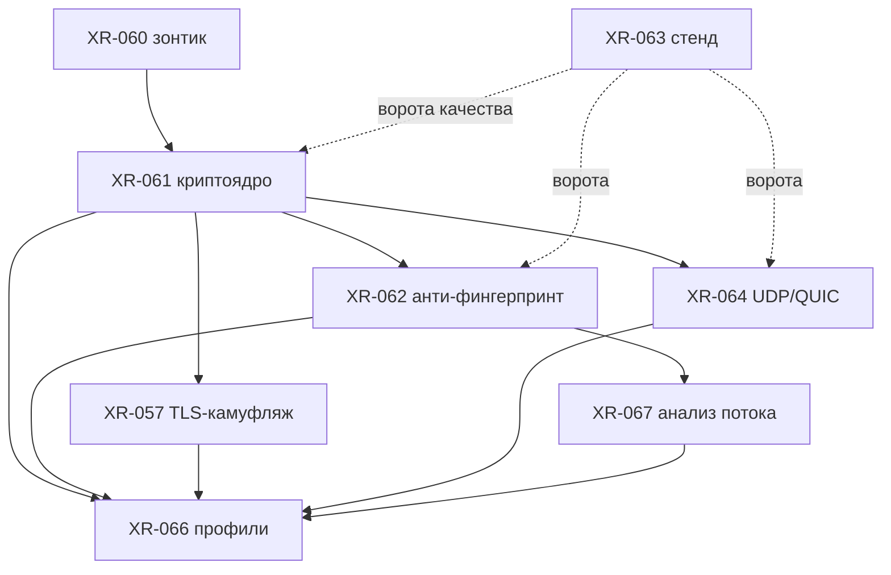

# LLD-35. Протокол v2: криптотранспорт вместо XOR (XR-060)

**Статус:** Draft (зонтик кластера v2; рамку и очередь листьев фиксирует этот
документ, детальные спецификации в листьях XR-061..067)
**Область:** `xr-proto` (кадр, хендшейк, mux, UDP relay: замена XOR-обфускатора
Noise-сессией, кадр v2), `xr-server` и `xr-core`/`xr-client` (двойной приём на
переходный период, выбор транспорта из подписанного инвайта/пресета), `xr-hub`
(раздача статических ключей серверов и профильного PSK через инвайт/пресет),
`xr-android` (подхват v2 из обновлённого пресета). Ядро крипты собирается под
musl-роутер и Android тем же стеком, что уже в дереве (`ring`,
`ed25519-dalek`), плюс `snow` для Noise.
**Зависимости:** гейтит [XR-061](../tasks/XR-061.md) (криптоядро), поэтому идёт
первым в кластере. Листья [XR-062](../tasks/XR-062.md) (анти-фингерпринт),
[XR-057](../tasks/XR-057.md) (TLS-камуфляж), [XR-064](../tasks/XR-064.md)
(UDP/QUIC), [XR-066](../tasks/XR-066.md) (профили приватности),
[XR-067](../tasks/XR-067.md) (стойкость к анализу трафика),
[XR-063](../tasks/XR-063.md) (стенд сравнения, ворота качества).
**Связанные документы:** [ARCHITECTURE.md](../ARCHITECTURE.md) раздел 5.1 (TCP
туннель), 5.2 (UDP relay), 4.1 (xr-proto). Смежники по ключам и раздаче:
[LLD-01](01-control-plane.md) (пресеты и инвайты, подпись ed25519),
[LLD-04](04-onboarding-qr-uri.md) (TOFU-ключ хаба), [LLD-13](13-zero-touch-provisioning.md)
(генерация ключей при provisioning), [LLD-20](20-router-remote-management.md)
(доставка конфига на роутер), [LLD-30](30-max-carrier.md) (общая абстракция
`Carrier` для будущих транспортов).

Это зонтик: главный результат тут выбранная рамка и порядок листьев, а не
построчная спецификация каждого. Развилки закрыты рекомендацией в разделе 8,
открытых вопросов не остаётся; там, где выбор принадлежит листу (внутренний
спайк XR-057, крипта QUIC у XR-064), зонтик задаёт направление и явно передаёт
финальное слово листу.

---

## 0. Рамка для тех, кто видит это впервые

Сейчас туннель прячется статическим XOR: гамма это функция позиции и ключа,
nonce лишь сдвигает выравнивание. Это many-time pad без конфиденциальности,
целостности и forward secrecy, и класс он даёт «fully-encrypted» (высокая
энтропия без структуры), который DPI ловит по энтропии и добивает активным
зондированием. Протокол v2 меняет обфускатор на настоящий криптотранспорт:
хендшейк Noise поднимает сессию с взаимной аутентификацией и forward secrecy,
дальше данные едут AEAD-записями. Вся остальная механика (кадры, команды, mux,
UDP relay, пул серверов) сохраняется и просто переезжает внутрь зашифрованного
канала.

```text
до:   [Nonce:4B][Header:4B XOR][Padding][Payload XOR]           XOR-поток
v2:   Noise-хендшейк -> AEAD-записи { прежний кадр/команда/mux внутри }
```

Криптоядро (XR-061) это фундамент. Поверх него встают независимые линии:
анти-фингерпринт первого пакета (XR-062), камуфляж под честный TLS (XR-057),
UDP/QUIC-транспорт (XR-064). Профили приватности (XR-066) компонуют эти кирпичи
в именованные уровни, а стойкость к анализу установившегося потока (XR-067)
углубляет самый скрытный из них. Стенд сравнения (XR-063) меряет каждый шаг
против Xray и AmneziaWG, чтобы «на голову лучше» было числом, а не декларацией.

## 1. Текущее состояние и модель угроз

### 1.1 Что не так с XOR и кадром

- Обфускатор ([obfuscation.rs](../../xr-proto/src/obfuscation.rs)) это
  `data[i] ^ key[(i+offset) % key_len] ^ modifier(i)`. Ключ профиля статичен и
  раздаётся всем клиентам, гамма детерминирована по позиции, nonce лишь
  выбирает выравнивание ключа. Один и тот же ключ шифрует весь трафик всех
  сессий: это many-time pad. Конфиденциальности нет (XOR двух шифртекстов гасит
  гамму), целостности нет (бит в шифртексте это бит в плейнтексте, MAC
  отсутствует), forward secrecy нет (утечка профильного ключа раскрывает весь
  прошлый и будущий трафик профиля).
- Кадр ([protocol.rs](../../xr-proto/src/protocol.rs)) несёт в заголовке магию
  `HEADER_MAGIC 0xA0` (старшие три бита командного байта). Проверка магии это
  единственная аутентификация приёма («magic совпал -> ключ верный»), она же
  детерминированный маркер первого байта для DPI и точка отсева при активном
  зондировании (`Command::from_byte` отвергает чужую магию, но сам факт ответа
  или молчания различим).
- Аутентификации эндпоинта нет вовсе: любой, кто владеет профильным ключом,
  для сервера неотличим от легитимного клиента, а сервер для клиента ничем не
  подтверждает себя, кроме того же ключа.

### 1.2 Модель угроз

1. **Пассивный DPI по фингерпринту.** Классификатор смотрит на энтропию и
   структуру первых байт (popcount, доля печатаемых, случайность первых N
   байт) и на статистику потока (распределение длин записей, тайминги). XOR
   палится как fully-encrypted со второго байта.
2. **Активное зондирование.** Пробер шлёт на подозрительный порт свой первый
   пакет и смотрит на реакцию (ответ, RST, таймаут, длину ответа). Наш
   реактивный HTTP-fallback ([fallback.rs](../../xr-server/src/fallback.rs))
   отвечает только после 4096 байт мусора и от прицельной пробы не спасает.
3. **Блокировка по фингерпринту протокола.** ТСПУ заносит в фильтр сам
   опознанный протокол (как это было с наивным Shadowsocks и голым WireGuard),
   и тогда обход перестаёт работать без смены транспорта.
4. **Компрометация одного узла.** Утечка ключа одного VPS не должна раскрывать
   трафик к другим VPS и прошлые сессии (forward secrecy и изоляция ключей).

Чего v2 в этой рамке не закрывает и не обещает: глобального пассивного
наблюдателя, коррелирующего тайминги на входе и выходе (это ось XR-067, и то
частично), и деанонимизации на уровне оплаты и SIM (вне протокола). Владелец
явно ставит ось «не заблокироваться» выше оси «скрыть назначения» (XR-062,
XR-066), и рамка это отражает: сначала неотличимость и стойкость к блокировке,
приватность назначений глубже и опциональна.

## 2. Цели и не-цели

Цели:

- Настоящая крипта в туннеле: конфиденциальность, целостность (AEAD), взаимная
  аутентификация эндпоинтов, forward secrecy, защита от повтора. XOR из
  data-path удаляется полностью.
- Кадр без детерминированного маркера первого пакета (магию убрать), с версией
  и запасом на расширение, но без нового плейнтекст-фингерпринта на проводе.
- Раздача ключей поверх уже существующего доверенного канала (подписанный
  инвайт и пресет хаба, TOFU-ключ), без новой инфраструктуры PKI.
- Сохранение mux, оконного flow control (LLD-27), пула серверов (LLD-10) и UDP
  relay: они переезжают внутрь зашифрованного канала без переписывания.
- Миграция живого парка без флаг-дня: сервер принимает старых и новых клиентов
  на переходный период, откат делается конфигом, а не выкатом кода.
- Измеримость: каждый шаг сверяется стендом XR-063 против эталонов.

Не-цели (свои задачи, см. раздел 5):

- Камуфляж под честный TLS (XR-057), junk-пакеты и рандомизация хендшейка
  (XR-062), шейпинг установившегося потока (XR-067). v2-ядро даёт крипту и
  чистый кадр, косметика неотличимости встаёт поверх.
- QUIC/UDP как отдельный транспорт (XR-064): ядро определяет швы, но TCP+Noise
  остаётся базой роутера.
- Per-invite идентичность в крипте (свой статический ключ на каждого клиента):
  переезжает в линию XR-030/XR-073, ядро v2 держит для этого шов.
- Пост-квантовый гибрид: формат наружу не фиксируем, оставляем возможность
  добавить PQ-DH отдельным Noise-паттерном позже.

## 3. Дизайн рамки

### 3.1 Два слоя: Noise-конверт снаружи, прежний кадр внутри

v2 это вложенность. Внешний слой это Noise-сессия: хендшейк поднимает ключи,
дальше идут транспортные AEAD-записи. Внутренний слой это ровно сегодняшний
кадр с командой и mux-payload (`Frame`, `Command`, `encode_mux_payload`), только
теперь он едет как плейнтекст внутри AEAD-записи, а не как XOR-поток. Codec
перестаёт быть XOR-оболочкой и становится связкой «Noise-транспорт плюс
разбор кадров».

Из этого сразу следует совместимость: mux (`MuxStream`, деление id по чётности,
`WindowUpdate`, LLD-27), `MuxPool` и `ServerPool` (LLD-10) работают над
расшифрованным каналом и не меняются по существу. Меняется только слой, который
раньше был XOR, а стал Noise. Это же формулирует DoD XR-061: mux и UDP relay
сохранить, но нести AEAD-шифртекст вместо XOR.

### 3.2 Noise-паттерн: IK с профильным PSK

Выбор из брифа это IK против XK. Рекомендация: **IK с подмешанным PSK**.

- **IK, а не XK.** В IK инициатор знает статический ключ ответчика заранее, а
  свой статический шлёт (зашифрованным) в первом же сообщении. Это один
  round-trip, взаимная аутентификация закрывается за одно сообщение
  туда-обратно. XK прячет статику инициатора сильнее, но платит третьим
  сообщением (1.5 RTT). У нас статический ключ сервера и так доезжает до
  клиента подписанным инвайтом/пресетом (тот же канал, что сегодня несёт
  профильный ключ), а идентичность инициатора мы не прячем (сервер и так знает
  своих клиентов). Зато cold-start латентность это известная боль (до 20с на
  Android, XR-063), и лишний round-trip тут дорог. IK совпадает и с ментальной
  моделью классов, против которых меряемся (WireGuard/AmneziaWG: ответчик
  известен заранее).
- **Плюс PSK.** Профильный секрет, который сегодня раздаётся как
  `obfuscation_key`, переезжает в Noise как pre-shared key, подмешанный
  достаточно рано, чтобы гейтить первое сообщение. Без знания PSK пробер не
  соберёт первое сообщение с валидным тегом, и ответчик отбрасывает его молча,
  ничем себя не выдавая. Это прямой ответ на активное зондирование (угроза 1.2
  п. 2): даже если статический публичный ключ сервера утёк из инвайта, без PSK
  зонд не вытянет из сервера отличимую реакцию. PSK ещё и страховка на случай
  утечки статики сервера и задел под будущий PQ-слой. Точный токен паттерна
  (место psk в схеме `snow`) фиксирует XR-061; зонтик требует лишь, чтобы psk
  гейтил именно первое сообщение.

Итоговая сюита (шифр и хеш в 3.3): `Noise_IKpsk_25519_ChaChaPoly_BLAKE2s`,
крейт `snow` (кросс-компилируется под musl и Android, стек модерн-крипты в
дереве уже собирается).

### 3.3 AEAD и примитивы

- **AEAD: ChaCha20-Poly1305.** Роутеры это ARM без AES-NI, Android-парк по
  железу разный; ChaCha20 быстра и constant-time в софте, а Poly1305 даёт
  16-байтный тег целостности на запись. AES-GCM выиграл бы только там, где есть
  аппаратный AES, то есть не на нашей целевой платформе. ChaCha это и дефолт
  WireGuard/AmneziaWG.
- **DH: X25519, хеш: BLAKE2s** (как в XR-061). BLAKE2s легче SHA-2 на 32-битном
  ARM.
- Nonce транспортных записей это счётчик, которым управляет `snow` (на проводе
  его нет), что закрывает nonce-reuse конструктивно. Anti-replay в
  потоковом TCP-канале держит монотонность счётчика; для датаграмм (UDP relay,
  3.6) нужен явный nonce и окно повтора.

### 3.4 Формат кадра v2 и запас на расширение

- **Магии нет.** Детерминированный маркер первого байта убирается (это цель и
  XR-062). Валидность приёма подтверждает AEAD-тег, а не совпадение магии.
- **На проводе нет плейнтекст-версии.** Плейнтекст-дискриминатор версии сам по
  себе фингерпринт, поэтому версия транспорта не едет байтом на проводе. Какой
  транспорт у профиля (`xor` legacy или `noise-v2`) и какая сюита, клиент
  узнаёт из подписанного инвайта/пресета (поле `transport`), то есть
  out-of-band по доверенному каналу. Внутриканальные возможности (флаги фич)
  согласуются уже существующим механизмом: версия и байт `MuxCaps` в
  `MuxInit`/`MuxInitAck` ([mux.rs](../../xr-proto/src/mux.rs)), который сейчас
  включает оконный flow control без бампа версии. Запас на расширение это
  зарезервированные биты `MuxCaps` и тип-байт внутри плейнтекст-кадра, а не
  новые поля на проводе.
- **Записи транспорта.** После хендшейка данные едут AEAD-записями вида
  `[len:2B][ciphertext+tag]`. Двухбайтовый префикс длины это тоже потенциальный
  константный фингерпринт, поэтому он маскируется коротким keyed-keystream'ом,
  выведенным из хендшейк-хеша (дёшево, снимает постоянную структуру в начале
  записей). Паддинг и рандомизация размеров это уже XR-062, ядро оставляет для
  них место.
- Внутренний кадр (`Frame` с командой и payload) не меняет семантику: команды
  `Connect`/`Data`/`Close`/`MuxInit`/`WindowUpdate` и mux-payload едут как
  плейнтекст записи.

### 3.5 Ключи: где живут и как раздаются

- **Статический ключ сервера, по одному на VPS.** Приватная половина
  генерируется при provisioning на самом VPS (LLD-13, `xr-setup`) и никогда его
  не покидает; публичная уезжает в хаб и оттуда клиентам. По ключу на VPS, а не
  один на профиль: компрометация одного узла не раскрывает трафик к другим, а
  custody приватного ключа естественна (он и так живёт на своём VPS). Цена это
  32 байта публичного ключа на сервер в инвайте/пресете, что дёшево.
- **Профильный PSK, один на профиль.** Занимает слот сегодняшнего
  `obfuscation_key` в `InvitePayload`/пресете. Это общий «cover»-секрет
  профиля и гейт против зондирования (3.2).
- **Клиентский статический ключ, пока один на профиль.** IK требует статику
  инициатора. Чтобы не менять сегодняшнюю модель доступа («владеешь инвайтом
  значит внутри»), клиентский статический ключ профильный, его приватная
  половина едет в подписанном инвайте там же, где сегодня едет симметричный
  ключ. Per-client идентичность (свой ключ на инвайт) это отдельная линия
  XR-030/XR-073; ядро держит для неё шов, но сейчас не заводит.
- **Канал раздачи уже есть.** `InvitePayload` и пресет подписываются хабом,
  TOFU-ключ хаба закреплён у клиента (LLD-01, LLD-04). Клиент пиннит
  статический ключ сервера из подписанного инвайта. Новой PKI не заводим: в
  `InvitePayload` добавляется `transport`, публичный ключ на каждый сервер в
  списке `servers` и профильный PSK на месте `obfuscation_key`; в пресете
  соответствующие поля. Список `servers` под пул уже есть (LLD-10), к записи
  сервера добавляется публичный ключ.

### 3.6 Совместимость mux и UDP relay

- **Mux.** Работает над расшифрованным каналом без изменений по существу
  (3.1). Хендшейк Noise поднимается один раз на TCP-туннель, дальше идёт
  `MuxInit`/`MuxInitAck` как сейчас. `MuxPool` держит N туннелей, у каждого
  свой Noise-хендшейк; `ServerPool` и failover не трогаются.
- **UDP relay.** Датаграммный путь ([udp_relay.rs](../../xr-proto/src/udp_relay.rs))
  нельзя завести на последовательном транспортном nonce Noise: датаграммы
  теряются и переупорядочиваются. Поэтому UDP relay берёт из хендшейка
  симметричный ключ, а каждую датаграмму печатает ChaCha20-Poly1305 под явным
  per-датаграмма nonce (счётчик в датаграмме плюс окно защиты от повтора).
  Шифр общий с TCP-путём, дисциплина nonce разная. Это же подготавливает почву
  под XR-064 (QUIC/UDP). Деталь датаграммной крипты специфицирует срез под
  XR-061/XR-064, требования к нему ниже.

Скорость UDP-пути критична (за ним игровые приставки), поэтому дальше в этом
разделе разобрано, что переезд на v2 стоит по латентности и по байтам.

**Датаграммы остаются датаграммами.** Сегодня relay это fire-and-forget: ни
подтверждений, ни ретрансмитов, ни упорядочивания. v2 это свойство сохраняет.
Окно защиты от повтора это скользящий битмап на 64 позиции, как в IPsec и
WireGuard, а не квитанция: опоздавшую датаграмму никто не переспрашивает, окно
только отбрасывает уже виденный счётчик. Потерянная датаграмма остаётся
потерянной, как и сейчас.

**Заводить UDP внутрь mux нельзя.** Соблазн есть: одна сессия на всё, один
хендшейк, кодек уже готов. Но тогда игровой трафик получает head-of-line
blocking и ретрансмиты TCP, то есть ровно то, от чего датаграммный путь и
заводился. UDP relay остаётся отдельным сокетом со своим шифрованием, и это
требование к XR-061, а не деталь реализации.

**Хендшейк UDP-пути свой, на relay-сокете** (развилка 8.12). Альтернатива это
вывести ключ датаграмм из хендшейка TCP-туннеля через HKDF от хендшейк-хеша:
ноль дополнительных RTT и одна стейт-машина вместо двух. Экономия тут мнимая.
Демон на роутере живёт неделями и уже шлёт keepalive, так что свой хендшейк
проходит на старте задолго до первого пакета приставки, а платить за него
приходится только один раз. Взамен UDP-путь остаётся независим от состояния
TCP-туннеля, и это сегодняшнее свойство стоит сохранить: туннель
переподключается или `ServerPool` уводит трафик на backup, а игровая сессия не
рвётся. Рекей по времени и по исчерпанию счётчика вписывается в существующий
keepalive-цикл. Код хендшейка переиспользуется из криптоядра XR-061, второй
реализации не заводим.

**Бюджет байтов и MTU.** Сегодня оверхед это 16 байт на IPv4-датаграмму (4
байта nonce плюс 12 байт заголовка с полным адресом назначения). Если просто
навесить на прежний заголовок счётчик и тег, выйдет 36 байт, и вот это дороже
самого шифра: приставка шлёт датаграммы под 1472 байта, инкапсулированная
вылезает за MTU и фрагментируется, а фрагментированный UDP это лишние потери и
джиттер. Поэтому заголовок ужимается. Полный dst IP в каждой датаграмме
избыточен, таблица флоу и так есть с обеих сторон, так что снаружи AEAD едут
идентификатор сессии и счётчик, а внутри тип пакета и короткий flow id (2
байта), выданный при первом пакете флоу; сам адрес назначения уходит под
шифр и заодно перестаёт быть виден на проводе. Порядок 31 байта против
сегодняшних 16. Плюс честный PMTU: DF на туннельном сокете и явная
диагностика вместо молчаливой фрагментации в ядре.

**Горячий путь переписывается заодно.** Кодек всё равно меняется, поэтому в
новом сразу: шифрование in-place в переиспользуемом буфере вместо трёх
аллокаций на датаграмму (`payload.to_vec()` плюс два `Vec` внутри
`encode_relay_packet`), пакетные `recvmmsg`/`sendmmsg` вместо сисколла на
каждую датаграмму и обычный мьютекс на таблице флоу вместо
`tokio::sync::Mutex`, который сейчас берётся на каждый пакет в обе стороны при
микроскопической критической секции. На роутере эти три вещи стоят
сопоставимо с самой ChaCha над 1400 байтами, так что наследовать их в v2
незачем. Та же работа на TCP-пути это XR-065.

Отдельно стоит держать в голове, что джиттер игрового трафика сегодня задаёт
не крипта, а общая очередь аплинка, где датаграммы стоят вперемешку с
буферизованным трафиком туннеля. Пометка туннельного сокета через `IP_TOS` и
правило QoS дадут больше, чем любая оптимизация шифра, но это работа за
рамками ядра v2 и просится отдельной строкой на доску.

## 4. Миграция живых деплоев

### 4.1 Состав парка и порядок

Парк это VPS-флот (`xr-server`, наш, обновляется легко), хаб (`xr-hub`, наш),
Android (`xr-android`, самообновление APK по LLD-12, постепенный раскат) и
роутеры OpenWRT (`xr-client`, unattended, обновляются удалённым управлением
LLD-20 или руками, тяжелее всего в восстановлении). Порядок раската от
безопасного к рискованному:

1. **Сервер первым.** Выкатить поддержку v2 на весь VPS-флот, чтобы клиентам
   было с кем говорить. Сервер начинает принимать оба транспорта (двойной приём,
   4.2). Наш риск минимальный, откат мгновенный.
2. **Хаб.** Инвайты и пресеты начинают нести `transport = noise-v2`, публичные
   ключи серверов и PSK. Уже закреплённые клиенты не трогаются, пока не обновят
   пресет; новые выдачи сразу v2.
3. **Android.** Раскат через самообновление (LLD-12) постепенными долями. v2
   подхватывается из обновлённого пресета/инвайта. Откат простейший: перестать
   отдавать v2 в пресете, приложение возвращается на legacy.
4. **Роутеры последними.** После того как Android подтвердил стабильность,
   пушим v2-конфиг на роутеры через LLD-20 (или руками). Роутер тяжелее всего
   поднимать после поломки, поэтому идёт в конце.
5. **Ретайр XOR.** Когда fleet-телеметрия (LLD-17/LLD-18) показывает, что
   legacy-приём по флоту простаивает, XOR-listener и XOR-код удаляются.

### 4.2 Двойной приём без флаг-дня

Транспорт это атрибут профиля из подписанного инвайта/пресета, а не то, что
сервер угадывает по проводу. На переходный период VPS держит два акцептора:
legacy (XOR) и v2 (Noise). Чтобы не гадать по первому пакету (trial-decode
хрупок: сообщение Noise, скормленное XOR-декодеру, случайно проходит проверку
магии с вероятностью около 1.5%, и это ещё и различимая проба), v2 слушает на
отдельном порту, который прописан в v2-записях `servers` инвайта. Старые
клиенты продолжают ходить на старый порт XOR-ом, обновлённые на новый порт
Noise'ом. Никакой неоднозначности на проводе.

### 4.3 Откат

Поскольку v2 живёт на отдельном listener'е и выбирается селектором из инвайта,
откат это конфиг, а не выкат: перестать отдавать v2 в инвайте/пресете и вернуть
клиентов на XOR-порт. Гранулярность по-клиентная через рефреш пресета. Legacy-
путь стоит нетронутым до явного ретайра (4.1 п. 5), поэтому единичный сломанный
v2-клиент откатывается обновлением конфига, а не откатом бинаря.

### 4.4 Компат-слой намеренно короткий

Парк сейчас тестовый, и проект держит установку «форматы ломаем, пока парк
тестовый»: слои совместимости без запроса не закладываем. Поэтому двойной приём
это не постоянная подсистема версионирования, а короткоживущий мост. Флот наш и
маленький, так что дуал-стек живёт недели, а не кварталы: как только Android и
роутеры переехали, XOR вырезается целиком. Механику двойного приёма
проектируем аккуратно, но не пестуем как вечный shim.

## 5. Дорожная карта листьев

Порядок реализации и зависимости (нумерация листьев историческая, порядок
задаёт этот список):

1. **XR-061, криптоядро** (гейт кластера). Noise-хендшейк (IKpsk), AEAD-кадр v2,
   удаление XOR из TCP-туннеля, датаграммная крипта UDP relay, механика
   двойного приёма и селектор транспорта в инвайте/пресете. Зависит от XR-060.
2. **XR-063, стенд сравнения** (ворота качества, стоит рядом с самого начала).
   Поднять до XR-061, чтобы снять базовые числа на XOR, дальше прогонять после
   каждого шага и ловить регресс. Скрипты плюс отчёт по нам и двум эталонам.
3. **XR-062, анти-фингерпринт первого пакета.** Убрать магию (уже сделано
   ядром), рандомизировать размеры и тайминг хендшейка, junk-пакеты и
   pre-handshake padding, параметры пер-деплой. Зависит от XR-061.
4. **XR-057, TLS-камуфляж** (потолок неотличимости). Обёртка потока в честный
   TLS/Reality-класс. Свой внутренний спайк (б/в/г), см. развилку 8.10.
   Зависит от XR-061, усиливается XR-062. Параллелится с XR-062 и XR-064.
5. **XR-064, UDP/QUIC-транспорт.** QUIC (quinn) как выбираемый транспорт для
   мобильных, TCP+Noise остаётся базой роутера (TPROXY и UDP relay завязаны на
   TCP-путь). Общая абстракция `Carrier` с LLD-30. Зависит от XR-061,
   параллельно с XR-057/XR-062.
6. **XR-066, профили приватности.** Именованные уровни, компонующие кирпичи
   v2 (крипта-пол XR-061, паддинг XR-062, камуфляж XR-057, транспорт XR-064,
   агрессивность mux). Capability-negotiation клиент-сервер, серверный пол
   политики. Зависит от XR-061/062/057/064.
7. **XR-067, стойкость к анализу установившегося потока.** Нормализация длин,
   джиттер, опциональный cover traffic. Дорого по каналу, включается «Скрытным»
   профилем XR-066, не по умолчанию. Смежно с XR-062, углубляет XR-066.



## 6. Изменения долгоживущей доки

Каждый лист правит доку в своей задаче; зонтик перечисляет карту.

- [ARCHITECTURE.md](../ARCHITECTURE.md) раздел **5.1**: описание TCP-туннеля
  переписывается с XOR-кадра на Noise-конверт с AEAD-записями и прежним кадром
  внутри. Раздел **5.2**: UDP relay переезжает на датаграммный AEAD с явным
  nonce, схема пакета в разделе перерисовывается (адрес назначения уходит под
  шифр, наружу выходят идентификатор сессии и счётчик), туда же приезжает свой
  хендшейк relay-сокета. Раздел **4.1**: `obfuscation.rs` уходит из data-path (после ретайра
  XOR удаляется), появляется noise-модуль; описание `protocol.rs`/`Codec`
  обновляется. Раздел **9**: строка зонтика LLD-35 и строки листьев в таблице
  порядка реализации.
- Референс-конфиги: `configs/client.toml`, `configs/server.toml`, схема
  инвайта. Вместо `[obfuscation] key/salt/modifier` появляются статический ключ
  сервера, профильный PSK и селектор `transport`. `preset.rs` (поле
  `obfuscation_key` -> ключи v2). `scripts/generate-key.sh` учит генерить пару
  ключей вместо симметричного ключа.
- README: раздел про транспорт (Noise вместо XOR, что раздаётся инвайтом).

По правилу проекта: устоявшиеся факты после реализации каждого листа переезжают
из его LLD в ARCHITECTURE.md тем же коммитом-доком, а LLD остаётся историей
решения. Отличия реализации от этого дизайна фиксируются здесь по факту.

## 7. Сценарий проверки

Автотесты по пирамиде живут в листьях (юнит на крипту: roundtrip хендшейка,
tamper/replay/wrong-key/wrong-psk -> reject; интеграционные на стык
клиент-сервер и на двойной приём). Сквозные ворота качества это стенд XR-063,
и они же гейтят весь кластер:

- **Пропускная способность** на чистом канале и на lossy (`tc netem`:
  потери/задержка/джиттер), поведение под потерями против одиночного TCP.
- **Латентность установки** соединения (cold start; было до 20с на Android),
  чтобы IK и датаграммный путь реально её не ухудшили.
- **CPU и память** на ARM-роутере (musl): ChaCha должна укладываться в бюджет
  железа без AES-NI.
- **UDP relay отдельным замером:** оверхед на датаграмму в байтах и доля
  фрагментированных пакетов при размере от приставки под MTU, задержка на
  датаграмму в обе стороны и джиттер под встречной нагрузкой на туннеле.
  Дельта против XOR-базы снимается на том же стенде, потому что за этим путём
  живут игровые приставки и деградация тут заметна пользователю первой.
- **Детект-тесты:** энтропия и структура первого пакета, реакция на активное
  зондирование (пробер без PSK получает молчание), сравнение с эталонными Xray
  (VLESS+Reality) и AmneziaWG на том же стенде.

Правило прогона: снять базовую линию на XOR до XR-061, затем гнать стенд до и
после каждого шага (XR-061/062/064) и ловить регресс. DoD каждого листа
включает зелёную дельту стенда, `cargo test --workspace` без warnings и
сведённые с поведением референс-конфиги.

## 8. Развилки (закрыты в этом дизайне)

1. *Noise-паттерн IK или XK?* -> **IK.** Один round-trip против 1.5 у XK,
   статика сервера и так едет подписанным инвайтом, идентичность инициатора мы
   не прячем, а cold-start латентность дорога (3.2).
2. *Подмешивать ли PSK?* -> **Да, IK с профильным PSK**, гейтящим первое
   сообщение. Пробер без PSK получает молчание, это прямой ответ на активное
   зондирование; PSK переиспользует слот сегодняшнего профильного ключа (3.2).
3. *AEAD-шифр?* -> **ChaCha20-Poly1305**, X25519, BLAKE2s, крейт `snow`. ARM без
   AES-NI, constant-time в софте, дефолт WireGuard/AmneziaWG (3.3).
4. *Статический ключ сервера: один на профиль или на VPS?* -> **на VPS.**
   Изоляция компрометации узла, естественная custody приватного ключа; цена 32
   байта на сервер в инвайте (3.5).
5. *Клиентская идентичность: per-client или профильная?* -> **профильная
   сейчас** (паритет с моделью «инвайт значит доступ»), per-client отложен в
   XR-030/XR-073, ядро держит шов (3.5).
6. *Версия на проводе или out-of-band?* -> **out-of-band**: транспорт и сюита
   приходят подписанным инвайтом/пресетом, плейнтекст-версии на проводе нет
   (она сама фингерпринт); внутриканальные фичи через существующий
   `MuxInit`/`MuxCaps` (3.4).
7. *Префикс длины записи: плейнтекст или маска?* -> **маска** keyed-keystream'ом
   из хендшейк-хеша, чтобы в начале записей не было константной структуры;
   паддинг это XR-062 (3.4).
8. *Крипта UDP relay: последовательный nonce Noise или явный?* -> **явный
   per-датаграмма nonce плюс окно повтора**: датаграммы теряются и
   переупорядочиваются, общий с TCP только хендшейк и шифр (3.6).
9. *Миграция: флаг-день, trial-decode или двойной приём?* -> **двойной приём**
   по селектору транспорта на отдельном listener'е, откат конфигом, сервер
   первым, роутеры последними; компат-слой короткий, потому что парк тестовый
   (4.2, 4.4).
10. *Направление XR-057 (спайк б/в/г)?* -> зонтик **рекомендует начать с
    переиспользования обкатанного внешнего слоя (вариант г)** под наш mux, чтобы
    дойти до Reality-класса быстро и без крупного рискового протокола на Rust;
    свою Rust-реализацию Reality (вариант в) держать в резерве под
    эксплуатационное требование «без внешних бинарей». Финальный выбор за LLD
    XR-057.
11. *Крипта QUIC у XR-064 (Noise поверх QUIC или родная QUIC-крипта)?* -> зонтик
    **рекомендует родную QUIC-крипту (TLS 1.3) с закреплённой идентичностью**,
    чтобы не шифровать дважды, а QUIC подключить как ещё один backend
    абстракции `Carrier` (LLD-30). Финальный выбор за LLD XR-064; TCP+Noise
    остаётся базой роутера в любом случае.
12. *Ключ UDP relay: выводить из хендшейка TCP-туннеля или поднимать свой
    хендшейк на relay-сокете?* -> **свой хендшейк на relay-сокете.** Экономия
    RTT у вывода из туннеля мнимая (демон на роутере живёт неделями и
    хендшейкует на старте), а взамен UDP-путь остаётся независим от
    переподключений туннеля и failover'а `ServerPool`. Код хендшейка общий с
    XR-061 (3.6).
