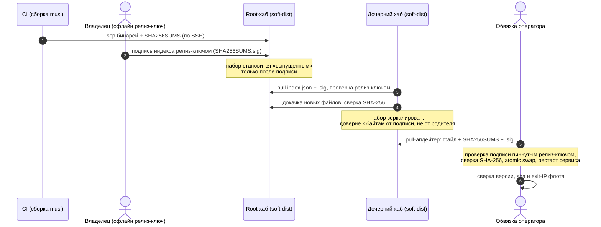

# LLD-36. Федеративная дистрибуция софта (XR-173)

**Статус:** Draft
**Область:** `xr-hub` (стор софт-набора `soft-dist` со всеми компонентами,
зеркалирование набора от родительского хаба, роут раздачи, блок
`[federation]` в конфиге, расширение `sign-release` до подписи индекса стора);
`xr-setup` (движок pull-апдейтера: проверка подписи индекса релиз-ключом,
режим `update` по компонентам, атомарный swap бинаря и рестарт сервиса);
`xr-proto` (компайл-тайм константа публичной половины релиз-ключа, домен
подписи индекса); CI (workflow'ы релиза `xr-server`/`xr-relay`/`xr-hub`/
`xr-client`/`xr-setup` по образцу `release-xr-share.yml`); скрипты обвязки
оператора (`release-*.sh`/`deploy-*.sh`) и install-скрипты как доки деплоя.
`xr-server`/`xr-relay`/`xr-client` меняются минимально: пиннинг ключа
компайл-тайм плюс опциональная сабкоманда самопроверки.
**Зависимости:** [LLD-12](12-android-apk-self-update.md) (релиз-ключ офлайн у
владельца, verify подписи и SHA-256 в [update.rs](../../xr-core/src/update.rs),
CLI `xr-hub sign-release`/`gen-release-key`, раздача из `releases/`);
[LLD-13](13-zero-touch-provisioning.md) (`xr-setup` как идемпотентный
pull-инсталлер, `setup-dist` на хабе, `install.sh` тонкой обёрткой);
[LLD-19](19-file-sharing-agent.md) и [LLD-23](23-share-relay-nat.md) (`xr-share`
и `xr-relay` как компоненты набора, `share-dist` и образцовый CI
[release-xr-share.yml](../../.github/workflows/release-xr-share.yml)); XR-109
(релиз APK смежной цепочкой, `scripts/release-apk.sh`). Рамка будущей федерации
данных разобрана в п. 2.7, в скоуп этого LLD не входит.

Целевая картина экосистемы (решение владельца, 2026-07-21) это множество
хабов у разных владельцев, собранных в единое целое по принципу конструктора.
Полная федерация включает и данные (идентичности, шары, чат между хабами), но
её фундамент это per-invite идентичность (XR-074) и криптоядро (XR-061).
Дистрибуция софта от крипты не зависит и отгружается первой фазой. Хабы делят
софт и цепочку доверия к нему, данные пока остаются локальными. Заодно
закрывается вопрос «наш CI не знает про чужие серверы»: CI не держит списка
агентов и хостов, он собирает бинари и кладёт их в известную точку на хабе, а
машины тянут их сами. Образец уже работает у `xr-share` (пункт 1), этот LLD
распространяет его на остальные компоненты и добавляет два недостающих слоя:
подпись артефактов офлайновым релиз-ключом и зеркалирование набора хабом от
родителя.

---

## 0. Схема



## 1. Текущее состояние

- Образец pull-дистрибуции уже живёт у `xr-share`. CI
  ([release-xr-share.yml](../../.github/workflows/release-xr-share.yml))
  собирает статические musl-бинари (x86_64 + aarch64), Windows и macOS,
  проверяет наличие relay-фичи и по SSH публикует бинари, install-скрипты и
  `SHA256SUMS` в `share-dist` на хабе. Установщик
  ([install.sh](../../xr-share/dist/install.sh)) качает бинарь под свою
  ОС/арку, сверяет SHA-256 по `SHA256SUMS` и ставит сервис. Того же образца
  придерживается `setup-dist`.
- `xr-setup` уже pull-инсталлер (LLD-13): `release-xr-setup.sh` выкладывает
  musl-бинари `xr-setup`, `xr-server`, `xr-hub`, `xr-client` под обе арки
  плюс `install.sh` и `SHA256SUMS` в `setup-dist`, а хаб раздаёт их роутом
  `GET /api/v1/setup/{file}` (`dist::serve_setup`). Чистый VPS или роутер
  ставится одной командой `curl ... | sh -s -- server|router`. Проверка при
  скачивании это SHA-256, подписи артефактов нет.
- Релиз-ключ (офлайн ed25519 у владельца) пинится и проверяется **только у
  APK** (LLD-12): публичная половина зашита в сборку
  (`BuildConfig.RELEASE_PUBLIC_KEY`), приложение тянет подписанный манифест
  версии (`/api/v1/app/latest`), проверяет подпись пиннутым ключом и SHA-256
  APK. Verify живёт в [update.rs](../../xr-core/src/update.rs)
  (`fetch_manifest`/`verify_manifest`/`verify_apk_sha256`), подпись готовит
  владелец локально `xr-hub sign-release` (ключ из `gen-release-key`), хаб сам
  не подписывает и раздаёт готовое из `releases/`.
- Инвентарь пиннинга релиз-ключа по компонентам:

| Компонент | Пинит релиз-ключ | Как обновляется сегодня | Пробел |
|---|---|---|---|
| `xr-android` (APK) | да, `BuildConfig.RELEASE_PUBLIC_KEY`, verify в `update.rs` | подписанный манифест + SHA, `PackageInstaller` | нет, это образец |
| `xr-server` | нет | `deploy-server.sh` руками на VPS (`cargo build` + `systemctl restart`) | завести пиннинг и pull-апдейтер |
| `xr-relay` | нет | своего скрипта нет, руками | завести |
| `xr-hub` | нет (admin-ui вшит `rust-embed`) | `deploy-hub.sh` на VPS (`npm run build` + `cargo` + restart) | завести |
| `xr-client` | нет | `deploy-router.sh` push по SSH, verify только `pgrep` | завести, плюс сверка exit-IP |
| `xr-setup` | нет | `install.sh` -> `xr-setup`, TOFU по TLS, сверка SHA-256 | добавить проверку подписи индекса |

- Клиент пока одно-хабовый и одно-роутерный по деплою: `deploy-router.sh`
  работает с одним хостом и проверяет живость только `pgrep`, без сверки
  версии, чек-суммы и тем более exit-IP. XR-110 (деплой на оба роутера)
  закрыта в пользу этого LLD, её требования переезжают сюда (п. 2.6).
- Зеркалирования софт-набора между хабами нет: у дочернего хаба свой CI-канал
  или ручная выкладка, единого проверяемого набора «от родителя» не
  существует.

## 2. Целевое поведение

### 2.1 Два корня доверия и один релиз-ключ

Доверие разведено на два независимых корня, и смешивать их нельзя:

- **Релиз-ключ подписывает код.** Приватная половина офлайн у владельца (не на
  VPS, не в CI), публичная зашита в каждую установленную сборку. Это тот же
  ключ, что уже подписывает APK (LLD-12); новых релиз-ключей не заводим, один
  на весь проект. Чтобы доверять бинарю, скачанному с хаба, доверять оператору
  хаба не нужно: доверие держит подпись, а не источник.
- **Ключ хаба подписывает данные** (инвайты, токены, пресеты), у каждого хаба
  свой. Он на VPS и к дистрибуции софта отношения не имеет.

Пиннинг заводится для всех компонентов, а не только для APK. Публичная
половина релиз-ключа становится компайл-тайм константой в `xr-proto`
(`RELEASE_PUBKEY`), заполняемой из build-env `XR_RELEASE_PUBKEY` при сборке
(та же модель, что у APK через gradle-проперть). Ключ зашивается в бинарь, а
не читается из конфига: конфиг живёт на хабе и оператор мог бы его подменить,
компайл-тайм константу подменить нельзя без пересборки доверенным каналом.
Сборка без переменной (dev) остаётся без самопроверки и без апдейтера, это
явно допустимо для отладки.

### 2.2 Формат стора: софт-набор на хабе

Существующие раздачи (`setup-dist`, `share-dist`, `releases/`) обобщаются в
единый стор `soft-dist` под данными хаба (`<data_dir>/soft-dist`,
переопределяется `[soft].dist_dir`). Структура:

```text
soft-dist/
  index.json               # софт-набор: компонент -> версия -> файлы + sha256 + арки
  SHA256SUMS               # плоский список sha256 по всем файлам набора
  SHA256SUMS.sig           # detached ed25519 релиз-ключом над каноническими байтами индекса
  install.sh install.ps1   # тонкие обёртки (без изменений по духу)
  xr-server/<ver>/xr-server-linux-{x86_64,aarch64}
  xr-relay/<ver>/xr-relay-linux-{x86_64,aarch64}
  xr-hub/<ver>/xr-hub-linux-{x86_64,aarch64}          # admin-ui уже внутри бинаря
  xr-client/<ver>/xr-client-linux-{aarch64,mips,mipsel,arm}
  xr-setup/<ver>/xr-setup-linux-{x86_64,aarch64}
  xr-share/<ver>/xr-share-{linux,windows,macos}-...
  android/<ver>/app.apk manifest.json manifest.sig    # путь APK из LLD-12 сходится сюда
```

- `index.json` перечисляет компоненты, их актуальные версии, файлы по аркам и
  sha256 каждого файла. Он и есть носитель «что входит в набор», по нему
  работают и зеркалирование (п. 2.4), и «обновить всё» (п. 2.6).
- `SHA256SUMS.sig` это единственная новая поверхность подписи: одна подпись над
  каноническими байтами индекса тянет целостность всего набора, ровно как
  подпись манифеста в LLD-12 тянет целостность APK через `apk_sha256` внутри.
  Подписывать многомегабайтные бинари по отдельности не нужно.
- Раздача читается с диска штатным `ServeDir`, как `admin-ui` и `setup-dist`
  сейчас. Роут `GET /api/v1/soft/{path}` отдаёт файлы набора и индекс с
  подписью; `GET /api/v1/soft/install.sh` остаётся точкой входа обёртки.
- Набор доступен там, где GitHub недоступен: он живёт на хабе, а не в GitHub
  Releases (п. 3.3).

### 2.3 Релиз-CI по компонентам и офлайновая подпись

Каждый серверный компонент получает workflow релиза по образцу
`release-xr-share.yml`:

- `xr-server`, `xr-relay`, `xr-hub`, `xr-setup`: статические musl-артефакты под
  x86_64 и aarch64 (cargo-zigbuild, zig из PyPI, как у образца). У `xr-hub`
  сборке предшествует `npm run build` admin-ui: морда вшита в бинарь через
  `rust-embed`, отдельным артефактом не едет, поэтому релиз хаба это релиз
  одного бинаря с уже встроенной мордой.
- `xr-client`: матрица арок роутеров, те же цели, что кросс-собирает
  `deploy-router.sh` (aarch64, mips, mipsel, arm). Одна сборка на арку, имена
  файлов по образцу `xr-client-linux-<arch>`.
- `xr-android` (APK) покрыт своей цепочкой и остаётся смежным (XR-109): его
  выход кладётся в `android/<ver>/` того же стора, формат манифеста из LLD-12
  не меняется.

Все workflow'ы публикуют артефакты и обновляют `SHA256SUMS` в `soft-dist` по
SSH, как образец. Подпись индекса они **не** ставят: приватная половина
релиз-ключа офлайн и в CI её нет (п. 3.1). Набор становится «выпущенным»
отдельным шагом владельца: `xr-hub sign-release` расширяется до подписи индекса
стора (`sign-release --store <dir>` рядом с текущим режимом APK), владелец
запускает её там, где лежит офлайн-ключ, и заливает `SHA256SUMS.sig`.
Апдейтеры и зеркала отвергают набор без валидной подписи, поэтому свежая, но
ещё не подписанная CI-выкладка никем не подхватывается: это осознанный гейт
выпуска, а не гонка.

### 2.4 Зеркалирование от родителя и пиринг

- Хаб знает своего родителя из конфига: блок `[federation]` с `parent_url`
  (адрес стора родительского хаба). Root-хаб родителя не имеет и кормится
  прямо от CI. Дочерний хаб при бутстрапе и дальше по таймеру тянет от родителя
  `index.json` + `SHA256SUMS.sig`, проверяет подпись **пиннутым** релиз-ключом,
  докачивает недостающие файлы, сверяет sha256 каждого и публикует набор у себя.
- Компрометация родительского хаба не травит граф: без приватного релиз-ключа
  родитель не подпишет подменённый набор, дочерний хаб отвергнет подпись.
  Именно поэтому мирроринг безопасен через хаб, которому ты не обязан доверять
  как оператору (п. 2.1).
- Пиринг явный и попарный: хаб зеркалит только от родителей, прямо прописанных
  в `[federation]`, транзитивного доверия нет. Знакомство с родителем идёт
  через инвайт от него (переиспользуем машинерию инвайтов), инвайт несёт адрес
  стора и отпечаток релиз-ключа для сверки вне канала. Для софта «доверие» это
  глобальный релиз-ключ, а пиринг задаёт лишь топологию доставки (откуда тянуть),
  не круг доверия к байтам.

### 2.5 Pull-апдейтеры компонентов

Оператор ставит и обновляет компоненты pull-скриптом по образцу `install.sh`,
а движком проверки и подмены становится `xr-setup` (он уже умеет качать бинари
и сверять SHA-256, LLD-13):

- `xr-setup update <server|relay|hub|client|setup|all> [--from <store_url>]`:
  тянет `index.json` + `SHA256SUMS.sig` из стора (по умолчанию свой хаб),
  проверяет подпись индекса пиннутым релиз-ключом, для каждого целевого
  компонента качает файл под нужную арку, сверяет sha256, кладёт рядом с
  боевым бинарём как `.new`, атомарно `mv` поверх и перезапускает сервис
  (`systemctl restart` на VPS, `/etc/init.d/... restart` на роутере).
- install-обёртки (`soft-dist/install.sh`) остаются тонкими: они лишь
  доставляют `xr-setup` и зовут его `update`, вся крипта и рестарт в бинаре.
  Первый bootstrap `xr-setup` идёт по TOFU через TLS (как сегодня); дальше
  обновления самозаверены подписью, TLS перестаёт быть единственным корнем.
- Проверка после апдейта у сервисов это версия и sha боевого бинаря плюс
  здоровье сервиса; у клиента добавляется сверка exit-IP (п. 2.6).
- Апдейтер идемпотентен: тот же набор, тот же результат, повтор безопасен.
  Провал на любом шаге (плохая подпись, несошедшийся sha, упавший сервис)
  оставляет старый бинарь на месте и возвращает ненулевой код.

### 2.6 Обвязка оператора над своим флотом

Апдейтер из п. 2.5 работает по одному хосту. Управление своим парком (десктоп
оператора, оба хаба, оба роутера, все VPS) это тонкая обёртка поверх него, и
именно в неё превращаются XR-109/111/112:

- Адреса, порты и доступы флота живут в гитигнорнутом env
  (`local-docs/*.env`), а не в коммитируемом коде. Обёртка source'ит env и
  фанит апдейтер по своим хостам. В git попадают только роли (первичный хаб,
  второй хаб, роутеры), без IP и ключей, как уже сделано у `release-apk.sh`
  (XR-109) и `release-xr-*.sh`.
- Из закрытой XR-110 сюда переезжают два требования к клиентской обёртке:
  1. Обновление всех роутеров оператора одной командой (сейчас
     `deploy-router.sh` работает с одним хостом).
  2. Проверка после обновления помимо версии и чек-суммы сверяет **exit-IP**.
     Живой HTTP-ответ сам по себе не доказывает, что трафик идёт через туннель
     (Direct тоже отдаёт 200), поэтому обёртка гоняет проверку выходного IP и
     сверяет его с ожидаемым exit-адресом VPS. Это заменяет нынешнюю
     `pgrep`-проверку `deploy-router.sh`.
- Судьба задач:
  - **XR-109** (релиз APK одной командой) остаётся как есть, это релизный путь
    Android-компонента; его выход просто кладётся в `android/` стора.
  - **XR-111** (деплой `xr-server` на все VPS) переформулируется в обёртку
    оператора над `xr-setup update server` по хостам из env.
  - **XR-112** (деплой `xr-hub` на оба хаба) переформулируется в обёртку над
    `xr-setup update hub`; сборка admin-ui уходит в CI (п. 2.3), обёртка её не
    делает.
  - **XR-110** закрыта, её требования выше подшиты в клиентскую обёртку.
- Push-заливка отладочных сборок на свой роутер в релизный цикл не входит и
  остаётся за `deploy-router.sh` как была: это dev-инструмент, а не
  дистрибуция.

### 2.7 Рамка будущей федерации данных (непротиворечие)

Федерация данных (идентичности, шары, чат между хабами) отдельным LLD, когда
двинется фундамент (XR-074, XR-061). Решения этого LLD ей не противоречат:

- Адресация софт-слоя это URL хабов (топология доставки), а доверие к байтам
  держит глобальный релиз-ключ. Будущий переход данных на ключ-нативную
  адресацию (pubkey плюс подсказка-хаб) софт-слоя не касается: софт одинаков во
  всём графе, «дом» у него не бывает.
- `home-authoritative` это про данные (сущность живёт на родном хабе), не про
  софт. Мirror pull в фазе 1 идёт по HTTPS к публичному стору родителя, слепой
  транспорт достаточен, потому что бинари самозаверены подписью. Когда S2S
  поверх своего obf-mux/relay появится, зеркалирование сможет переехать на
  него без смены модели доверия.
- Ротация релиз-ключа и восстановление это ключ кода, отдельная линия от
  ротации ключа идентичности хаба (обязательный раздел того LLD).

### 2.8 Фазы реализации

Реализация режется на задачи, каждая со своим выкатом и проверкой (на доску
заводятся отдельно, здесь только состав):

1. **Пиннинг и подпись индекса** (п. 2.1-2.3, серверная часть): константа
   релиз-ключа в `xr-proto`, домен подписи индекса и `verify_store_index` в
   `xr-core`, стор `soft-dist` и роут раздачи в `xr-hub`, расширение
   `sign-release --store`. Проверяется офлайн-подписью и ручной сверкой.
2. **Релиз-CI компонентов** (п. 2.3): workflow'ы `xr-server`/`xr-relay`/
   `xr-hub`/`xr-client`/`xr-setup`, публикация в стор. Проверяется прогоном
   релиза и появлением файлов в наборе.
3. **Pull-апдейтер** (п. 2.5): `xr-setup update`, install-обёртки. Проверяется
   обновлением компонента с одного хоста.
4. **Зеркалирование и пиринг** (п. 2.4): `[federation]` в конфиге хаба, цикл
   мирроринга, инвайт-знакомство. Проверяется на паре хабов.
5. **Обвязка флота** (п. 2.6): переформулированные XR-111/112 и клиентская
   обёртка с exit-IP. Проверяется обновлением всего парка одной командой.

## 3. Дизайн-решения

### 3.1 Один релиз-ключ, приватная половина офлайн, CI не подписывает

Ключей не множим: релиз-ключ APK из LLD-12 подписывает код всех компонентов.
Приватная половина остаётся офлайн у владельца, как сейчас. Отсюда следует, что
подписывать в CI нельзя: держи CI приватный ключ, компрометация GitHub стала бы
RCE на всём флоте, а весь смысл двух корней в том, что этого не случается. CI
собирает и раскладывает набор, а «выпускает» его отдельным офлайновым шагом
владелец, ровно как готовит APK-манифест сегодня. Формулировка брифа «CI
собирает подписанные артефакты» читается именно так: подписывает ключ, а не CI.

### 3.2 Подпись над индексом, sha внутри

Подписываем маленький канонизируемый `index.json` (перечень версий и sha), а
целостность больших бинарей тянем через sha256 внутри подписанного индекса.
Это то же решение, что XR-046 для манифеста шары и LLD-12 для APK, перенесённое
на набор компонентов. Не нужно ни подписывать многомегабайтные бинари, ни
заводить подпись на каждый файл: одна подпись над индексом накрывает набор.

### 3.3 Pull, а не push; стор на хабе, не GitHub Releases

CI кладёт в апстрим-стор на хабе, а не в GitHub Releases: релизы должны быть
достижимы там, где GitHub недоступен. Машины тянут сами, CI не держит списка
хостов и агентов. Это уже работающий инвариант `xr-share`/`setup-dist`, LLD его
не изобретает, а достраивает подписью и зеркалированием.

### 3.4 Ключ зашит в сборку, а не в конфиг

Публичная половина релиз-ключа компайл-тайм константа, а не поле конфига.
Конфиг живёт на хабе, и оператор (или тот, кто хаб скомпрометировал) мог бы
подменить в нём ключ и выдать свой набор за доверенный. Компайл-тайм константу
так не подменить: чтобы сменить пиннутый ключ, нужна пересборка и доставка
прежним доверенным каналом (та же модель ротации, что у APK в LLD-12).

### 3.5 Пиринг попарный и явный, доверие к байтам отдельно от топологии

Хаб зеркалит только от прописанных родителей, транзитивного доверия нет:
скомпрометированный хаб не протащит набор дальше своей пары. При этом доверие к
самим байтам держит глобальный релиз-ключ, а не пир. Поэтому пиринг здесь это
топология доставки (откуда тянуть), а не круг доверия. Разведение важно для
непротиворечия будущей федерации данных, где доверие как раз попарное и
ключ-нативное (п. 2.7).

### 3.6 xr-setup движком апдейтера, обёртки тонкие

`xr-setup` уже тянет бинари и сверяет SHA-256, у него есть каркас шагов
check/apply/verify (LLD-13). Апдейтер это его естественный дом: добавляем
проверку подписи индекса и режим `update` с рестартом сервиса. Скрипты остаются
тонкими обёртками поверх бинаря, крипта и подмена не расползаются по shell.
Отдельный демон-автообновление в скоуп не входит (п. 7): апдейтер запускает
оператор.

### 3.7 exit-IP как критерий проверки роутера

После обновления клиента живой HTTP-ответ не доказывает, что трафик идёт через
туннель: Direct отдаёт те же 200. Поэтому обёртка сверяет выходной IP с
ожидаемым exit-адресом VPS, а не только версию и чек-сумму. Это требование
переезжает из XR-110 и заменяет `pgrep`-проверку `deploy-router.sh`.

## 4. Изменения в коде

| Файл | Что меняется | Фаза |
|---|---|---|
| `xr-proto/src/...` | Компайл-тайм константа `RELEASE_PUBKEY` из build-env `XR_RELEASE_PUBKEY`; домен подписи индекса стора (`store_index_signing_bytes`, рядом с манифестными). | 1 |
| `xr-core/src/update.rs` | `verify_store_index(index_bytes, sig, pinned_pubkey)` рядом с `verify_manifest`; тип индекса (компонент -> версия -> файлы + sha256). Переиспользует ed25519-verify и SHA-256 APK-контура. | 1 |
| `xr-hub/src/config.rs` | Блок `[soft]` (`dist_dir`) и `[federation]` (`parent_url`, таймер мирроринга); дефолт `dist_dir` = `<data_dir>/soft-dist`. | 1, 4 |
| `xr-hub/src/api/...` (dist) | Роут `GET /api/v1/soft/{path}` (раздача файлов набора и индекса с диска через `ServeDir`); входная точка обёртки `soft/install.sh`. | 1 |
| `xr-hub` CLI (`sign-release`) | Режим `--store <dir>`: канонический `index.json`, подпись индекса офлайновым релиз-ключом, запись `SHA256SUMS.sig`. Режим APK не трогается. | 1 |
| `xr-hub/src/...` (mirror) | Цикл зеркалирования: pull `index.json` + `.sig` от `parent_url`, verify пиннутым ключом, докачка + сверка sha, публикация; бутстрап и таймер. | 4 |
| `xr-setup/src/...` | Режим `update` по компоненту или `all`: pull индекса, `verify_store_index`, докачка под арку, сверка sha, атомарный swap `.new` и `mv`, рестарт сервиса; идемпотентно, fail-closed. | 3 |
| `xr-server`, `xr-relay`, `xr-client` (`main.rs`/`Cargo.toml`) | Пиннинг `RELEASE_PUBKEY` в сборке (build-env), опциональная сабкоманда самопроверки боевого бинаря против пиннутого ключа. | 1, 3 |
| `.github/workflows/release-xr-{server,relay,hub,client,setup}.yml` (новые) | Сборка musl-артефактов по образцу `release-xr-share.yml`; у `xr-hub` предваряющий `npm run build` admin-ui; у `xr-client` матрица арок роутеров; публикация в `soft-dist`. | 2 |
| `scripts/release-*.sh`, `scripts/deploy-*.sh` | `deploy-server.sh`/`deploy-hub.sh` переводятся на обёртку над `xr-setup update` по хостам из env (XR-111/112); клиентская обёртка обновляет все роутеры одной командой и сверяет exit-IP (XR-110). Адреса в гитигнорнутом env. | 5 |
| `xr-share/dist/install.sh`, `install.ps1` | Проверка подписи индекса релиз-ключом вдобавок к `SHA256SUMS` (или делегирование `xr-setup`), консистентно с новым стором. | 3 |

Тесты (Rust; серверные это роутер-тесты axum, как в существующих хаб-тестах):

- `test_store_index_sign_verify`: подпись индекса сходится с пиннутым ключом;
  подмена байта индекса или чужой ключ ломают проверку (fail-closed).
- `test_updater_swaps_on_valid_set`: валидный набор -> `.new` + swap боевого
  бинаря; повтор идемпотентен; несошедшийся sha не трогает боевой бинарь.
- `test_updater_rejects_unsigned_or_bad_sig`: индекс без подписи и с чужой
  подписью отвергается до скачивания файлов.
- `test_mirror_rejects_tampered_parent`: подменённый набор родителя (валидный
  sha, но чужая подпись) не публикуется дочерним хабом.
- `test_soft_route_serves_index_and_files`: роут отдаёт `index.json`,
  `SHA256SUMS.sig` и файл компонента с корректным content-type.

Это новая функциональность, регрессионного бага нет: тесты фиксируют поведение
по пирамиде (юнит на подпись и апдейтер, интеграционные на роут и мирроринг).
exit-IP-сверка и рестарт сервисов проверяются сценариями на флоте (п. 6), не
юнитами, по тем же основаниям, что деплой-скрипты не покрываются юнитами.

### Затронутые долгоживущие доки

- `docs/ARCHITECTURE.md`: строка LLD-36 в разделе 9; после реализации факты в
  раздел про `xr-hub` (стор `soft-dist`, роут `/api/v1/soft`, зеркалирование,
  `[federation]`) и в текст про APK self-update (обобщение релиз-ключа на все
  компоненты), в карту компонентов (`xr-setup` как движок апдейтера).
- `README.md`: раздел про дистрибуцию и обновление флота (pull-апдейтер,
  зеркалирование, два корня доверия).
- `docs/HUB-DEPLOY.md`: выпуск набора (`sign-release --store`, офлайн-ключ,
  выкладка `SHA256SUMS.sig`), настройка `[federation]` и зеркалирования.
- Референс-конфиги: `configs/hub.toml` (блоки `[soft]`, `[federation]`),
  комментарии про стор и родителя.
- Install-скрипты как доки деплоя: `xr-share/dist/install.sh`/`install.ps1`,
  `soft-dist/install.sh` (проверка подписи вдобавок к SHA256SUMS); строка про
  обёртки флота в разделе Scripts проектного `CLAUDE.md`, чтобы агент находил
  их вместо ручной цепочки.

## 5. Риски и edge-кейсы

1. **Утечка приватного релиз-ключа.** Тогда злоумышленник подпишет вредонос под
   любой компонент, не только APK. Митигация та же, что в LLD-12: ключ офлайн,
   ротация это смена пиннутого ключа и пересборка всех компонентов, раздача
   прежним доверенным каналом. Риск редкий, но цена выше, чем у одного APK,
   поэтому ротация выносится в план (п. 2.7) как отдельная линия.
2. **CI-компрометация.** CI не держит приватного ключа (п. 3.1), поэтому
   подменённый CI-набор не будет подписан и никем не подхватится. CI может
   разве что не выложить релиз (доступность), но не протащить вредонос.
3. **Компрометация родительского хаба при зеркалировании.** Без ключа родитель
   не подпишет подмену, дочерний хаб отвергнет подпись (п. 2.4). Родитель может
   отдать устаревший, но валидно подписанный набор (замедлить обновление), это
   доступность, не подмена.
4. **Bootstrap `xr-setup` по TOFU.** Самый первый бинарь тянется по TLS без
   подписи (курицы и яйца: пиннинг живёт в бинаре, которого ещё нет).
   Фиксируем как границу: первый контакт доверяет TLS, дальше подпись. Отпечаток
   релиз-ключа можно сверить вне канала, как при пиринге.
5. **Частичная выкладка набора CI.** Файлы уже в сторе, подписи ещё нет:
   апдейтер и зеркала ждут `SHA256SUMS.sig` и не берут набор (п. 2.3). Это гейт,
   а не гонка.
6. **Несовпадение арки роутера.** Матрица `xr-client` фиксирована (п. 2.3);
   арка вне матрицы это честный отказ апдейтера, как у `install.sh` при
   неизвестном `uname -m`. Добавление арки это правка матрицы CI.
7. **Рестарт сервиса после swap.** Упавший после обновления сервис оставляет
   ненулевой код и заметен в сверке здоровья; боевой бинарь при провале
   скачивания/сверки не трогается (swap только после verify). Откат это
   повторный `update` на прошлую версию из стора (версии в наборе не
   затираются).
8. **exit-IP-сверка ложно краснеет** при смене exit-адреса VPS или сетевом
   сбое. Обёртка отделяет «бинарь обновился» от «туннель проверен»: первое это
   версия и sha, второе это exit-IP; провал второго не откатывает бинарь, а
   сигналит оператору.
9. **admin-ui рассинхрон.** Морда вшита в бинарь хаба (`rust-embed`), отдельно
   не едет, поэтому рассинхрона версии морды и бэка не бывает: релиз хаба это
   один бинарь (п. 2.3).
10. **Размер стора растёт с версиями.** Держим ограниченное окно версий на
    компонент (старые чистятся), индекс всегда указывает на актуальную;
    политика хранения это параметр стора, не инвариант.

## 6. План проверки

Автотесты из п. 4 плюс сценарии на флоте по фазам.

Фаза 1-3 (пиннинг, CI, апдейтер):

1. `xr-hub sign-release --store <dir>` офлайн: индекс подписан, `SHA256SUMS.sig`
   рядом; порча байта индекса ломает verify.
2. Прогон релиза компонента (например `xr-server`): файл появился в
   `soft-dist/xr-server/<ver>/`, индекс и `SHA256SUMS` обновлены.
3. `xr-setup update server` на VPS: подпись сошлась, sha сошёлся, боевой бинарь
   заменён, сервис перезапущен, версия совпала. Подмена файла после подписи ->
   апдейтер краснеет, боевой бинарь не тронут.
4. Токеном без подписи (набор без `.sig`) апдейтер отказывается до скачивания.

Фаза 4 (зеркалирование, пара хабов):

1. Дочерний хаб с `parent_url` на root: при бутстрапе набор зеркалирован,
   подпись проверена пиннутым ключом, файлы сошлись по sha.
2. Порча набора у родителя (валидный sha, чужая подпись) -> дочерний хаб не
   публикует, ошибка в логе.
3. Оператор за дочерним хабом обновляется от него без доступа к root.

Фаза 5 (обвязка флота):

1. Обёртка обновляет `xr-server` на всех VPS и `xr-hub` на обоих хабах одной
   командой, адреса из гитигнорнутого env; сводка по хостам (версия, sha,
   health).
2. Клиентская обёртка обновляет оба роутера одной командой; после рестарта
   сверка версии, sha и **exit-IP** (Direct-ответ 200 не засчитывается за
   проверку туннеля).

Каждая фаза: `cargo test --workspace` зелёный, 0 warnings; README и
референс-конфиги сходятся с поведением.

## 7. Вне скоупа (отдельные задачи)

- **Федерация данных** (идентичности, шары, чат между хабами): отдельный LLD
  по фундаменту XR-074/XR-061, рамка непротиворечия в п. 2.7.
- **S2S-транспорт зеркалирования** поверх своего obf-mux/relay: фаза 1 тянет по
  HTTPS (бинари самозаверены), переезд на S2S при живом спросе.
- **Демон-автообновление** на хостах (апдейтер по расписанию без оператора):
  апдейтер запускает оператор, автономный демон при живом спросе.
- **Дельта-обновления и патчи**: качаем полный бинарь, дельты преждевременны
  для редких релизов (как в LLD-12).
- **Anti-rollback с монотонным счётчиком версий**: индекс несёт версии, замена
  на любую из стора возможна; строгий anti-rollback для self-hosted флота
  избыточен (как в риске 6 LLD-12).
- **Ротация релиз-ключа** и восстановление: отдельная линия (п. 2.7), пересечёт
  ротацию ключа идентичности хаба.
- **Push-заливка отладочных сборок** на свой роутер: остаётся за
  `deploy-router.sh`, в релизный цикл не входит.

## 8. Открытые вопросы (закрыты в этом дизайне)

- *Один релиз-ключ или по компоненту?* -> **один на проект**, тот же, что
  подписывает APK (LLD-12); ключей не множим (п. 3.1).
- *Кто подписывает набор, CI или владелец?* -> **владелец офлайн**, CI держать
  приватный ключ не может, иначе компрометация CI это RCE (п. 3.1, 2.3).
- *Что подписывать, каждый бинарь или индекс?* -> **индекс стора**, sha бинарей
  внутри подписанного индекса (п. 3.2), как манифест APK в LLD-12.
- *Где живёт пиннинг у серверных компонентов?* -> **компайл-тайм константа**,
  не поле конфига, иначе хаб мог бы её подменить (п. 3.4).
- *Push или pull?* -> **pull в стор на хабе**, не GitHub Releases: достижимость
  там, где GitHub заблокирован (п. 3.3).
- *Чем зеркалировать от родителя безопасно?* -> **проверкой подписи пиннутым
  ключом**: доверие к байтам от релиз-ключа, а не от оператора родителя
  (п. 2.4, 3.5).
- *Транзитивное доверие хабов?* -> **нет**, пиринг попарный и явный; для софта
  пиринг это топология доставки, доверие к байтам глобальный ключ (п. 3.5).
- *Чем обновлять компоненты?* -> **`xr-setup update`** как движок, install
  тонкой обёрткой (п. 3.6), переиспользуем существующий pull-инсталлер.
- *Что переезжает из XR-110?* -> **обновление всех роутеров одной командой и
  сверка exit-IP** после обновления (п. 2.6, 3.7).
- *Судьба XR-109/111/112?* -> XR-109 остаётся релизом APK; XR-111/112
  переформулируются в обёртки над `xr-setup update` с адресами в гитигнорнутом
  env (п. 2.6).
