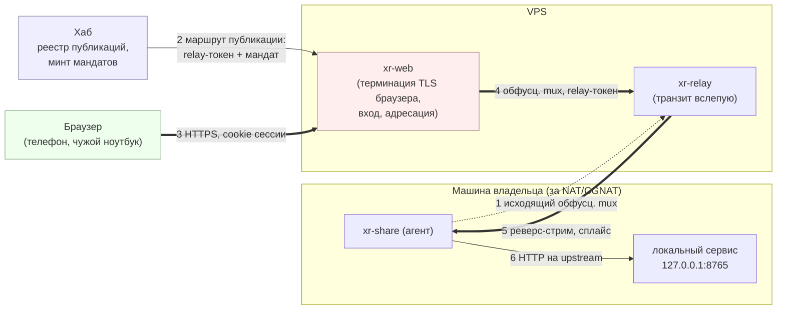

# LLD-38. Браузерный вход к живому HTTP-сервису агента (XR-252)

**Статус:** Draft
**Область:** новый крейт `xr-web` (HTTPS-фронт на VPS: вход владельца, адресация
публикаций, проксирование в туннель, апгрейд до WebSocket); `xr-share`
(экспорт локального HTTP-сервиса реверс-стримом, гейт мандатом публикации);
`xr-hub` (реестр публикаций, минт мандатов, сервисные ручки для `xr-web`);
`xr-proto` (`ExposeToken`, коннектор «relay-стрим плюс pinned-TLS» для hyper);
`xr-setup` и `deploy/` (раскладка нового сервиса).
**Зависимости:** [LLD-23](23-share-relay-nat.md) (транзит за NAT, реестр
агентов, relay-токены, identity-TLS: берётся как есть, код relay не меняется);
[LLD-19](19-file-sharing-agent.md) (`AgentCredential`, токены хаба);
[LLD-33](33-share-git-sync.md) фаза 3 (XR-190: страница шары живёт у агента,
LLD-38 даёт ей канал наружу, п. 2.6); цель DK-112 в devkit (дашборд агентской
разработки, потребитель первой фазы).

Живой HTTP-сервис на машине за NAT сегодня открывается только своим клиентом.
Дашборд агентской разработки (DK-112) и web-страница шары (XR-190) это обычные
HTTP-сервисы на ноутбуке или мак мини: чтобы зайти на них с телефона, нужен
белый IP с пробросом либо установленный клиент, а за CGNAT не работает ни то,
ни другое. Транзит до такой машины уже построен и работает (LLD-23), не хватает
плеча, которое понимает браузер.

---

## 0. Схема браузерного пути



Розовым выделено единственное место, где содержимое браузерной сессии живёт
плейнтекстом. Внутри сплайса (стрелки 4 и 5) идёт pinned-TLS `xr-web` до агента,
поэтому relay по-прежнему несёт только шифртекст и его код не трогается вовсе.

## 1. Текущее состояние

- `xr-relay` держит реестр агентов по исходящему обфусцированному mux, пускает
  потребителя по relay-токену хаба и слепо сплайсит стримы (LLD-23 п. 2.1, п. 2.2).
  Слепота проверяется тестом `test_relay_splice_opaque`.
- Агент (`xr-share`, фича `relay`) терминирует identity-TLS на реверс-стриме и
  отдаёт его своему axum-роутеру шары (`xr-share/src/relay.rs`, `serve_reverse`).
  Ничего, кроме роутера шары, за реверс-стримом сегодня не живёт.
- Потребителем может быть только свой код: `xr-core` (Android) и
  `xr-share pull`, оба поднимают loopback-форвардер из
  `xr-proto/src/relay_client.rs` и говорят pinned-TLS (SPKI равен
  `agent_pubkey`). HTTP и TLS браузерного вида у relay нет, публичного домена
  на relay не заведено, обфусцированный mux браузер не говорит.
- Хаб раздаёт relay-дескриптор (`GET /api/v1/relay`, XR-123) и минтит
  `RelayToken` при выдаче гранта на шару (`xr-hub/src/api/share_v2.rs`).
  Минт привязан к записи шары: для сервиса, который шарой не является,
  выдать нечего.
- Аутентификация хаба это учётки админки (argon2 в конфиге, сессии в памяти,
  `Bearer` в заголовке) плюс инвайты и гранты на шары. Cookie хаб не ставит
  никому.
- Дашборд DK-112 это Go-сервер devkit на машине разработки со своей
  аутентификацией. Про канал он не знает ничего: канал это решение выката, и
  этим решением становится LLD-38.

## 2. Целевое поведение

### 2.1 Публикация как сущность

Публикация это тройка «имя, агент, локальный адрес». Заводится на агенте и
регистрируется в хабе:

```toml
# конфиг xr-share
[[expose]]
name = "dash"                  # имя публикации, оно же поддомен
upstream = "127.0.0.1:8765"    # куда проксировать внутри машины
```

`xr-share expose add --name dash` отправляет запись в хаб своим
`AgentCredential` (тот же канал, что `share add`), хаб кладёт
`ExposeRecord { name, agent_pubkey, created }`. Имя уникально в пределах хаба,
занятое чужим агентом имя отвергается: поддомен адресует ровно одну машину.
Снимается публикация `expose rm`, список смотрится `expose ls` и разделом
админки.

Апстрим в хаб не уезжает: это внутренний адрес машины владельца, знать его
посреднику незачем, а проксирует агент по своему конфигу. Публикация без
записи в конфиге агента не обслуживается, даже если запись в хабе есть.

### 2.2 Вход браузера

- Браузер приходит на `https://<имя>.<web-домен>` (например
  `https://dash.web.example.com`). `xr-web` разбирает `Host`, находит
  публикацию и проверяет свою cookie сессии.
- Сессии нет: отдаётся страница входа (вшитая в бинарь, без внешних запросов),
  форма логин плюс пароль. Пароль проверяет хаб служебной ручкой
  `POST /api/v1/web/verify-password`, отвечающей только вердиктом; учётной базы
  у `xr-web` своей нет, ключа хаба и прав админки у него тоже нет.
- Успех ставит cookie `xrweb=<токен>` с флагами `HttpOnly; Secure;
  SameSite=Lax; Path=/` **без атрибута Domain**, то есть host-only: сессия
  публикации `dash` не читается публикацией `notes` и не утекает между ними.
  Сессии живут в памяти `xr-web` (TTL 7 дней, продление при активности,
  рестарт разлогинивает всех).
- Выход: `POST /.xr-web/logout` снимает сессию. Служебные пути `xr-web` живут
  под префиксом `/.xr-web/` и до агента не доезжают: имя выбрано так, чтобы не
  пересечься с путями проксируемого приложения.
- Протухшая сессия на обычном запросе даёт страницу входа (HTTP 200 с формой),
  на запросе с `Accept: application/json` или `X-Requested-With` даёт 401 с
  телом `{"error":"unauthenticated"}`: XHR дашборда получает код, а не HTML.

### 2.3 Путь запроса до сервиса

- Пройдя гейт, `xr-web` берёт из своего кеша маршрут публикации либо
  запрашивает его у хаба:
  `POST /api/v1/web/route {publication}` -> `{agent_pubkey, relay, relay_token,
  expose_token, exp}`. Ручка защищена общим секретом (п. 3.5), кеш живёт до
  `exp` минус запас.
- Соединение до агента: обфусцированный mux к relay (тот же клиент
  `xr-proto::relay_client`), стрим с hello из `relay_token`, поверх сплайса
  pinned-TLS с проверкой `SPKI == agent_pubkey`. Дальше это обычное
  HTTP/1.1-соединение, которое `xr-web` держит в пуле на публикацию и
  переиспользует под следующие запросы.
- Запрос уходит агенту как пришёл (метод, путь, query, тело потоком), плюс
  два служебных заголовка: `X-Xr-Expose: <имя>` и
  `Authorization: Bearer <expose_token>` (свой `Authorization` браузера, если
  он был, переезжает в `X-Xr-Forwarded-Authorization`, чтобы приложение могло
  им пользоваться). Добавляются `X-Forwarded-Proto: https` и
  `X-Forwarded-Host`. Адрес браузера дальше VPS не едет, он остаётся в логе
  `xr-web`.
- Агент на реверс-стриме смотрит `X-Xr-Expose`: мандат проверяется офлайн
  ключом хаба (подпись, `exp`, совпадение имени и своего `agent_pubkey`), имя
  ищется в `[[expose]]`, и запрос проксируется на `upstream` со снятием
  служебных заголовков. Мандата нет или он чужой: 403, и запрос до upstream не
  доходит. Заголовка `X-Xr-Expose` нет вовсе: запрос обслуживает роутер шары,
  как сегодня.
- Ответ едет обратно потоком, без буферизации целиком: скачивание большого
  файла из публикации не упирается в память VPS.

### 2.4 WebSocket и долгие соединения

- Апгрейд идёт насквозь: `xr-web` пробрасывает `Upgrade`/`Connection` и после
  101 перестаёт быть HTTP-посредником, сплайся байты в обе стороны. Кадры
  WebSocket он не разбирает, ping/pong это дело сторон.
- Соединение живёт не дольше, чем ему позволяет relay: `splice_lifetime_secs`
  (по умолчанию час) рубит сплайс жёстко. Чтобы обрыв не выглядел зависанием,
  `xr-web` закрывает апгрейд сам за минуту до предела штатным закрытием
  (`1001 going away` для WebSocket, обычный FIN для прочих апгрейдов), а лимит
  берёт из маршрута: хаб отдаёт `splice_lifetime` вместе с дескриптором relay.
- Плановая ротация mux у агента и переподключение uplink роняют живые стримы
  раньше срока. Это штатное состояние канала, и переподключение остаётся на
  стороне приложения: живая лента дашборда обязана переподключаться сама, как
  она это делает при потере Wi-Fi. Обязательство названо в DoD фазы 3.
- Агент не на связи: relay отвечает `CLOSE_REASON_AGENT_OFFLINE`, `xr-web`
  отдаёт 502 со своей страницей «машина не на связи» (та же вшитая тема, что у
  входа) и не тратит соединения на ретраи. На живом WebSocket тот же случай
  закрывает соединение, а не подвешивает.

### 2.5 Наблюдаемость и раскладка

- `GET /.xr-web/healthz` на любом поддомене отвечает состоянием самого
  `xr-web`, а `GET /api/v1/web/status` на хабе состоянием публикаций: имя,
  агент, на связи ли он сейчас (хаб знает это от relay по той же служебной
  ручке, что и минт). Неработающая публикация отличима от работающей без
  чтения логов.
- Лог `xr-web`: вход (успех и отказ с адресом и именем публикации), выбор
  маршрута, отказ мандата, обрыв туннеля, метод-статус-длительность запроса.
  Не логируются тела, query-строки (там едут токены шар) и cookie.
- Трафик считает relay как и раньше, per `share_id` токена; для публикации
  `xr-web` минтит relay-токен с `share_id = "web:<имя>"`, поэтому браузерный
  расход виден в тех же агрегатах отдельной строкой.
- Раскладка: `xr-web` ставится профилем `xr-setup ... --with-web`, юнит
  `deploy/xr-web.service`, секрет к хабу генерируется установщиком, публикации
  заводит агент. Ручных шагов на VPS, кроме DNS и сертификата (п. 3.3), нет.

### 2.6 Отношение к XR-190

Страница шары живёт у агента и раздаётся его же роутером (LLD-33 п. 2.8), своей
страницы `xr-web` не заводит. Публикация типа `share` это отдельный тип
маршрута на общем хосте `https://s.<web-домен>/{share_id}/...`: логина нет,
гейтом служит сам `ShareToken` из query, который `xr-web` проверяет офлайн
публичным ключом хаба (подпись, `exp`, совпадение `share_id` с путём) и лишь
после этого берёт маршрут. Конечную авторизацию по-прежнему делает агент, как
и на клиентском пути. `xr-share weblink` начинает печатать публичный URL
вместо локального, когда хаб знает web-домен.

Порядок работ такой: XR-190 делает страницу и роуты у агента, LLD-38 фазой 4
выводит её наружу. Задачи развязаны, стык только в формате URL.

## 3. Дизайн-решения (развилки задачи закрыты здесь)

### 3.1 Модель доверия: отдельная роль, а не режим relay

Терминировать TLS браузера обязан VPS: браузер не умеет ни обфусцированный
mux, ни пиннинг ключа агента, а сертификат ему нужен на публичное имя. Значит
на браузерном пути посредник видит содержимое, и обещание надо не размывать, а
разделить по ролям:

- **Клиентский путь не меняется.** Android, `pull` и `sync` ходят как ходили,
  E2E до агента, relay слепой. Ни строчки в relay не правится, и
  `test_relay_splice_opaque` остаётся действующим утверждением о нём.
- **Браузерный вход это доверенный посредник.** Плейнтекст живёт в памяти
  процесса `xr-web`, и это сказано прямо: в доке, в описании публикации и на
  странице входа строкой «трафик расшифровывается на сервере входа».

Отсюда и решение делать `xr-web` отдельным сервисом, а не режимом relay. Режим
дал бы одному процессу два противоположных обещания, и «relay ничего не видит»
перестало бы быть проверяемым: судить пришлось бы по конфигу, а не по коду.
Отдельный процесс сохраняет проверяемость и раздельные лимиты, а `xr-web`
подключается к relay как обычный потребитель, то есть даже на общей машине
плейнтекст не пересекает границу процессов. Хаб на эту роль не годится по
инварианту LLD-19 п. 3.1 (байты через хаб не идут).

Альтернатива, которую отвергаем: тонкий клиент в браузере (wasm-mux плюс
пиннинг через WebCrypto), чтобы VPS не видел плейнтекст. Загрузчик страницы всё
равно отдаёт VPS, подменённый им скрипт снимает любой E2E внутри страницы,
поэтому доверие остаётся ровно там же, а цена это свой TLS-стек в браузере.
Выигрыш иллюзорный.

Практический вывод, который идёт в доку: браузерный вход стоит ровно столько,
насколько доверяешь своему VPS, а дашборд DK-112 вдобавок управляет машиной
разработки. Поэтому публикации выключены по умолчанию и заводятся поимённо,
а не «весь агент наружу».

### 3.2 Аутентификация: учётка владельца из хаба, cookie на публикацию

Своей базы паролей `xr-web` не заводит: второй пароль владельцу помнить незачем,
а второе место хранения хэшей это второе место утечки. Проверку делает хаб
служебной ручкой, отвечающей только вердиктом. Инвайты и гранты на эту роль не
годятся: они выдают доступ к шаре, а тут доступ к машине, и смешивать капабилити
шар с управлением машиной нельзя.

Сессия своя, потому что браузеру нужна cookie, а хаб cookie никому не ставит.
Cookie host-only и без `Domain`: публикации изолированы, XSS в одном
проксируемом приложении не забирает сессию к соседнему. `SameSite=Lax` режет
чужие сайты и заодно прикрывает CSRF самого приложения: cross-site POST
приезжает без cookie и падает на 401 у `xr-web`, до приложения не доходя.
Вход стоит на каждой публикации отдельно (единый вход через отдельный хост с
обменом кода это следующий шаг, п. 8): при одной-двух публикациях владельца
редирект-обвязка дороже пользы.

Перебор пароля гасится на обеих сторонах: `xr-web` считает попытки на адрес и
на публикацию с экспоненциальной задержкой, хаб держит свой лимит на ручку
проверки, отказы пишутся в лог с адресом.

### 3.3 Адресация: поддомен на публикацию, путь для шар

Поддомен, потому что проксируемое приложение видит себя в корне: относительные
и абсолютные пути (`/api/...`), адреса WebSocket, cookie самого приложения и
редиректы работают без переписывания. Префикс в пути потребовал бы от каждого
приложения уметь base-path, а дашборд DK-112 такого обязательства не давал и
давать не должен: канал не имеет права диктовать приложению его устройство.

Цена решения это wildcard-сертификат на `*.<web-домен>`: DNS-01 у Let's Encrypt
либо Origin CA у Cloudflare, которым деплой хаба уже пользуется (docs/HUB-DEPLOY
раздел 3). Сам `xr-web` сертификатами не занимается: слушает HTTP на локальном
порту за тем же фронтом, что выводит наружу хаб, а собственный `[tls]` в
конфиге это опция для установки без фронта.

Страница шары идёт путём, а не поддоменом, ровно по обратной причине: её роуты
уже начинаются с `/{share_id}/`, префикс это её собственный API, и на одном
хосте `s.<web-домен>` она работает без единой правки. Заводить поддомен на
каждую шару значило бы дёргать DNS при каждой раздаче.

### 3.4 Экспорт делает агент, и он же гейтит мандатом хаба

Uplink, идентичность, реестр и identity-TLS уже есть у `xr-share`, поэтому
экспорт локального сервиса это его новая роль, а не второй демон на машине
владельца. Отдельный бинарь пришлось бы учить тому же самому: мандат, mux,
бэкоф, ротация.

Гейт на стороне агента обязателен, и одного relay-токена мало. Держатель
валидного relay-токена на шару того же агента иначе дотянулся бы до локального
сервиса, подставив заголовок публикации: relay-токен разрешает транзит к
машине, но не выбор того, что на ней открыто. Поэтому у публикации свой мандат
`ExposeToken` (домен подписи `xr-expose-token`, поля `publication`,
`agent_pubkey`, `exp`), который минтит только хаб и проверяет офлайн только
агент, тем же ключом, которым он проверяет токены шар. Отдельный тип, а не
скоуп внутри `ShareToken`, потому что смешение неймспейсов имён публикаций и
идентификаторов шар порождает ровно один класс ошибок: токен на шару, открывший
публикацию.

Апстрим берётся строго из конфига агента по имени публикации. Адрес приходящим
запросом не выбирается никогда, поэтому браузерный вход не становится плечом
SSRF внутрь домашней сети.

### 3.5 Хаб это источник правды по публикациям, у сервиса least-privilege

Маршрут (какой агент, какой relay, какие мандаты) собирает хаб, потому что он
единственный держит приватный ключ подписи и уже играет роль сигналинга для
relay. Альтернатива с общим секретом, прописанным руками в двух конфигах,
экономит ручку, но переносит раскладку на пользователя: завёл публикацию на
машине, пошёл править конфиг на VPS, перезапустил сервис. С хабом заведение
публикации это одна команда на агенте.

Сервисные ручки (`/api/v1/web/route`, `/api/v1/web/verify-password`,
`/api/v1/web/status`) защищены общим секретом `[web] shared_secret` в конфигах
хаба и `xr-web`, а не админской сессией: у транзитного сервиса не должно быть
прав админки, это тот же принцип, что в LLD-20 (компрометация VPS не даёт
права минта). Приватного ключа хаба у `xr-web` нет, поэтому взломанный `xr-web`
не выпишет себе мандат на агента, которого хаб ему не отдавал.

### 3.6 Пул соединений на публикацию, а не соединение на запрос

Каждое новое соединение до агента это mux-стрим плюс TLS-хендшейк через VPS,
то есть лишние RTT на каждый запрос страницы. `xr-web` держит hyper-клиент с
коннектором «relay-стрим плюс pinned-TLS» и keep-alive: страница с десятком
запросов едет по уже готовым соединениям. Апгрейд забирает соединение из пула
насовсем, потому что после 101 оно перестаёт быть HTTP.

## 4. Изменения в коде

| Файл | Что меняется |
|---|---|
| `xr-proto/src/share.rs` | `ExposeToken { publication, agent_pubkey, exp, signature }` плюс `sign_expose_token`/`verify_expose_token` (домен `xr-expose-token`); `WebRoute` (ответ маршрутизации: агент, дескриптор relay, relay-токен, мандат, лимит жизни сплайса). |
| `xr-proto/src/relay_client.rs` | Коннектор под hyper: `relay_tls_connect(endpoint) -> impl AsyncRead + AsyncWrite` (стрим плюс pinned-TLS) рядом с существующим loopback-форвардером, чтобы `xr-web` не поднимал loopback-сокет на каждое соединение. |
| `xr-hub/src/api/web.rs` (новый) | `ExposeRecord` и его хранение; `POST /api/v1/expose/add`, `DELETE /api/v1/expose/{name}`, `GET /api/v1/expose` (мандат агента, как у `share add`); сервисные `POST /api/v1/web/route`, `POST /api/v1/web/verify-password`, `GET /api/v1/web/status` под общим секретом; лимит попыток на проверку пароля. |
| `xr-hub/src/config.rs`, админка | Блок `[web] shared_secret`, `domain`; раздел «Публикации» в admin UI (список, снятие). |
| `xr-share/src/expose.rs` (новый, фича `relay`) | Блок `[[expose]]` в конфиге; разбор реверс-запроса по `X-Xr-Expose` с офлайн-проверкой мандата; прокси на `upstream` (hyper-клиент, стриминг тела, проброс апгрейда); команды `expose add/rm/ls` и харнесс `expose open` (локальный форвардер, печатает `http://127.0.0.1:PORT` для проверки без VPS). |
| `xr-share/src/relay.rs` | `serve_reverse` выбирает обработчик: публикация (по заголовку и мандату) либо прежний роутер шары. |
| `xr-web/` (новый крейт) | Листенер HTTP/1.1 (опц. `[tls]`), маршрутизация по `Host` и по префиксу `s.` для шар, сессии в памяти с TTL, вшитые страницы входа и ошибок, кеш маршрутов, пул соединений на публикацию, проксирование с апгрейдом, лимит попыток входа, лог и `/.xr-web/healthz`. |
| `xr-setup` | Профиль `--with-web`: бинарь, конфиг, генерация общего секрета, юнит, шаг диагностики. |
| `deploy/xr-web.service`, `docs/HUB-DEPLOY.md` | Юнит и раздел про DNS-запись `*.<web-домен>`, wildcard-сертификат и фронт. |

Тесты (Rust, без сети, in-process через duplex и эфемерные порты):

- `test_expose_token_sign_verify`: валидный, чужой ключ, протухший, чужое имя
  публикации, чужой агент; домен-сепарация от `ShareToken` и `RelayToken`.
- `test_expose_requires_mandate`: реверс-запрос с `X-Xr-Expose` без мандата и с
  мандатом на другую публикацию получает 403, до upstream не доходит.
- `test_relay_token_alone_cannot_reach_expose`: держатель валидного
  relay-токена на шару того же агента, подставивший заголовок публикации, не
  проходит (регрессия на дыру из п. 3.4).
- `test_expose_proxies_upstream`: запрос доезжает до локального сервиса,
  ответ возвращается потоком, служебные заголовки сняты, `X-Forwarded-Proto`
  добавлен.
- `test_expose_unknown_name`: имя есть в хабе, но не в конфиге агента -> 404 с
  внятной причиной, а не 500.
- `test_web_requires_session`: запрос без cookie отдаёт форму входа, с
  `Accept: application/json` отдаёт 401 JSON; после входа тот же запрос
  проксируется.
- `test_web_session_cookie_is_host_only`: в `Set-Cookie` нет `Domain`, есть
  `HttpOnly`, `Secure`, `SameSite=Lax`; сессия одной публикации не пускает в
  другую.
- `test_web_login_rate_limit`: серия неверных паролей упирается в задержку,
  верный пароль после неё проходит.
- `test_web_route_cache_and_refresh`: маршрут берётся из кеша, по истечении
  `exp` перезапрашивается, ошибка хаба даёт 502, а не пятисотку без причины.
- `test_web_websocket_upgrade`: 101 проходит насквозь, байты идут в обе
  стороны, закрытие с одной стороны доезжает до другой.
- `test_web_upgrade_closes_before_splice_cap`: при коротком лимите жизни
  сплайса `xr-web` закрывает апгрейд штатным закрытием раньше обрыва.
- `test_web_agent_offline_page`: агент не в реестре relay -> 502 с названной
  причиной, без ретрай-шторма.
- `test_web_share_route_verifies_token_offline`: путь `s.<домен>` с подделанным
  или протухшим `ShareToken` не доходит до минта маршрута; валидный доходит.
- `test_hub_expose_name_conflict`: чужой агент не занимает уже занятое имя.
- Интеграционный: агент с публикацией, relay, хаб и `xr-web` в одном процессе;
  логин, GET страницы, WebSocket-эхо, снятие публикации -> 404.

## 5. Риски и edge-кейсы

1. **Плейнтекст на VPS.** Компрометация машины с `xr-web` даёт содержимое
   браузерных сессий, а для дашборда и управление машиной разработки. Смягчение:
   отдельный процесс со своим юнитом и правами, ничего не пишется на диск
   (сессии и кеш маршрутов в памяти), логов тел и query нет, публикации
   заводятся поимённо. Совсем убрать риск нельзя, поэтому он назван в доке
   (п. 3.1), а не спрятан.
2. **Пароль владельца как единственный ключ.** За ним стоит запуск задач на
   машине разработки. Смягчение: лимит попыток с обеих сторон, лог отказов,
   TTL сессии, логаут. Второй фактор вне скоупа первой фазы (п. 8), и это
   осознанный долг, а не забытая деталь.
3. **Публикация как плечо внутрь домашней сети.** Апстрим только из конфига
   агента, произвольный адрес запросом не выбирается (п. 3.4). Владелец,
   опубликовавший `127.0.0.1:80` роутера, делает это явно и один раз.
4. **Подделка адресации.** Имя публикации берётся из `Host`, но право на неё
   даёт мандат хаба, а не заголовок; агент сверяет имя внутри подписи с
   заголовком и своим конфигом.
5. **Долгие соединения против лимитов.** Живой WebSocket рвётся лимитом сплайса
   и ротацией mux. Закрываем штатно и заранее (п. 2.4), переподключение на стороне
   приложения; молчаливого зависания ленты быть не должно.
6. **Двойной egress.** Браузерный трафик стоит VPS дважды, как и любой relayed.
   Видно в тех же счётчиках отдельной строкой `web:<имя>` (п. 2.5); тяжёлые
   выгрузки через браузерный вход это плохая идея, и цифры это покажут.
7. **Совместимость.** Relay не меняется вовсе. Старый агент без поддержки
   публикаций отдаёт на `X-Xr-Expose` обычный 404 роутера шары, `xr-web`
   переводит это в «публикация не обслуживается, обновите агента». Клиентский
   путь и wire mux не трогаются.
8. **Компрометация `xr-web`.** Даёт доступ к тем публикациям, маршруты которых
   хаб ему уже отдал, и к живым сессиям. Не даёт права минта (приватного ключа
   хаба нет), доступа к шарам мимо их токенов и доступа к агентам без записи
   публикации в хабе.
9. **Хаб недоступен.** Кешированные маршруты работают до `exp`, новые входы
   упираются в проверку пароля и отдают внятную 503. Постоянного состояния у
   `xr-web` нет, восстанавливать после хаба нечего.

## 6. Фазы реализации

1. **Экспорт у агента** (п. 2.1, п. 2.3 в части агента, п. 3.4): `ExposeToken` в
   `xr-proto`, `[[expose]]`, гейт мандатом, прокси на upstream, реестр
   публикаций и минт в хабе, команды `expose add/rm/ls` и харнесс
   `expose open`. Проверяется без VPS-фронта: локальный форвардер плюс curl.
2. **`xr-web` и вход** (п. 2.2, п. 2.3, п. 3.2, п. 3.3, п. 3.6): HTTPS-фронт, поддомены,
   логин и сессии, пул соединений, проксирование HTTP, страницы ошибок,
   раскладка `xr-setup --with-web` и юнит. Закрывает заход в дашборд без живой
   ленты.
3. **Долгие соединения** (п. 2.4, п. 2.5): апгрейд до WebSocket, штатное закрытие
   по лимиту, поведение при офлайн-агенте, `healthz` и статус публикаций,
   лог входов. Закрывает пользовательскую проверку DK-112.
4. **Страница шары наружу** (п. 2.6): тип маршрута `share` на `s.<домен>`,
   офлайн-проверка `ShareToken`, публичный URL в `weblink`. Идёт после XR-190.

Каждая фаза это своя задача со своим выкатом и проверкой; первые три
последовательны, четвёртая ждёт XR-190 и от первых трёх зависит только фронтом.

## 7. План проверки

Rust-часть автотестами (п. 4), плюс живые сценарии по фазам.

Фаза 1 (без VPS-фронта):

1. Локальный сервис на машине агента (`python3 -m http.server 8765` годится),
   `[[expose]]`, `xr-share expose add --name dash`.
2. `xr-share expose open --name dash` печатает локальный адрес; `curl` по нему
   отдаёт страницу сервиса.
3. Тот же адрес без мандата (запрос напрямую в реверс-стрим по токену шары)
   отвечает 403.

Фаза 2:

4. `https://dash.web.<домен>` с телефона вне домашней сети: страница входа,
   неверный пароль отвергается и попадает в лог, верный пускает.
5. Дашборд открывается целиком: статика, XHR, редиректы, свои cookie
   приложения. `curl -I` показывает `Set-Cookie` без `Domain`.
6. Вторая публикация: cookie первой её не открывает.

Фаза 3:

7. Живая лента дашборда идёт по WebSocket не менее часа: при подходе к лимиту
   соединение закрывается штатно и приложение переподключается, лента не
   замирает молча.
8. Агент выключен: браузер получает страницу «машина не на связи» за секунды,
   не таймаут-минуты. Агент включён обратно: доступ восстанавливается без
   действий на VPS.
9. `GET /api/v1/web/status` показывает публикации и их живость; в логе relay
   видна строка расхода `web:dash`.

Фаза 4:

10. Ссылка `weblink` открывается в браузере телефона: страница шары, просмотр
    md; подделанный токен в query не пускает.

Во всех фазах: `cargo test --workspace` зелёный, 0 warnings.

## 8. Вне скоупа

- **Единый вход на все публикации** (отдельный хост входа с обменом кода на
  host-only cookie): нужен, когда публикаций станет много; при одной-двух
  дороже пользы (п. 3.2).
- **Второй фактор и вход по ключу устройства** (WebAuthn): следующий шаг после
  того, как вход станет повседневным (п. 5.2).
- **Автовыпуск и продление wildcard-сертификата**: делается штатным certbot или
  Cloudflare, своей автоматики не заводим (п. 3.3).
- **Публикация не-HTTP сервисов** (голый TCP, ssh через браузер): другая задача
  с другой моделью доступа.
- **Несколько `xr-web` и выбор ближайшего**: как и у relay, MVP это один фронт
  на хаб.
- **Квоты на браузерный трафик**: здесь только счётчики, политика в
  XR-073/075.
- **Свой UI поверх публикаций** (каталог, превью): `xr-web` это канал, страницы
  живут у сервисов.

## 9. Открытые вопросы (закрыты в этом дизайне)

- *Кто терминирует TLS браузера и что обещано пользователю?* -> **отдельный
  сервис `xr-web`, relay остаётся слепым, браузерный путь честно назван
  доверенным посредником** (п. 3.1).
- *Аутентификация своя или на существующих сущностях хаба?* -> **пароль
  владельца проверяет хаб, сессия своя, cookie host-only на публикацию**
  (п. 3.2).
- *Поддомен или путь?* -> **поддомен на публикацию (wildcard-сертификат), путь
  для страниц шар на общем хосте** (п. 3.3).
- *Как не пустить держателя relay-токена в локальный сервис?* -> **отдельный
  мандат публикации `ExposeToken`, офлайн-проверка агентом** (п. 3.4).
- *Откуда `xr-web` знает маршрут?* -> **из хаба служебной ручкой под общим
  секретом, без прав админки и без ключа подписи** (п. 3.5).
- *WebSocket и лимиты?* -> **сплайс насквозь, штатное закрытие до лимита,
  переподключение на стороне приложения** (п. 2.4).
- *Отношение к XR-190?* -> **канал, а не своя страница; фаза 4 после XR-190**
  (п. 2.6).
