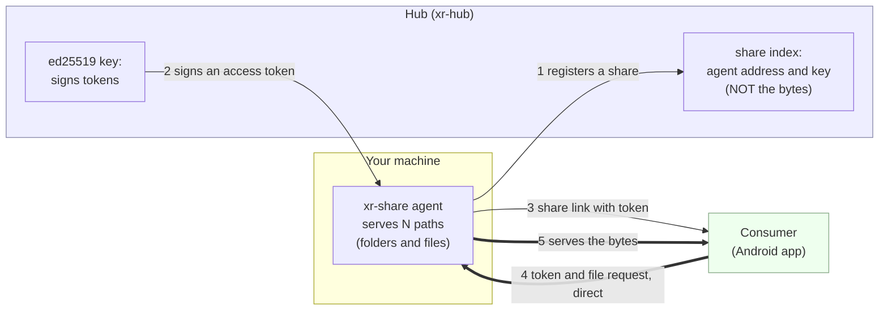

# xr-share: file-sharing agent (LLD-19)

Shares **any number of paths** (folders *and* individual files) read-only over
HTTP(S): it serves a signed-hash **manifest** and verifies hub-minted **access
tokens offline**. The hub is only an index and a notary. It knows agent addresses
and signs access tokens, but **file bytes never pass through it** (legal
cleanliness).

## How it works

Three roles. The **hub** is a phone book + notary. The **agent** (this binary)
holds your files and checks access tokens itself. The **consumer** pulls files
straight from the agent.



The bold arrows (4 and 5) are the file transfer: **agent ↔ consumer, bypassing the
hub**. A token is a hub-signed note *"access to share X until time T"*; the agent
verifies its signature with the hub key it pinned at install, **offline**, never
calling the hub. Revocation is the token's TTL.

Full design + sequence diagrams: [docs/lld/19-file-sharing-agent.md](../docs/lld/19-file-sharing-agent.md).

## Install

One command on any OS: downloads the binary from the hub, verifies its SHA-256,
installs the autostart service (systemd / Scheduled Task / launchd) with a
long-lived hub mandate, and shares a folder right away. Take a **setup token**
in the hub admin (**Shares** tab) and run as root/Administrator:

```sh
# Linux / macOS
curl -fsSL https://xr-hub.zoobr.top/share/install.sh | sudo sh -s -- \
  --setup <SETUP-TOKEN> --dir /srv/share
```
```powershell
# Windows (elevated PowerShell)
$env:XR_SETUP="<SETUP-TOKEN>"; $env:XR_DIR="C:\share"
irm https://xr-hub.zoobr.top/share/install.ps1 | iex
```

The setup token packs a registration token and an invite (XR-127): the share
gets attached to the invite, and the relay leg turns on by itself when the
mandate carries a relay descriptor, so a share behind NAT just works
(`--no-relay` opts a public-IP host out). With a plain **reg token**
(`--token <REG-TOKEN>` / `$env:XR_TOKEN`) the same line installs the mandated
service only; share any path anytime after:

```sh
sudo xr-share share /srv/photos   # a folder OR a single file
sudo xr-share list
```

Run the installer with no token at all to just fetch or update the binary; an
already-installed service is restarted with the new one.

Re-running the installer keeps the existing agent: `install` looks for the
config at the requested path, then at the path recorded in the autostart
service, then at the OS default location, and reuses its identity, shares and
mandate (a fresh `--setup` only re-points the default invite). A fresh identity
would orphan every share registered under the old one on the hub (XR-134), so
it is minted only when no config is found anywhere (with a warning if service
traces remain) or on `xr-share install --force`, which also takes the previous
shares off the hub index.

> Self-hosting the hub? Point the installer elsewhere with
> `XR_SHARE_BASE=https://your-hub/share`.

> The distributed binary serves **plain HTTP** (run behind a TLS terminator, or
> direct in a trusted circle). Direct HTTPS termination by the agent is an
> opt-in source build, `cargo build --release -p xr-share --features tls`
> (Linux only; its crypto backend doesn't cross-compile to Windows).

## Endpoints

| Method / path        | Auth  | Purpose                                            |
|----------------------|-------|----------------------------------------------------|
| `GET /healthz`       | none  | liveness                                           |
| `GET /manifest`      | token | listing: `path`, `size`, `mtime`, `sha256`         |
| `GET /file/{*path}`  | token | file bytes; supports `Range` (resume); 404/403/401 |

Token is presented as a URL-safe base64 blob of the hub's `ShareToken` JSON, via
`Authorization: Bearer <blob>`, `X-Share-Token: <blob>`, or `?token=<blob>`
(best-effort for browsers). Verified offline against the pinned hub key (bound
`share_id`, not expired, valid signature); otherwise `401`/`403`. Tokens are never
logged.

The manifest response is signed with the agent's identity key (XR-046): the
`x-xr-manifest-sig` / `x-xr-manifest-signed-at` headers carry an ed25519
signature over the exact body bytes plus the share id, and consumers verify it
against the `agent_pubkey` pinned from the grant. Without the identity key
(config `identity_key` or `identity.key` next to the config) the agent serves
unsigned and pinning consumers refuse the listing.

## Manual setup (no installer)

```sh
# 1. Generate the agent identity (once). Register the printed PUBLIC key in the
#    hub as the share's agent_pubkey (the consumer pins it, TOFU).
xr-share keygen

# 2. Register the share in the hub (Admin UI → Shares, or POST /admin/shares)
#    using addr:port + that public key; copy the returned share_id.

# 3. Fetch the hub's signing key (pin it): GET https://<hub>/api/v1/public-key

# 4. Fill /etc/xr-share/config.toml (see configs/share.toml), then run:
xr-share -c /etc/xr-share/config.toml
```

Direct access needs a public IP or a forwarded port. Behind NAT the relay leg
(LLD-23) carries the share instead: token installs pick the relay descriptor up
from the hub automatically, hand-rolled setups add a `[relay]` block.

## Build

Pure Rust, no platform-specific code in the binary, so it builds for Linux and
Windows alike.

```sh
# Linux (static musl)
cargo build --release -p xr-share --target x86_64-unknown-linux-musl

# Windows
cargo build --release -p xr-share --target x86_64-pc-windows-gnu
```

Release binaries in the hub's share-dist are built with `--features relay`
(the CI relay guard refuses a binary without it, XR-133); add the flag to a
source build if the share must work behind NAT.

## Autostart

`sudo xr-share service install` covers every OS: a systemd unit on Linux, a
SYSTEM Scheduled Task on Windows, a LaunchDaemon on macOS (XR-127);
`service status` / `service uninstall` to inspect and remove. The install
one-liner already did this for you. For a hand-rolled Linux setup there is
also [`deploy/xr-share.service`](../deploy/xr-share.service) to drop into
`/etc/systemd/system/` and `systemctl enable --now xr-share`.
