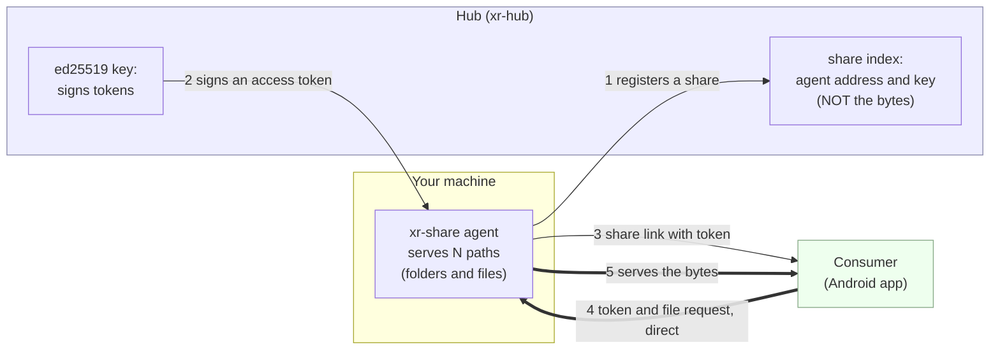

# xr-share: file-sharing agent (LLD-19)

Shares **any number of paths** (folders *and* individual files) read-only over
HTTP(S): it serves a signed-hash **manifest** and verifies hub-minted **access
tokens offline**. The hub is only an index and a notary. It knows agent addresses
and signs access tokens, but **file bytes never pass through it** (legal
cleanliness).

## How it works

Three roles. The **hub** is a phone book + notary. The **agent** (this binary)
holds your files and checks access tokens itself. The **consumer** pulls files
straight from the agent.



The bold arrows (4 and 5) are the file transfer: **agent ↔ consumer, bypassing the
hub**. A token is a hub-signed note *"access to share X until time T"*; the agent
verifies its signature with the hub key it pinned at install, **offline**, never
calling the hub. Revocation is the token's TTL.

Full design + sequence diagrams: [docs/lld/19-file-sharing-agent.md](../docs/lld/19-file-sharing-agent.md).

## Install

One command downloads the binary from the hub, verifies its SHA-256, and
puts `xr-share` on your PATH:

```sh
# Linux / macOS
curl -fsSL https://xr-hub.zoobr.top/share/install.sh | sh
```
```powershell
# Windows (PowerShell)
irm https://xr-hub.zoobr.top/share/install.ps1 | iex
```

Then configure and enable autostart:

```sh
xr-share init                  # asks: folder to share, hub URL (fetches its key), share_id
sudo xr-share service install  # systemd (Linux) / Scheduled Task (Windows)
```

`init` generates this agent's identity and prints its **public key**. Register
a share in the hub admin (**Shares** tab) with your `addr:port` and that key, and
the hub returns the `share_id` you paste back. Consumers then pin the agent by that
key (TOFU) and pull files straight from you.

> Self-hosting the hub? Point the installer elsewhere with
> `XR_SHARE_BASE=https://your-hub/share`.

> The distributed binary serves **plain HTTP** (run behind a TLS terminator, or
> direct in a trusted circle). Direct HTTPS termination by the agent is an
> opt-in source build, `cargo build --release -p xr-share --features tls`
> (Linux only; its crypto backend doesn't cross-compile to Windows).

## Endpoints

| Method / path        | Auth  | Purpose                                            |
|----------------------|-------|----------------------------------------------------|
| `GET /healthz`       | none  | liveness                                           |
| `GET /manifest`      | token | listing: `path`, `size`, `mtime`, `sha256`         |
| `GET /file/{*path}`  | token | file bytes; supports `Range` (resume); 404/403/401 |

Token is presented as a URL-safe base64 blob of the hub's `ShareToken` JSON, via
`Authorization: Bearer <blob>`, `X-Share-Token: <blob>`, or `?token=<blob>`
(best-effort for browsers). Verified offline against the pinned hub key (bound
`share_id`, not expired, valid signature); otherwise `401`/`403`. Tokens are never
logged.

## Setup

```sh
# 1. Generate the agent identity (once). Register the printed PUBLIC key in the
#    hub as the share's agent_pubkey (the consumer pins it, TOFU).
xr-share keygen

# 2. Register the share in the hub (Admin UI → Shares, or POST /admin/shares)
#    using addr:port + that public key; copy the returned share_id.

# 3. Fetch the hub's signing key (pin it): GET https://<hub>/api/v1/public-key

# 4. Fill /etc/xr-share/config.toml (see configs/share.toml), then run:
xr-share -c /etc/xr-share/config.toml
```

Reachability is direct-access only in the MVP: public IP, forwarded port, or an
already-public machine. CGNAT/relay is out of scope.

## Build

Pure Rust, no platform-specific code in the binary, so it builds for Linux and
Windows alike.

```sh
# Linux (static musl)
cargo build --release -p xr-share --target x86_64-unknown-linux-musl

# Windows
cargo build --release -p xr-share --target x86_64-pc-windows-gnu
```

## Autostart

**Linux (systemd):** install [`deploy/xr-share.service`](../deploy/xr-share.service)
to `/etc/systemd/system/`, then `systemctl enable --now xr-share`.

**Windows:** run at boot via Task Scheduler:

```powershell
schtasks /create /tn xr-share /sc onstart /ru SYSTEM ^
  /tr "C:\xr-share\xr-share.exe -c C:\xr-share\config.toml"
```

(or wrap it as a proper service with [nssm](https://nssm.cc/)). A native
Windows-service integration is a follow-up.
