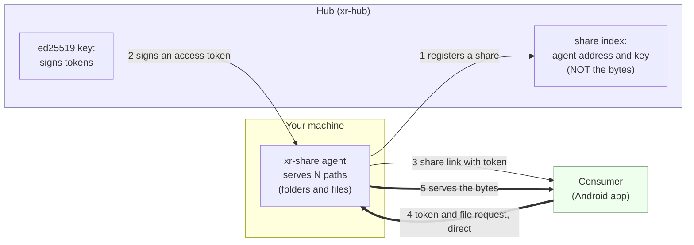

# xr-share: file-sharing agent (LLD-19)

Shares **any number of paths** (folders *and* individual files) over HTTP(S):
it serves a signed-hash **manifest** and verifies hub-minted **access tokens
offline**. Shares are **read by default**; a folder marked writable also accepts
uploads and deletes from invite holders who carry a write-binding (LLD-28). The
hub is only an index and a notary. It knows agent addresses and signs access
tokens, but **file bytes never pass through it** (legal cleanliness).

## How it works

Three roles. The **hub** is a phone book + notary. The **agent** (this binary)
holds your files and checks access tokens itself. The **consumer** pulls files
straight from the agent.


```mermaid
flowchart LR
    subgraph Owner["Your machine"]
        AG["xr-share agent<br/>serves N paths<br/>(folders and files)"]
    end
    subgraph HubBox["Hub (xr-hub)"]
        HK["ed25519 key:<br/>signs tokens"]
        IDX["share index:<br/>agent address and key<br/>(NOT the bytes)"]
    end
    CON["Consumer<br/>(Android app)"]

    AG -->|"1 registers a share"| IDX
    HK -->|"2 signs an access token"| AG
    AG -->|"3 share link with token"| CON
    CON ==>|"4 token and file request, direct"| AG
    AG ==>|"5 serves the bytes"| CON

    style HubBox fill:#eef,stroke:#88a
    style CON fill:#efe,stroke:#8a8
```

The bold arrows (4 and 5) are the file transfer: **agent ↔ consumer, bypassing the
hub**. A token is a hub-signed note *"access to share X until time T"*; the agent
verifies its signature with the hub key it pinned at install, **offline**, never
calling the hub. Revocation is the token's TTL.

Full design + sequence diagrams: [docs/lld/19-file-sharing-agent.md](../docs/lld/19-file-sharing-agent.md).

## Install

One command on any OS: downloads the binary from the hub, verifies its SHA-256,
installs the autostart service (systemd / Scheduled Task / launchd) with a
long-lived hub mandate, and shares a folder right away. Take a **setup token**
in the hub admin (**Shares** tab) and run as root/Administrator:

```sh
# Linux / macOS
curl -fsSL https://xr-hub.zoobr.top/share/install.sh | sudo sh -s -- \
  --setup <SETUP-TOKEN> --dir /srv/share
```
```powershell
# Windows (elevated PowerShell)
$env:XR_SETUP="<SETUP-TOKEN>"; $env:XR_DIR="C:\share"
irm https://xr-hub.zoobr.top/share/install.ps1 | iex
```

The setup token packs a registration token and an invite (XR-127): the share
gets attached to the invite, and the relay leg turns on by itself when the
mandate carries a relay descriptor, so a share behind NAT just works
(`--no-relay` opts a public-IP host out). With a plain **reg token**
(`--token <REG-TOKEN>` / `$env:XR_TOKEN`) the same line installs the mandated
service only; share any path anytime after:

```sh
sudo xr-share share /srv/photos              # a folder OR a single file
sudo xr-share share /srv/dropbox --writable  # invite holders can upload/delete (folders only)
sudo xr-share list
```

`--writable` opts a folder into the write path and adds a write-binding on the
attached invite; re-running `share` without the flag turns write back off.

Re-sharing a path the agent already serves **replaces** that entry instead of
adding a second one (XR-162): the flags of the last run win, the path gets a
fresh `share_id`, and the previous registration is taken off the hub index. One
folder is therefore one share, and a link printed by an earlier `share` of the
same path stops working.

Invite bindings do **not** travel with the replacement, so repeat the
`--invite` you used before (or set a default invite with a `--setup` token).
The retired `share_id` leaves the hub together with whatever invites it hung
on, and the agent cannot re-create those bindings: it never learns which
invites carry a share, and the hub tells only an admin session. The new entry
lands on the invites of that run alone; anything else is re-attached from the
hub admin UI. `share` warns about the lost bindings when the entry it replaces
had been attached at least once (the config remembers that much), so a plain
invite-less share stays quiet.

From a laptop the desktop harness mirrors `pull` for sending:

```sh
xr-share push --invite <TOKEN> --share <id|name> report.pdf   # upload (--to <rel> to rename)
xr-share rm   --invite <TOKEN> --share <id|name> report.pdf   # delete
```

`push` refuses locally if the invite grants no write access, and on overwrite
sends `If-Match` with the hash it just read, so it cannot silently clobber a
newer version (`--force` drops that guard).

Run the installer with no token at all to just fetch or update the binary; an
already-installed service is restarted with the new one.

Re-running the installer keeps the existing agent: `install` looks for the
config at the requested path, then at the path recorded in the autostart
service, then at the OS default location, and reuses its identity, shares and
mandate (a fresh `--setup` only re-points the default invite). A fresh identity
would orphan every share registered under the old one on the hub (XR-134), so
it is minted only when no config is found anywhere (with a warning if service
traces remain) or on `xr-share install --force`, which also takes the previous
shares off the hub index.

> Self-hosting the hub? Point the installer elsewhere with
> `XR_SHARE_BASE=https://your-hub/share`.

> The distributed binary serves **plain HTTP** (run behind a TLS terminator, or
> direct in a trusted circle). Direct HTTPS termination by the agent is an
> opt-in source build, `cargo build --release -p xr-share --features tls`
> (Linux only; its crypto backend doesn't cross-compile to Windows).

## Endpoints

The share id is in the URL (`GET /{share_id}/manifest`, `GET /{share_id}/file/...`);
the bare `/manifest` and `/file/...` are legacy aliases that select the share from
the token. The write routes are v2 only.

| Method / path                  | Scope         | Purpose                                            |
|--------------------------------|---------------|----------------------------------------------------|
| `GET /healthz`                 | none          | liveness                                           |
| `GET /{id}/manifest`           | `share:read`  | listing: `path`, `size`, `mtime`, `sha256`         |
| `GET /{id}/file/{*path}`       | `share:read`  | file bytes; supports `Range` (resume)              |
| `PUT /{id}/file/{*path}`       | `share:write` | upload a file; `201` new, `204` overwrite          |
| `DELETE /{id}/file/{*path}`    | `share:write` | remove a file; `204`, `404` missing, `409` a dir   |
| `POST /{id}/import`            | `share:import`| start a URL-import job; `202 {"job_id"}`           |
| `GET /{id}/import/{job}`       | `share:import`| poll: `state`, `progress`, `files`/`error`         |
| `DELETE /{id}/import/{job}`    | `share:import`| cancel the job (kills the plugin); `204`           |
| `GET /{id}/git/info/refs`      | `share:write`| smart-HTTP ref advertisement                       |
| `POST /{id}/git/git-upload-pack`| `share:write`| fetch, one process per request                    |
| `POST /{id}/git/git-receive-pack`| `share:write`| push, one process per request                     |
| `GET /{id}/git/head`           | `share:write`| signed `main` head, long-poll via `since`/`wait`  |
| `GET /{id}/git/log`            | `share:write`| commit rows `[{sha,author,date,subject}]`, `path`/`limit` |
| `GET /{id}/git/diff`           | `share:write`| `git diff` text, `from`/`to`/`path`, capped at 1 MiB |
| `GET /{id}/web`                | `share:read` | the share's built-in web page (see below)         |

Token is presented as a URL-safe base64 blob of the hub's `ShareToken` JSON, via
`Authorization: Bearer <blob>`, `X-Share-Token: <blob>`, or `?token=<blob>`
(best-effort for browsers). Verified offline against the pinned hub key (bound
`share_id`, not expired, valid signature, and carrying the route's scope);
otherwise `401` (no/garbled token) or `403` (wrong share, expired, bad signature,
or missing scope). Tokens are never logged.

### Scope model (LLD-28, LLD-29)

The token carries an OAuth-style `scope` string inside its signed bytes: today
`share:read`, `share:write` and `share:import`. Read routes need `share:read`,
write routes `share:write`, import routes `share:import`. Write and import
scopes are minted by a single path only, `GET /api/v1/invite/{token}/shares` for
an invite that has a **write-binding** to a **writable** share (import rides on
the write binding; a separate axis appears when someone needs one without the
other); the share link and `/share/mint` always hand out read-only tokens. A
holder reads its own rights by decoding the grant's token blob and looking for
the names in `scope`.

### Write path (PUT / DELETE)

The order of gates: the share exists (`404`), the agent config marks it
`writable` (`403`), the token carries `share:write` (`401`/`403`), and the path
resolves inside the share (`403`). Both master switches are the owner's: the hub
never mints `share:write` for a share the owner did not mark writable, and the
agent refuses even a valid `share:write` token unless its own config allows the
share, so a compromised hub still cannot write.

An upload streams into a reserved `.xr-part-<rand>` temp next to the target,
hashing on the fly, then `fsync` + atomic rename over the target, so a
half-written file never appears in the manifest or under the target name. The
`.xr-part-` prefix is reserved: no request path (including `GET`) may name a
component with it, and the manifest walk skips such files.

Optional headers:

- `X-Xr-Sha256: <hex>` on `PUT` verifies the received bytes before the rename;
  a mismatch is `422` and the target is untouched.
- `If-Match: <sha256>` runs the operation only if the target's current content
  hash equals that value (optimistic concurrency against a lost update); `PUT`
  also honours `If-None-Match: *` to require the target not to exist. A violated
  precondition is `412`, target untouched. Without these the default is
  last-write-wins on atomic operations.
- `max_file_mb` in the agent config caps an upload: over the cap is `413` (by
  `Content-Length` up front, else while streaming). A full disk is `507`; the
  temp is removed on any failure.

### URL import (LLD-29)

A writable share can also accept **import jobs**: an invite holder sends a page
URL, and the *agent* downloads its content into the share with an external
plugin (the reference is a yt-dlp + ffmpeg wrapper). The core stays a thin file
server: nothing is vendored, the owner installs the tools and lists them in the
`[import]` config block (see [configs/share.toml](../configs/share.toml)).
Enable per share:

```sh
sudo xr-share share /srv/dropbox --writable --import
```

If the config has no `[import]` block yet, `share --import` bootstraps the
reference yt-dlp block itself, after checking that `yt-dlp` and `ffmpeg` are in
`PATH` (a clear refusal with an install hint otherwise). The desktop harness
runs an import without a device:

```sh
xr-share import --invite <TOKEN> --share <id|name> "https://youtu.be/..." \
  [--to <subdir>] [--height 720]
```

Plugin contract: the agent runs `cmd` + `args` as one process per job, cwd is a
private `.xr-import-<rand>/` dir in the share root. The `{url}` args element is
replaced by the link as **one literal argv argument** (no shell); `{height}`
inside any element becomes the effective frame height, `min(requested,
max_height)`. On exit 0 the agent publishes the cwd's top-level non-hidden
regular files into the destination through the same hash + fsync + rename
contour as an upload. Optional `xr-progress <percent>` lines on stdout feed the
job's progress; the stderr tail becomes the error text of a failed job.

Jobs are asynchronous and ephemeral: one runs at a time (a short queue behind
it, then `429`), finished ones stay pollable for an hour, an agent restart
forgets the table (a poll then answers `404`) and sweeps leftover
`.xr-import-*` dirs. The whole `.xr-` name prefix is reserved in every route
and hidden from the manifest. Limits: `timeout_min` per job, `max_total_mb`
per job's output (checked while downloading), `max_file_mb` per published file.

**SSRF stance.** The URL comes from a device but is fetched from the owner's
machine inside their LAN, so before the plugin starts the agent refuses
non-http(s) schemes and any host resolving to a private/special range
(loopback, RFC1918, link-local, CGNAT, multicast, v6 ULA...). On Linux with
systemd the plugin additionally runs in a `systemd-run` scope with those same
ranges denied at the kernel (`IPAddressDeny`), which also covers redirects and
DNS rebinding after the check; on Windows or systemd-less Linux the pre-start
gate is the only barrier -- an accepted residual risk in a trusted write
circle. `sandbox = "none"` turns the wrapper off explicitly.

The manifest response is signed with the agent's identity key (XR-046): the
`x-xr-manifest-sig` / `x-xr-manifest-signed-at` headers carry an ed25519
signature over the exact body bytes plus the share id, and consumers verify it
against the `agent_pubkey` pinned from the grant. Without the identity key
(config `identity_key` or `identity.key` next to the config) the agent serves
unsigned and pinning consumers refuse the listing.

### Git contour (LLD-33)

A writable share can also carry a **git repository** as its history. Every edit
of the folder becomes a commit. A co-author with the write token clones, pulls
and pushes with a stock git client over the same HTTP surface. The repository
lives **outside the folder** (`<state dir>/git/<share_id>`, next to the config
and identity). The folder stays clean: no `.git`, no service files, and its
owner keeps editing it in any editor without ever seeing git. Enable per
share, with git in `PATH` on the agent's machine:

```sh
sudo xr-share share /srv/notes --writable --git
```

Every change of the folder passes through one loop, whatever its origin: an
editor save, a `PUT`/`DELETE`, an import publish. A filesystem watcher commits
after a two-second debounce. A five-minute safety scan catches what watchers
miss on network filesystems. Commits are authored as `git_author` from the
config, or the hostname, so co-authors see whose machine made them. Files over
`git_max_file_mb` (default 10 MiB) and the reserved `.xr-*` service names stay
out of history; they keep flowing through the manifest surface.

The gate ladder matches the write path: the share exists (`404`), the contour
is on (`403`), the share is writable (`403`), the token carries `share:write`
(`401`/`403`). **Fetch lives under `share:write` too**: the repository is the
owner's private history, not a published binding. A plain git client passes
the token with `git -c http.extraHeader=...`:

```sh
git -c http.extraHeader="Authorization: Bearer <token>" \
    clone http://agent:8443/<share_id>/git notes
```

A push lands in the folder itself: once the pack is accepted, the new `main`
is materialized into the working folder. This is git's `updateInstead`
semantics, run through receive hooks, because the bare-style layout cannot use
the config switch. A dirty folder refuses the push with a named error instead
of discarding local edits. Non-fast-forward pushes and ref deletions are
denied, and a push bigger than `8x git_max_file_mb + 64` MiB is cut. Pushes
serialize against the commit loop, so a materialization and an auto-commit
never interleave. `unshare` leaves the repository on disk, and prints where:
the folder may come back, and its history should not vanish with the flag.

`GET /{id}/git/head` answers the current `main` SHA with an ed25519 signature
by the same identity key that signs manifests. The route also long-polls:
pass the head you already know as `since` and a `wait` budget in seconds. It
parks until the next commit or push, so change notifications cost a request
per minute instead of a poll storm. An unborn `main` reports an empty string.

### Web page (LLD-33)

Every share serves a **built-in web page** at `GET /{id}/web`. The page is a
single-file view embedded in the binary: no CDN, no external requests. The
token rides the URL as `?token=<blob>`, the same blob `Bearer` uses. So the
link opens on any machine with a browser, no app or git client needed.

A **read token** shows the file tree from the manifest and renders Markdown
files in place. A **write token** unlocks the rest of the page. That is the
history of a file (commit list via `git/log`, diffs between adjacent commits
via `git/diff`) and in-place editing of text files. The edit box PUTs with
`If-Match`. A file that changed on the agent answers `412`, and the page
offers to re-read instead of overwriting someone else's edit. The page decodes
the token's scope client-side to know what to show; the routes behind each
action hold the real gates.

The holder of a write grant prints the link without touching the mint:

```sh
xr-share weblink --invite <invite> --share <share_id>
```

`weblink` reuses the token the grant already carries, so no new channel for
write scope appears. The printed URL carries that token in full. Treat it like
the token itself, and remember the browser history keeps it (the command says
so too). Add `--https` when the agent serves TLS.

## Manual setup (no installer)

```sh
# 1. Generate the agent identity (once). Register the printed PUBLIC key in the
#    hub as the share's agent_pubkey (the consumer pins it, TOFU).
xr-share keygen

# 2. Register the share in the hub (Admin UI → Shares, or POST /admin/shares)
#    using addr:port + that public key; copy the returned share_id.

# 3. Fetch the hub's signing key (pin it): GET https://<hub>/api/v1/public-key

# 4. Fill /etc/xr-share/config.toml (see configs/share.toml), then run:
xr-share -c /etc/xr-share/config.toml
```

Direct access needs a public IP or a forwarded port. Behind NAT the relay leg
(LLD-23) carries the share instead: token installs pick the relay descriptor up
from the hub automatically, hand-rolled setups add a `[relay]` block.

## Build

Pure Rust, no platform-specific code in the binary, so it builds for Linux and
Windows alike.

```sh
# Linux (static musl)
cargo build --release -p xr-share --target x86_64-unknown-linux-musl

# Windows
cargo build --release -p xr-share --target x86_64-pc-windows-gnu
```

Release binaries in the hub's share-dist are built with `--features relay`
(the CI relay guard refuses a binary without it, XR-133); add the flag to a
source build if the share must work behind NAT.

## Autostart

`sudo xr-share service install` covers every OS: a systemd unit on Linux, a
SYSTEM Scheduled Task on Windows, a LaunchDaemon on macOS (XR-127);
`service status` / `service uninstall` to inspect and remove. The install
one-liner already did this for you. For a hand-rolled Linux setup there is
also [`deploy/xr-share.service`](../deploy/xr-share.service) to drop into
`/etc/systemd/system/` and `systemctl enable --now xr-share`.
